

  

## Universidad Peruana de Ciencias Aplicadas

**Ingeniería de Software**

**Ciclo:** 2026-10

**Curso:** Desarrollo de Aplicaciones Open Source

**Sección:** 11881

**Profesor:** Efraín Ricardo Bautista Ubillús

----
## Informe de Trabajo Final
Equipo
### SmartTecnologies

Proyecto
### SmartLock
#### Relación de integrantes
 

| Integrante                      | Código     |
|---------------------------------|------------|
| Palacios Tinoco Adrian Fernando | u202410817 |
| Peñaranda Caldas Gabriel Augusto| u202210836 |
| Huaman Oscco Aldo Jesus         | u20231h067 |
| Ayllon Pauccar Juan David       | u20241a860 |
| Limache Coronel Imanol Fabrizio | u202410382  |

 
<h3>Junio 2026</h3>
 

 

---
### Registro de Versiones

| **Versión** | **Fecha** | **Autor** | **Descripción de modificación** |
|-------------|------------|----------------------------------------------------|-------------------------------------------------------------------------------------------------------------------------------------------------|
| 1\.0        | 07/04/2026 | Adrian Fernando Palacios Tinoco                    | Se agregó parte de la estructura del capítulo I del informe, asimismo se agregó la carátula, el startup profile; y antecedentes y problemáticas |
| 1\.1        | 08/04/2026 | Juan David Ayllon Pauccar                          | Se desarrolló la sección 1.1 del documento.                                                                                                     |
| 1\.2        | 09/04/2026 | Juan David Ayllon Pauccar                          | Se redactó la sección 1.2 referente a la solución.                                                                                              |
| 1\.3        | 10/04/2026 | Gabriel Augusto Peñaranda Caldas                   | Se elaboraron las secciones 1.3 y 1.4 del primer capítulo.                                                                                      |
| 1\.4        | 11/04/2026 | Gabriel Augusto Peñaranda Caldas                   | Se finalizó el Capítulo 1 con los puntos restantes.                                                                                             |
| 2\.0        | 12/04/2026 | Gabriel Augusto Peñaranda Caldas                   | Se dio inicio al Capítulo 2 con la redacción de las secciones 2.1 y 2.2.                                                                        |
| 2\.1        | 13/04/2026 | Gabriel Augusto Peñaranda Caldas                   | Se completó la sección 2.3 correspondiente a User Personas.                                                                                     |
| 2\.2        | 14/04/2026 | Limache Coronel Imanol Fabricio                                             | Se elaboró la sección 2.4 (Big Picture Event Storming).                                                                |
| 2\.3        | 15/04/2026 | Limache Coronel Imanol Fabricio                                             | Se redactó la sección 2.5 completando la etapa de diseño conceptual.                                                   |
| 2\.4        | 16/04/2026 | Adrian Fernando Palacios Tinoco                    | Se agregó el Style Guidelines y el Information Architecture.                                                                                    |
| 3\.0        | 17/04/2026 | Limache Coronel Imanol  Fabricio                                             | Se estructuró y brindó apoyo inicial en la redacción de la sección 3.1.                                               |
| 3\.1        | 18/04/2026 | Aldo Jesus Huaman Oscco                            | Se finalizó la sección 3.1 y se avanzó con la sección 3.2.                                                                                      |
| 3\.2        | 19/04/2026 | Aldo Jesus Huaman Oscco                            | Se desarrollaron las secciones 3.3 y 3.4 enfocadas en la gestión del proyecto.                                                                  |
| 3\.3        | 20/04/2026 | Aldo Jesus Huaman Oscco                            | Se finalizó el Capítulo 3 con la redacción de las secciones restantes.                                                                          |
| 4\.0        | 22/04/2026 | Adrian Fernando Palacios Tinoco                    | Se agregó el diagrama de Clases tanto para Frontend como para Backend.                                                                          |
| 4\.1        | 23/04/2026 | Juan David Ayllon Pauccar                          | Se elaboró la sección 4.3 del documento técnico.                                                                                                |
| 4\.2        | 24/04/2026 | Juan David Ayllon Pauccar                          | Se completó la sección 4.4 cerrando los requerimientos asignados.                                                                               |

  

---

# Project Report Collaboration Insights

URL de Organización de GITHUB del equipo SmartIndustries:
https://github.com/gapc2124/Smartlock-DAOP

URL de Repositorio del Project Report:
https://github.com/202610-1asi0729-11881-SmartIndustries/smartindustries-report

---

# Contenido

- [Contenido](#contenido)
- [Student Outcome](#student-outcome)
- [Capítulo I: Introducción](#capítulo-i-introducción)
  - [1.1. Startup Profile](#11-startup-profile)
    - [1.1.1. Descripción de la StartUp](#111-descripción-de-la-startup)
    - [1.1.2. Perfiles de integrantes del equipo](#112-perfiles-de-integrantes-del-equipo)
  - [1.2. Solution Profile](#12-solution-profile)
    - [1.2.1. Antecedentes y problemática](#121-antecedentes-y-problemática)
    - [1.2.2. Lean UX Process](#122-lean-ux-process)
      - [1.2.2.1. Lean UX Problem Statements](#1221-lean-ux-problem-statements)
      - [1.2.2.2. Lean UX Assumptions](#1222-lean-ux-assumptions)
      - [1.2.2.3. Lean UX Hypothesis Statements](#1223-lean-ux-hypothesis-statements)
      - [1.2.2.4. Lean UX Canvas](#1224-lean-ux-canvas)
  - [1.3. Segmentos Objetivo](#13-segmentos-objetivo)
- [Capítulo II: Requirements Elicitation & Analysis](#capítulo-ii-requirements-elicitation--analysis)
  - [2.1. Competidores](#21-competidores)
    - [2.1.1. Análisis competitivo](#211-análisis-competitivo)
    - [2.1.2. Estrategias y tácticas frente a competidores](#212-estrategias-y-tácticas-frente-a-competidores)
  - [2.2. Entrevistas](#22-entrevistas)
    - [2.2.1. Diseño de entrevistas](#221-diseño-de-entrevistas)
    - [2.2.2. Registro de Entrevistas](#222-registro-de-entrevistas)
    - [2.2.3. Análisis de entrevistas](#223-análisis-de-entrevistas)
  - [2.3. Needfinding](#23-needfinding)
    - [2.3.1. User Personas](#231-user-personas)
    - [2.3.2. User Task Matrix](#232-user-task-matrix)
    - [2.3.3. User Journey Mapping](#233-user-journey-mapping)
    - [2.3.4. Empathy Mapping](#234-empathy-mapping)
    - [2.3.5. As-is Scenario Mapping](#235-as-is-scenario-mapping)
  - [2.4. Big Picture Event Storming](#24-big-picture-event-storming)
  - [2.5. Ubiquitous Language](#25-ubiquitous-language)
- [Capítulo III: Requirements Specification](#capítulo-iii-requirements-specification)
  - [3.1. User Stories](#31-user-stories)
  - [3.2. Impact Mapping](#32-impact-mapping)
  - [3.3. Product Backlog](#33-product-backlog)
- [Capítulo IV: Product Design](#capítulo-iv-product-design)
  - [4.1. Style Guidelines](#41-style-guidelines)
    - [4.1.1. General Style Guidelines](#411-general-style-guidelines)
    - [4.1.2. Web Style Guidelines](#412-web-style-guidelines)
  - [4.2. Information Architecture](#42-information-architecture)
    - [4.2.1. Organization Systems](#421-organization-systems)
    - [4.2.2. Labeling Systems](#422-labeling-systems)
    - [4.2.3. SEO Tags and Meta Tags](#423-seo-tags-and-meta-tags)
    - [4.2.4. Searching Systems](#424-searching-systems)
    - [4.2.5. Navigation Systems](#425-navigation-systems)
  - [4.3. Landing Page UI Design](#43-landing-page-ui-design)
    - [4.3.1. Landing Page Wireframe](#431-landing-page-wireframe)
    - [4.3.2. Landing Page Mock-up](#432-landing-page-mock-up)
  - [4.4. Web Applications UX/UI Design](#44-web-applications-uxui-design)
    - [4.4.1. Web Applications Wireframes](#441-web-applications-wireframes)
    - [4.4.2. Web Applications Wireflow Diagrams](#442-web-applications-wireflow-diagrams)
    - [4.4.3. Web Applications Mock-ups](#443-web-applications-mock-ups)
    - [4.4.4. Web Applications User Flow Diagrams](#444-web-applications-user-flow-diagrams)
  - [4.5. Web Applications Prototyping](#45-web-applications-prototyping)
  - [4.6. Domain-Driven Software Architecture](#46-domain-driven-software-architecture)
    - [4.6.1. Design-Level Event Storming](#461-design-level-event-storming)
    - [4.6.2. Software Architecture Context Diagram](#462-software-architecture-context-diagram)
    - [4.6.3. Software Architecture Container Diagrams](#463-software-architecture-container-diagrams)
    - [4.6.4. Software Architecture Components Diagrams](#464-software-architecture-components-diagrams)
  - [4.7. Software Object-Oriented Design](#47-software-object-oriented-design)
    - [4.7.1. Class Diagrams](#471-class-diagrams)
  - [4.8. Database Design](#48-database-design)
    - [4.8.1. Database Diagrams](#481-database-diagrams)
- [Capítulo V: Product Implementation, Validation & Deployment](#capítulo-v-product-implementation-validation--deployment)
  - [5.1. Software Configuration Management](#51-software-configuration-management)
    - [5.1.1. Software Development Environment Configuration](#511-software-development-environment-configuration)
    - [5.1.2. Source Code Management](#512-source-code-management)
    - [5.1.3. Source Code Style Guide & Conventions](#513-source-code-style-guide--conventions)
    - [5.1.4. Software Deployment Configuration](#514-software-deployment-configuration)
  - [5.2. Landing Page, Services & Applications Implementation](#52-landing-page-services--applications-implementation)
    - [5.2.1. Sprint 1](#521-sprint-1)
      - [5.2.1.1. Sprint Planning 1](#5211-sprint-planning-1)
      - [5.2.1.2. Aspect Leaders and Collaborators](#5212-aspect-leaders-and-collaborators)
      - [5.2.1.3. Sprint Backlog 1](#5213-sprint-backlog-1)
      - [5.2.1.4. Development Evidence for Sprint Review](#5214-development-evidence-for-sprint-review)
      - [5.2.1.5. Execution Evidence for Sprint Review](#5215-execution-evidence-for-sprint-review)
      - [5.2.1.6. Services Documentation Evidence for Sprint Review](#5216-services-documentation-evidence-for-sprint-review)
      - [5.2.1.7. Software Deployment Evidence for Sprint Review](#5217-software-deployment-evidence-for-sprint-review)
   - [5.2.1.8. Team Collaboration Insights during Sprint](#5218-team-collaboration-insights-during-sprint)
   - [5.2.2. Sprint 2](#522-sprint-2)
     - [5.2.2.1. Sprint Planning 2](#5221-sprint-planning-2)
     - [5.2.2.2. Aspect Leaders and Collaborators](#5222-aspect-leaders-and-collaborators)
     - [5.2.2.3. Sprint Backlog 2](#5223-sprint-backlog-2)
     - [5.2.2.4. Development Evidence for Sprint Review](#5224-development-evidence-for-sprint-review)
     - [5.2.2.5. Execution Evidence for Sprint Review](#5225-execution-evidence-for-sprint-review)
     - [5.2.2.6. Services Documentation Evidence for Sprint Review](#5226-services-documentation-evidence-for-sprint-review)
     - [5.2.2.7. Software Deployment Evidence for Sprint Review](#5227-software-deployment-evidence-for-sprint-review)
     - [5.2.2.8. Team Collaboration Insights during Sprint](#5228-team-collaboration-insights-during-sprint)
   - [5.2.3. Sprint 3](#523-sprint-3)
     - [5.2.3.1. Sprint Planning 3](#5231-sprint-planning-3)
     - [5.2.3.2. Aspect Leaders and Collaborators](#5232-aspect-leaders-and-collaborators)
     - [5.2.3.3. Sprint Backlog 3](#5233-sprint-backlog-3)
     - [5.2.3.4. Development Evidence for Sprint Review](#5234-development-evidence-for-sprint-review)
     - [5.2.3.5. Execution Evidence for Sprint Review](#5235-execution-evidence-for-sprint-review)
     - [5.2.3.6. Services Documentation Evidence for Sprint Review](#5236-services-documentation-evidence-for-sprint-review)
     - [5.2.3.7. Software Deployment Evidence for Sprint Review](#5237-software-deployment-evidence-for-sprint-review)
     - [5.2.3.8. Team Collaboration Insights during Sprint](#5238-team-collaboration-insights-during-sprint)
   - [5.3. Validation Interviews](#53-validation-interviews)
    - [5.3.1. Diseño de entrevistas](#531-diseño-de-entrevistas)
    - [5.3.2. Registro de Entrevistas](#532-registro-de-entrevistas)
    - [5.3.3. Evaluaciones Según Heurísticas](#533-evaluaciones-según-heurísticas)
  - [5.4. Video About-the-Product](#54-video-about-the-product)
- [Conclusiones](#conclusiones)
- [Bibliografía](#bibliografía)
- [Anexos](#anexos)

---

# Student Outcome

El curso contribuye al cumplimiento del Student Outcome ABET:  
**ABET – EAC - Student Outcome 3**
Criterio: Capacidad de comunicarse efectivamente con un rango de audiencias.  
En el siguiente cuadro se describe las acciones realizadas y enunciados de conclusiones por parte del grupo, que permiten sustentar el haber alcanzado el logro del ABET – EAC - Student Outcome 3.  

<table>
<thead>
<tr>
<th colspan="3"><b>Criterio específico</b></th>
<th colspan="3"><b>Acciones realizadas</b></th>
<th colspan="3"><b>Conclusiones</b></th>
</tr>
</thead>
<tbody>
<tr>
<td colspan="3">Comunica oralmente con efectividad a diferentes rangos de audiencia.</td>
<td colspan="3" align="justify">
<h4>Limache Coronel Imanol Fabricio</h4>
 <b>AV1:</b>
Presentó la arquitectura de eventos (Big Picture) al equipo y a los stakeholders, explicando el flujo de datos de forma clara.

<h4>Peñaranda Caldas Gabriel Augusto</h4>
 <b>AV1:</b>
Expuso el modelo de negocio, el proceso de User Personas y la propuesta de valor de SmartLock frente a la clase.

<h4>Palacios Tinoco Adrian Fernando</h4>
 <b>AV1:</b>
Detalló los diagramas de clases y la arquitectura de la información durante la revisión del sprint técnico.

<h4>Ayllon Pauccar Juan David</h4>
 <b>AV1:</b>
Explicó las secciones introductorias y la justificación de la solución propuesta en el pitch inicial del proyecto.

<h4>Huaman Oscco Aldo Jesus</h4>
 <b>AV1:</b>
Dirigió las reuniones de daily scrum y sustentó el backlog del proyecto ante el product owner y el equipo.

</td>
<td colspan="3" align="justify">
<h4>Limache Coronel Imanol Fabricio</h4>
<b>AV1:</b> Demostró fluidez al explicar conceptos técnicos de Event Storming a un público no técnico.  
<h4>Peñaranda Caldas Gabriel Augusto</h4>
<b>AV1:</b> Logró captar la atención de la audiencia al articular claramente los beneficios del sistema sin depender de tecnicismos.  
<h4>Palacios Tinoco Adrian Fernando</h4>
<b>AV1:</b> Sustentó con seguridad las decisiones de diseño arquitectónico frente a las consultas del jurado calificador.  
<h4>Ayllon Pauccar Juan David</h4>
<b>AV1:</b> Comunicó eficazmente el problema inicial y cómo la solución se alinea con los objetivos del cliente.  
<h4>Huaman Oscco Aldo Jesus</h4>
<b>AV1:</b> Mantuvo una comunicación asertiva y constante, asegurando el alineamiento del equipo durante las exposiciones.
</td>
</tr>
<tr>
<td colspan="3">Comunica por escrito con efectividad a diferentes rangos de audiencia.</td>
<td colspan="3" align="justify">
<h4>Limache Coronel Imanol Fabricio</h4>
 <b>AV1:</b>
Redactó la documentación del Design-Level Event Storming y la conceptualización en el informe técnico del proyecto.

<h4>Peñaranda Caldas Gabriel Augusto</h4>
 <b>AV1:</b>
Elaboró los perfiles de usuario, el análisis Lean UX y documentó los capítulos iniciales de la propuesta.

<h4>Palacios Tinoco Adrian Fernando</h4>
 <b>AV1:</b>
Creó las guías de estilo, diagramas técnicos y manuales de arquitectura de software para el equipo de desarrollo.

<h4>Ayllon Pauccar Juan David</h4>
 <b>AV1:</b>
Estructuró y redactó la problemática, los antecedentes y los requerimientos funcionales del sistema.

<h4>Huaman Oscco Aldo Jesus</h4>
 <b>AV1:</b>
Documentó la gestión del proyecto en Jira y estructuró el backlog y el roadmap en el informe final.

</td>
<td colspan="3" align="justify">
<h4>Limache Coronel Imanol Fabricio</h4>
<b>AV1:</b> Produjo documentación técnica coherente y fácil de seguir para facilitar la integración de futuros desarrolladores.  
<h4>Peñaranda Caldas Gabriel Augusto</h4>
<b>AV1:</b> Redactó los artefactos de UX y negocio con un nivel de detalle excelente, estructura lógica y ortografía impecable.  
<h4>Palacios Tinoco Adrian Fernando</h4>
<b>AV1:</b> Estructuró los diagramas y guías visuales acompañándolos con descripciones precisas y estandarizadas.  
<h4>Ayllon Pauccar Juan David</h4>
<b>AV1:</b> Consolidó los antecedentes y requisitos en un texto claro, formal y académicamente riguroso.  
<h4>Huaman Oscco Aldo Jesus</h4>
<b>AV1:</b> Mantuvo un registro detallado y ordenado de la planificación, permitiendo una lectura ágil del progreso del proyecto.
</td>
</tr>
</tbody>
</table>

---

# Capítulo I: Introducción

## 1.1. Startup Profile
### 1.1.1. Descripción de la Startup
**Área:** Seguridad Digital y Control de Accesos

**SmartTecnologies** es una startup formada por un equipo de estudiantes de ingeniería de software de la Universidad Peruana de Ciencias Aplicadas (UPC) que nace con la meta de proponer una alternativa moderna a los sistemas de seguridad tradicionales, que muchas veces se quedan cortos en control y trazabilidad. Identificamos que la gestión de llaves físicas y el registro manual de entradas son procesos lentos y poco fiables, por lo que desarrollamos Smart Lock. Nuestra solución es una plataforma web integral que permite administrar y monitorear el ingreso a cualquier espacio físico desde un solo lugar, transformando la seguridad convencional en un sistema inteligente basado en datos y control en tiempo real.

* **Misión:** Nuestra misión en SmartTecnologies es darle a los administradores y dueños de espacios una herramienta tecnológica avanzada que simplifique cómo controlan sus accesos. Con Smart Lock, buscamos que el proceso de decidir quién entra y quién no deje de ser una preocupación, ofreciendo un sistema basado en reglas claras y alertas automáticas que garantice que cada movimiento quede registrado de forma transparente y segura.
    
* **Visión:** Nos proyectamos como la startup líder en digitalización de accesos dentro de la región, logrando que nuestra tecnología sea el estándar en edificios, oficinas y centros de estudio. Queremos que SmartTecnologies sea sinónimo de modernidad y eficiencia, impulsando una cultura donde la seguridad no sea una barrera, sino un proceso fluido y totalmente automatizado.
    
* **Valores:**
   
  * **Seguridad y Confidencialidad:** Como estudiantes de Ingeniería de Software, sabemos que los datos de acceso son críticos. Por eso, nos tomamos muy en serio la protección de la información, usando protocolos de autenticación y cifrado para que solo las personas autorizadas tengan el control.
     
  * **Precisión en los datos:** Nos comprometemos con la exactitud en la gestión de presupuestos y tareas, asegurando que la información reflejada en la plataforma sea un espejo fiel de la realidad del proyecto.
     
  * **Innovación aplicada:** No nos conformamos con lo que ya existe. Buscamos aplicar lo aprendido en nuestra formación para integrar funciones como la simulación de flujo sin hardware y reglas de acceso dinámicas que mantengan a Smart Lock a la vanguardia.
     
  * **Gestión Colaborativa y Simple:** Creemos que la tecnología debe ser fácil de usar. Centralizamos todo en un panel intuitivo para que la comunicación entre administradores y usuarios sea rápida, eliminando complicaciones innecesarias.
     
  * **Compromiso con la Excelencia:** Trabajamos para que nuestra plataforma soporte las exigencias de un entorno real, ofreciendo una herramienta robusta que aguante el flujo constante de usuarios sin perder fiabilidad.
### 1.1.2. Perfiles de integrantes del equipo

|**Integrante**|**Perfil**|**Imagen**|
|:-------------|----------|:--------:|
| **Juan David Ayllon Pauccar**|"Estudiante de 5to ciclo de Ingeniería de Software en la UPC. Cuento con conocimientos técnicos avanzados en desarrollo con C++, SQL, Python Intermedio, HTML, CSS. Me distingo por ser un integrante responsable y con gran capacidad de comunicación asertiva, facilitando la coordinación y el flujo de trabajo dentro del equipo. Mi compromiso con el proyecto SmartLock se refleja en mi disposición para aprender, resolver desafíos complejos y asegurar que cada entrega cumpla con los estándares esperados."|
| **Imanol Fabrizio Limache Coronel**|Soy un estudiante al que le gusta aprender cosas nuevas, sobre todo si se relacionan a la programación, además de la resolución de problemas.||
|**Huaman Oscco Aldo Jesus - u20231h067**|Estudiante de la carrera de Ingeniería de Software en la Universidad Peruana de Ciencias Aplicadas (UPC). Actualmente cursando el 5to ciclo de la carrera, asumo la responsabilidad de investigar y aplicar conocimientos y habilidades de desarrollo en **SmarLock** de manera eficiente para culminarlo con exito.| |
|**Peñaranda Caldas Gabriel Augusto - u202210836**|Estudiante de la carrera de Ingeniería de Software en la Universidad Peruana de Ciencias Aplicadas (UPC). Me encuentro llevando cursos de 5to y 6to ciclo de la carrera. Cuento con habilidades sobresalientes en cloud, python, typescript y UX/UI. Además se ser alguien muy preocupado por mis compañeros de equipo y amigable que las demás personas. Me comprometo a que el proyecto **SmartLock** se lleve a cabo con éxito brindando responsabilidad y puntualidad en las entregas y avances del proyecto.| |
|**Palacios Tinoco Adrian Fernando - u202410817** | Estudiante de la carrera de Ingeniería de Software en la Universidad Peruana de Ciencias Aplicadas (UPC). Me encuentro cursando el 5to ciclo de la carrera. Cuento con habilidades tanto blandas como tecnicas. Por un lado, entre mis habilidades blandas destaco el trabajo en equipo, comunicacion efectiva y escucha activa. Por otro lado, mis habilidades entre mis habilidades tecnicas es el diseño de base de datos, analisis de requisitos, diseño de software y como lenguajes destaco mi conocimiento en C++, JavaScript, Python, Java y SQL. Me comprometo a que el proyecto **SmartLock** se lleve a cabo con éxito brindando responsabilidad y puntualidad en las entregas y avances del proyecto. |  |

## 1.2. Solution Profile
### 1.2.1. Antecedentes y problemática

**5W's y 2H's**

Para definir el problema central de SmartLock, hemos aplicado la técnica de análisis detallado:
 

* **What?**
  La alta vulnerabilidad ante intrusiones y la ineficiencia administrativa en el control de personal, provocadas por la dependencia de métodos de registro manuales o hardware físico fácilmente clonable.
   

* **Why?**

  Porque los sistemas convencionales (llaves, tarjetas RFID o cuadernos) no poseen validación de identidad en tiempo real ni trazabilidad inmutable, lo que permite la suplantación de identidad y pérdida de datos sin posibilidad de auditoría fiable.
   

* **Who?**

  Administradores de oficinas, gestores de espacios de coworking y dueños de propiedades residenciales o comerciales que carecen de un control estricto sobre sus accesos.  

* **When?**
  El problema se manifiesta diariamente, especialmente en horarios fuera de oficina o durante cambios de turno, donde el control se vuelve crítico y propenso a errores humanos.
   

* **Where?**
  En entornos urbanos con alta densidad de oficinas y espacios compartidos donde el flujo de personas es constante y difícil de registrar manualmente.

   
* **How?**
  El problema se materializa a través de la pérdida o clonación de tarjetas de acceso, el ingreso de exempleados a los que no se les revocó el permiso a tiempo, y el "cuello de botella" humano en las porterías durante horas pico.
   
* **How much?**

  El costo de reposición de tarjetas y cerrajería puede superar los 1,500 soles anuales por empresa, sumado a la pérdida de hasta 10 horas semanales en tareas de auditoría manual y el riesgo financiero incalculable de una brecha de seguridad de activos corporativos.

### 1.2.2. Lean UX Process
#### 1.2.2.1. Lean UX Problem Statements
El dominio de nuestro producto es la gestión de seguridad y control de acceso a espacios físicos (Domain). Actualmente, nuestros administradores de edificios, dueños de negocios y personal de seguridad (Customer Segments) sufren por la falta de visibilidad en tiempo real, la dificultad para gestionar permisos temporales o por horarios, y la tediosa tarea de auditar accesos manualmente (Pain Points). Esto genera una brecha significativa de seguridad y eficiencia operativa frente a sistemas tradicionales que son inflexibles o ciegos ante anomalías (Gap).

Nuestra visión es proporcionar a las empresas una plataforma web inteligente y escalable que no solo permita o deniegue el acceso, sino que automatice el monitoreo mediante reglas, alertas y un historial detallado en tiempo real (Vision/Strategy). Para comenzar a validar nuestra solución, nos enfocaremos en un segmento inicial de pequeñas y medianas empresas (pymes) o espacios de coworking que requieran un control estricto de horarios para sus empleados sin invertir inicialmente en hardware complejo (Initial Segment).

#### 1.2.2.2. Lean UX Assumptions

**Business Assumptions (Suposiciones del Negocio):**

- Creemos que las empresas están dispuestas a pagar una suscripción mensual recurrente (modelo SaaS) en lugar de un pago único por un software de escritorio tradicional.

- Creemos que la simulación de acceso a puertas será suficiente para convencer a los primeros clientes (early adopters) del valor del software antes de integrarlo con hardware físico.

- Creemos que el límite de usuarios y de historial en el "Plan Básico" será el principal motivador para que los clientes escalen al "Plan Profesional".

**User Assumptions (Suposiciones del Usuario):**

- Creemos que el personal de monitoreo adoptará la verificación de dos pasos (2FA) sin considerarlo un bloqueo para su productividad.

- Creemos que los administradores valoran más recibir alertas automáticas (ej. intentos fallidos o fuera de horario) que revisar un historial de registros de forma manual.
#### 1.2.2.3. Lean UX Hypothesis Statements
- Hipótesis 1 (Alertas): El sistema de alertas por intentos fallidos y accesos fuera de horario optimiza la identificación instantánea de anomalías.

- Hipótesis 2 (Gestión de roles): El control de acceso segmentado por franjas horarias y días laborales automatiza la gestión de entrada del personal.

- Hipótesis 3 (Seguridad): El historial detallado de eventos y la autenticación segura (2FA) garantizan la trazabilidad total de las autorizaciones de ingreso para auditores internos.

#### 1.2.2.4. Lean UX Canvas

| 1. Business Problem | 2. Business Outcomes |
| :------------------ | :------------------- |
| La alta vulnerabilidad y el exceso de trabajo administrativo generados por sistemas de acceso manuales o de hardware clonable sin conexión en tiempo real. | - Lograr una conversión del 30% a planes de pago. - Reducir a 0 los incidentes de intrusión de clientes. - Alta retención mensual (Churn rate bajo). |
| **3. Users / Customers** | **4. User Benefits** |
| - Administradores de instalaciones / RRHH. - Personal de monitoreo / Prevención. - Empleados (usuarios finales). | - Trazabilidad e inmutabilidad de los ingresos. - Ahorro de horas semanales en auditorías. - Detección proactiva de intrusos vía alertas. |
| **5. Solutions / Ideas** | **6. Hypotheses** |
| - Panel en tiempo real. - Sistema de reglas por horario y roles. - Motor de alertas de anomalías. - Log de auditoría inmutable. | - Las alertas automáticas por intentos fallidos y accesos fuera de horario optimizan la capacidad de respuesta del personal de monitoreo al centralizar la detección de anomalías en tiempo real. Se alcanzará el éxito cuando el tiempo promedio de respuesta ante incidentes críticos disminuya en un 50% durante el primer trimestre de implementación. - El control de acceso segmentado por franjas horarias y días laborales elimina la carga operativa de recursos humanos al automatizar las restricciones de entrada de manera masiva. Validaremos esta solución si el número de suscripciones al Plan Pro aumenta en un 25%, impulsado por empresas que requieren gestión autónoma de turnos rotativos. |
| **7. What's the most important thing to learn first?** | **8. What's the least amount of work we need to do to learn this? (MVP)** |
| ¿Los administradores confiarán en la gestión de permisos a través de una interfaz web antes de conectar hardware real? | Construir la plataforma web funcional con la función de **Simulación de acceso a puertas** para demostrar la lógica del producto a clientes potenciales. |

## 1.3. Segmentos objetivo
---

Para el desarrollo de **SmartLock**, se han definido los siguientes segmentos objetivo, integrando sus perfiles, necesidades y comportamientos en la gestión de accesos:

| **Segmento** | **Descripción del Perfil** | **Necesidades Principales** | **Características Psicográficas y Comportamentales** |
| :--- | :--- | :--- | :--- |
| **Gerentes de Operaciones, TI y Seguridad Corporativa** | Líderes responsables de una empresa preocupada por la infraestructura y seguridad de sus espacios de trabajo, desde startups en crecimiento hasta corporativos con múltiples oficinas y alto flujo de personal. | - Centralizar el control de accesos de múltiples sedes en una sola plataforma. - Eliminar la vulnerabilidad de las llaves físicas y tarjetas clonables. - Automatizar el registro de asistencia y la revocación inmediata de permisos a gran escala. | - Priorizan la escalabilidad y la integración con herramientas SaaS existentes. - Toman decisiones basadas en datos y registros de auditoría inmutables. - Buscan máxima eficiencia operativa reduciendo el error humano en porterías. |
| **Administradores de Eventos y Espacios de Alto Tráfico** | Profesionales encargados de la logística en centros de convenciones, ferias o complejos de oficinas que requieren gestionar entradas masivas por periodos específicos. | - Creación rápida de credenciales digitales temporales para invitados o contratistas. - Monitoreo en tiempo real de la ocupación por zonas para evitar aglomeraciones. - Despliegue del sistema sin depender de instalaciones de hardware pesadas o fijas. | - Valoran la agilidad y la capacidad de respuesta inmediata ante incidentes. - Están familiarizados con protocolos de seguridad dinámica (2FA y alertas móviles). - Prefieren interfaces intuitivas que permitan delegar tareas de control de forma sencilla. |

# Capítulo II: Requirements Elicitation & Analysis

## 2.1. Competidores

### **Kisi (Control de Acceso en la Nube)**
Es una solución global de gestión de accesos de nivel empresarial que centraliza el control de múltiples instalaciones en una única interfaz basada en la nube. Se especializa en modernizar infraestructuras existentes sin necesidad de reemplazarlas por completo.
<https://www.getkisi.com/enterprise>

#### **Características Principales**
* **Gestión de Identidad Avanzada:** Permite asignar privilegios detallados por usuario e integra sistemas de autenticación **SSO** y protocolos **SCIM** para sincronizar la base de datos de empleados automáticamente.
* **Seguridad y Auditoría:** Facilita el cumplimiento de normativas de seguridad física mediante la obtención de datos vía **API** y la generación de informes automáticos personalizados.
* **Seguridad Multicapa:** Ofrece opciones de autenticación de dos factores (**2FA**) y **WebAuthn** para elevar los estándares de protección.
* **Implementación Híbrida:** Su gran diferencial es la capacidad de conectarse a cerraduras y lectores ya instalados, lo que reduce los costos de implementación hasta en un **65%**.

#### **Estructura de Planes**

| Plan | Descripción / Enfoque | Ideal para |
| :--- | :--- | :--- |
| **Standard** | Control básico en la nube. | Oficinas pequeñas. |
| **CRM** | Integración con sistemas de gestión de clientes. | Negocios con membresías. |
| **Enterprise** | Auditorías estrictas e integraciones de IT avanzadas. | Grandes corporaciones. |

---
<https://pages.getkisi.com/hubfs/kisi-pricing-overview.pdf>
 

### **Acceso Total Perú (Soluciones Integrales de Automatización)**
**Perfil de la Empresa:** Empresa peruana en fase de expansión con más de 5 años de experiencia en el sector de seguridad inteligente. Su competitividad radica en la flexibilidad de hardware y una sólida trayectoria con instituciones públicas y privadas de alto perfil (MININTER, MINCETUR, UNI, entre otros).

#### **Líneas de Servicio y Planes**
* **Control de Acceso para Puertas:** Sistema versátil con soporte para múltiples métodos de validación: códigos, tarjetas, huellas biométricas, reconocimiento facial y **códigos QR**.
* **Gestión de Asistencia Biométrica:** Solución especializada para **Recursos Humanos** que permite el control detallado de asistencias, faltas y horas extras con gestión local o centralizada.
* **Control de Acceso Vehicular:** Automatización de entradas y salidas de vehículos enfocada en la eficiencia operativa y reducción de costos de personal.
* **Control Peatonal Centralizado:** Implementación de barreras físicas (**torniquetes o molinetes**) gestionadas por un software integrado e intuitivo para flujos masivos.

#### **Valor Agregado**

| Beneficio | Descripción |
| :--- | :--- |
| **Asesoría Personalizada** | Acompañamiento técnico previo para determinar la viabilidad según la infraestructura. |
| **Experiencia Local** | Conocimiento profundo del mercado peruano y cumplimiento de estándares para entidades estatales. |

---
<https://accesototalperu.com/control-de-acceso-puerta/>
 

### **Kronos por SEIDOR (Gestión de Fuerza Laboral y Tiempo)**
**Descripción General:** Solución de alto nivel distribuida por **SEIDOR**, diseñada para el control integral de la jornada laboral y la optimización de la productividad. Su enfoque principal es el cumplimiento normativo y la eficiencia operativa en empresas con grandes planillas y turnos complejos.

#### **Pilares Estratégicos**
* **Optimización de Costos Operativos:** Alinea el personal con la demanda del negocio. Controla el pago de **horas extras** y proyecta el gasto de horas-hombre en tiempo real mediante alertas automáticas.
* **Mitigación de Riesgos y Cumplimiento:** Automatiza la generación de horarios asegurando el cumplimiento de la **legislación laboral** y acuerdos sindicales. Valida que el personal cuente con certificaciones vigentes antes de asignar turnos.
* **Productividad y Rendimiento:** Gestiona descansos obligatorios para prevenir el agotamiento y facilita la creación de equipos basados en competencias específicas.
* **Experiencia del Empleado (Self-Service):** Interfaz intuitiva para dispositivos móviles (**iOS y Android**) que permite a los colaboradores gestionar su disponibilidad y preferencias de turnos.

#### **Resumen de Valor**

| Enfoque | Objetivo Principal |
| :--- | :--- |
| **Financiero** | Control de presupuestos y reducción de sobrecostos laborales. |
| **Legal** | Automatización del cumplimiento de normativas vigentes. |
| **Humano** | Autogestión y bienestar del colaborador mediante movilidad. |

---
<https://www.seidor.com/es-pe/kronos>
 

### 2.1.1. Análisis Competitivo

#### Competitive Analysis Landscape

> **¿Por qué llevar a cabo el desarrollo de un software de gestión de accesos habiendo modelos internacionales que gestionan la seguridad a nivel empresarial?**
> 
> **Objetivo:** El objetivo de nuestro equipo es que los clientes vean nuestro software como una aplicación viable para la gestión de accesos de sus eventos o empresas, pudiendo ver reportes de asistencias, tardanzas e identificación de usuarios. Asimismo, facilitar la visualización de reportes que permitan analizar estadísticamente a sus colaboradores.

| Sección | Detalle | SmartLock  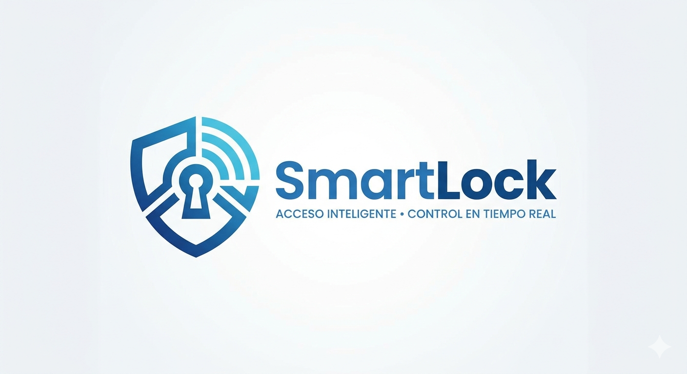 | Kisi   | Acceso total Peru   | Kronos por Seidor   |
| :--- | :--- | :--- | :--- | :--- | :--- |
| **Perfil** | Overview | Es un modelo de gestión de accesos "Asset-Light" que utiliza códigos QR dinámicos para eliminar la inversión en hardware, orientado a empresas y eventos que buscan una implementación inmediata, económica y escalable. | Es una solución de seguridad física basada en la nube que unifica el control de múltiples sedes globales en una sola interfaz, optimizando los costos de instalación al integrar infraestructura antigua con protocolos modernos de identidad (SSO/SCIM). | Se especializa en la integración de hardware y soporte técnico local, ofreciendo sistemas de barreras físicas y biometría para instituciones que requieren una fiscalización presencial estricta y cumplimiento de normativas nacionales. | Es una plataforma de Workforce Management estratégica enfocada en grandes corporaciones, cuyo objetivo es maximizar la rentabilidad del capital humano mediante la automatización de horarios complejos y el control de costos laborales. |
| | Ventaja competitiva (¿Qué valor ofrece?) | Optimiza la gestión de identidades mediante un modelo SaaS basado en códigos QR dinámicos, eliminando la dependencia de hardware costoso para ofrecer una solución ágil y de bajo costo en accesos corporativos y eventos temporales. | Se posiciona como una solución de control de accesos en la nube de nivel empresarial, cuyo objetivo es modernizar infraestructuras físicas antiguas integrándolas con sistemas de identidad avanzados como SSO y SCIM. | Se especializa en la integración de hardware y automatización local, enfocándose en la instalación de barreras físicas y sistemas biométricos para instituciones que requieren un control presencial robusto en el mercado peruano. | Ofrece una plataforma estratégica de Workforce Management, diseñada para grandes corporaciones que buscan maximizar la productividad y garantizar el cumplimiento legal mediante la gestión compleja de turnos y planillas. |
| **Perfil de Marketing** | Mercado objetivo | Se dirige a PYMES, startups y productoras de eventos que buscan una solución de acceso "ligera" y digital, priorizando la agilidad sobre la infraestructura física. | Su mercado son empresas tecnológicas y corporativos globales con múltiples sedes que necesitan centralizar la seguridad física en la nube e integrarla con su stack de IT (SSO/SCIM). | Enfocado en el sector público, industrial y educativo nacional, donde se requiere una fiscalización presencial estricta y soluciones de hardware robustas (torniquetes y biometría). | Orientada a grandes corporaciones con operaciones complejas (retail, manufactura, salud) que gestionan miles de empleados y requieren un control riguroso de normativas laborales. |
| | Estrategias de marketing | Basada en marketing digital, resaltando la facilidad de configuración, el ahorro en hardware y la flexibilidad del modelo por uso o suscripción. | Se posiciona mediante Inbound Marketing especializado en IT, ofreciendo contenido técnico sobre ciberseguridad física y eficiencia operativa para gerentes de tecnología y seguridad. | Utiliza una estrategia de ventas consultivas y licitaciones, apoyándose en su historial con el Estado y testimonios de grandes instituciones locales para generar confianza técnica. | Emplea un enfoque de ABM y eventos corporativos de alto nivel, posicionándose como un aliado estratégico para la transformación digital de Recursos Humanos. |
| **Perfil de Producto** | Productos & Servicios | Software de generación de QR dinámicos, panel de administración para gestión de planillas y módulos específicos para el control de asistencia en eventos masivos. | Controladores inteligentes de puertas, lectores compatibles con smartphones y una plataforma centralizada que integra autenticación de dos factores (2FA) con sistemas de oficina existentes. | Venta e instalación de terminales biométricos, molinetes y barreras vehiculares, acompañados de software de gestión local y servicios de mantenimiento preventivo. | Suite integral de Workforce Management que incluye módulos de planificación de horarios, control de fatiga, gestión de certificados y autoservicio para el empleado. |
| | Precios & Costos | Modelo de suscripción mensual escalable (SaaS) o pago por evento, eliminando los costos iniciales de instalación y mantenimiento de hardware especializado. | Estructura de precios por niveles (Standard, CRM, Enterprise) que combina una tarifa de software recurrente con el costo de adquisición de sus controladores propietarios. | Modelo de venta directa de activos (CAPEX) con un costo inicial alto por equipo e instalación, sumado a contratos opcionales de soporte técnico y licencias locales. | Inversión de nivel Enterprise que incluye costos significativos de consultoría, implementación personalizada y licencias anuales por volumen de empleados gestionados. |
| | Canales de distribución | Distribución 100% digital mediante plataforma Web para administración y App móvil nativa para que los usuarios finales validen sus accesos mediante QR. | Canal híbrido que utiliza plataforma Web para control global y aplicaciones móviles que emplean Bluetooth/NFC para la apertura de puertas físicas. | Distribución mediante ventas directas y consultoría presencial, utilizando interfaces de software locales (On-premise) o centralizadas para el monitoreo de hardware. | Ecosistema multi-dispositivo con interfaz Web robusta para la gestión administrativa y aplicaciones móviles (iOS/Android) enfocadas en la autogestión de turnos por el personal. |
| **Análisis SWOT** | Fortalezas | Su modelo "Asset-Light" basado en QR dinámicos elimina la inversión en hardware, permitiendo una implementación inmediata y costos operativos mínimos. | Excelente capacidad de integración híbrida, permitiendo gestionar infraestructuras antiguas desde una plataforma en la nube de nivel global. | Sólida presencia local y soporte técnico presencial, lo que les otorga una ventaja competitiva en licitaciones con el Estado y sector industrial. | Capacidad inigualable para gestionar cumplimiento legal y optimización de nómina en entornos corporativos con turnos altamente complejos. |
| | Debilidades | La dependencia total de la conectividad y batería del smartphone del usuario puede generar fricción en puntos de acceso de alta criticidad. | El costo de adquisición sigue siendo elevado debido a la necesidad de sus controladores propietarios para centralizar el mando. | Su modelo de negocio depende excesivamente de la venta e instalación de activos físicos (CAPEX), lo que dificulta una escalabilidad rápida. | Posee una curva de aprendizaje muy alta y procesos de implementación extremadamente largos y costosos para el cliente promedio. |
| | Oportunidades | Existe un mercado masivo en la digitalización de PYMES y eventos temporales que buscan seguridad profesional sin contratos de mantenimiento pesados. | El crecimiento del trabajo híbrido impulsa la demanda de soluciones que permitan gestionar oficinas desde cualquier parte del mundo. | Expansión hacia soluciones de ciudades inteligentes y automatización de edificios en el mercado inmobiliario peruano en auge. | La creciente regulación sobre el control de horas trabajadas y bienestar laboral obliga a las grandes empresas a adoptar sistemas tan robustos como este. |
| | Amenazas | La entrada de gigantes del software que integren funciones de acceso gratuitas en sus ecosistemas de oficina (como Microsoft o Google). | Startups con tecnologías puramente móviles (NFC/Bluetooth) que eliminan la necesidad de cualquier hardware intermedio. | El rechazo progresivo a los métodos de contacto físico (biometría de huella) frente a tecnologías de reconocimiento remoto o digital. | Herramientas de gestión de proyectos y comunicación que están añadiendo módulos de control de tiempo (Time Tracking) mucho más intuitivos. |

## 2.2. Entrevistas

### 2.2.1. Diseño de entrevistas

Para validar la propuesta de valor de **SmartLock**, se diseñaron entrevistas dirigidas a dos segmentos clave: **empresarios (dueños o administradores de negocios)** y **organizadores de eventos**, quienes enfrentan problemáticas relacionadas con el control de accesos y la seguridad en sus espacios.

El objetivo de estas entrevistas es comprender sus necesidades, problemas actuales, comportamientos y nivel de interés en una solución digital de control de accesos.

---

#### Segmento 1: Empresarios (dueños o administradores)

> **Objetivo:** Entender cómo gestionan actualmente el acceso a sus instalaciones, identificar problemas de seguridad y evaluar su disposición hacia soluciones digitales.

**Cuestionario de validación:**

1.  ¿Cómo gestionas actualmente el acceso de personas a tu negocio o instalaciones?
2.  ¿Qué tipo de problemas has tenido relacionados con el control de accesos?
3.  ¿Utilizas algún sistema digital o todo es manual? ¿Por qué?
4.  ¿Qué tan importante es para ti saber quién entra y sale en tiempo real?
5.  ¿Has tenido alguna situación de acceso no autorizado? ¿Cómo la manejaste?
6.  ¿Qué tan complicado es actualmente revocar el acceso a exempleados o terceros?
7.  ¿Qué herramientas utilizas para llevar un registro de accesos?
8.  ¿Cuánto tiempo inviertes en gestionar o supervisar estos accesos?
9.  ¿Qué características considerarías esenciales en un sistema de control de accesos?
10. ¿Estarías dispuesto a pagar por una solución que automatice este proceso? ¿Por qué?
11. ¿Qué nivel de confianza te generaría un sistema basado en la nube?
12. ¿Qué tan importante es para ti recibir alertas automáticas ante accesos sospechosos?
13. ¿Qué tan fácil debería ser implementar una solución como esta en tu negocio?
14. ¿Prefieres una solución sin hardware inicial (solo software)? ¿Por qué?
15. ¿Qué te haría decidirte por usar una plataforma como SmartLock?

---

#### Segmento 2: Organizadores de eventos

> **Objetivo:** Explorar cómo gestionan accesos en eventos, identificar dificultades operativas y validar oportunidades de mejora mediante tecnología.

**Cuestionario de validación:**

1.  ¿Cómo gestionas el ingreso de personas en los eventos que organizas?
2.  ¿Qué problemas has enfrentado al controlar accesos en eventos?
3.  ¿Cómo verificas la identidad o autorización de los asistentes?
4.  ¿Qué tan frecuente es que ocurran errores o accesos no autorizados?
5.  ¿Utilizas herramientas digitales para el control de ingreso? ¿Cuáles?
6.  ¿Qué tan importante es para ti tener un registro de asistencia en tiempo real?
7.  ¿Cómo manejas cambios de último momento en listas de invitados?
8.  ¿Qué tan complicado es coordinar el acceso con tu equipo de trabajo?
9.  ¿Has tenido problemas con sobreaforo o control de capacidad?
10. ¿Qué funcionalidades te gustaría tener en un sistema de control de accesos para eventos?
11. ¿Qué tan útil sería recibir alertas en tiempo real durante un evento?
12. ¿Estarías dispuesto a usar una plataforma web para gestionar accesos? ¿Por qué?
13. ¿Qué tan importante es la rapidez en el proceso de ingreso de asistentes?
14. ¿Qué te preocupa más: seguridad, rapidez o experiencia del usuario?
15. ¿Qué mejoras implementarías en tu proceso actual de control de accesos?

### 2.2.1. Diseño de entrevistas

Para validar la propuesta de valor de **SmartLock**, se diseñaron entrevistas dirigidas a dos segmentos clave: **empresarios (dueños o administradores de negocios)** y **organizadores de eventos**, quienes enfrentan problemáticas relacionadas con el control de accesos y la seguridad en sus espacios.

El objetivo de estas entrevistas es comprender sus necesidades, problemas actuales, comportamientos y nivel de interés en una solución digital de control de accesos.

---

#### Segmento 1: Empresarios (dueños o administradores)

> **Objetivo:** Entender cómo gestionan actualmente el acceso a sus instalaciones, identificar problemas de seguridad y evaluar su disposición hacia soluciones digitales.

**Cuestionario de validación:**

1.  ¿Cómo gestionas actualmente el acceso de personas a tu negocio o instalaciones?
2.  ¿Qué tipo de problemas has tenido relacionados con el control de accesos?
3.  ¿Utilizas algún sistema digital o todo es manual? ¿Por qué?
4.  ¿Qué tan importante es para ti saber quién entra y sale en tiempo real?
5.  ¿Has tenido alguna situación de acceso no autorizado? ¿Cómo la manejaste?
6.  ¿Qué tan complicado es actualmente revocar el acceso a exempleados o terceros?
7.  ¿Qué herramientas utilizas para llevar un registro de accesos?
8.  ¿Cuánto tiempo inviertes en gestionar o supervisar estos accesos?
9.  ¿Qué características considerarías esenciales en un sistema de control de accesos?
10. ¿Estarías dispuesto a pagar por una solución que automatice este proceso? ¿Por qué?
11. ¿Qué nivel de confianza te generaría un sistema basado en la nube?
12. ¿Qué tan importante es para ti recibir alertas automáticas ante accesos sospechosos?
13. ¿Qué tan fácil debería ser implementar una solución como esta en tu negocio?
14. ¿Prefieres una solución sin hardware inicial (solo software)? ¿Por qué?
15. ¿Qué te haría decidirte por usar una plataforma como SmartLock?

---

#### Segmento 2: Organizadores de eventos

> **Objetivo:** Explorar cómo gestionan accesos en eventos, identificar dificultades operativas y validar oportunidades de mejora mediante tecnología.

**Cuestionario de validación:**

1.  ¿Cómo gestionas el ingreso de personas en los eventos que organizas?
2.  ¿Qué problemas has enfrentado al controlar accesos en eventos?
3.  ¿Cómo verificas la identidad o autorización de los asistentes?
4.  ¿Qué tan frecuente es que ocurran errores o accesos no autorizados?
5.  ¿Utilizas herramientas digitales para el control de ingreso? ¿Cuáles?
6.  ¿Qué tan importante es para ti tener un registro de asistencia en tiempo real?
7.  ¿Cómo manejas cambios de último momento en listas de invitados?
8.  ¿Qué tan complicado es coordinar el acceso con tu equipo de trabajo?
9.  ¿Has tenido problemas con sobreaforo o control de capacidad?
10. ¿Qué funcionalidades te gustaría tener en un sistema de control de accesos para eventos?
11. ¿Qué tan útil sería recibir alertas en tiempo real durante un evento?
12. ¿Estarías dispuesto a usar una plataforma web para gestionar accesos? ¿Por qué?
13. ¿Qué tan importante es la rapidez en el proceso de ingreso de asistentes?
14. ¿Qué te preocupa más: seguridad, rapidez o experiencia del usuario?
15. ¿Qué mejoras implementarías en tu proceso actual de control de accesos?

### 2.2.2. Registro de entrevistas

En esta sección se consolidan las seis entrevistas realizadas para la validación de la propuesta de valor de SmartLock. Cada sesión ha sido documentada para asegurar la trazabilidad de los hallazgos y la construcción de nuestros arquetipos.

| Nombre del Entrevistado | Edad | Distrito | Segmento | Captura de Video | Enlace de la Entrevista (Stream) | Tiempo de Inicio | Tiempo de Fin | Duración |
| :--- | :---: | :--- | :--- | :---: | :--- | :---: | :---: | :---: |
| Almendra Lucía Lavi | 21 | La Molina | Organizador |  | [Ver Video](https://upcedupe-my.sharepoint.com/:v:/g/personal/u202210836_upc_edu_pe/IQA6jpKKXFtsSbTrA9FoQNMJAYrLkhuEY2yz_XDPp9MF6d4?e=0id4Mb) | 00:00 | 09:10 | 09:10 |
| Leugim Sajor | 32 | Surco | Organizador |  | [Ver Video](https://upcedupe-my.sharepoint.com/:v:/g/personal/u202210836_upc_edu_pe/IQA6jpKKXFtsSbTrA9FoQNMJAYrLkhuEY2yz_XDPp9MF6d4?e=a2Ghfv) | 09:10 | 15:40 | 06:30 |
| Evelyn Jannet Caldas | 48 | Ate | Organizador |  | [Ver Video](https://upcedupe-my.sharepoint.com/:v:/g/personal/u202210836_upc_edu_pe/IQA6jpKKXFtsSbTrA9FoQNMJAYrLkhuEY2yz_XDPp9MF6d4?e=uTUBUB) | 15:40 | 29:10 | 13:30 |
| Larissa Teofilo | 28 | Surco | Empresario |  | [Ver Video](https://upcedupe-my.sharepoint.com/:v:/g/personal/u202210836_upc_edu_pe/IQA6jpKKXFtsSbTrA9FoQNMJAYrLkhuEY2yz_XDPp9MF6d4?e=CY27NN) | 29:10 | 35:50 | 06:40 |
| Hugo Rojas O. | 72 | La Molina | Empresario |  | [Ver Video](https://upcedupe-my.sharepoint.com/:v:/g/personal/u202210836_upc_edu_pe/IQA6jpKKXFtsSbTrA9FoQNMJAYrLkhuEY2yz_XDPp9MF6d4?e=Ypp2WU) | 35:50 | 47:00 | 11:10 |
| Hugo Ricardo Rojas P. | 35 | Ate | Empresario |  | [Ver Video](https://upcedupe-my.sharepoint.com/:v:/g/personal/u202210836_upc_edu_pe/IQA6jpKKXFtsSbTrA9FoQNMJAYrLkhuEY2yz_XDPp9MF6d4?e=Pw5K7G) | 47:00 | 55:20 | 08:20 |

---

### 2.2.3. Análisis de entrevistas

A continuación, se presenta un análisis detallado de cada una de las sesiones de validación. En este apartado se describen los comportamientos detectados, los puntos de dolor específicos, rasgos de personalidad y la recepción de la propuesta de valor de SmartLock.

#### Segmento: Organizadores de Eventos

**1. Almendra Lucía Lavi Cuyubamba**
Almendra, de 21 años, es estudiante de la carrera de Marketing en la USIL y organizadora de eventos corporativos en la empresa Okawa. De personalidad extrovertida, detallista y muy dinámica, siempre busca la eficiencia y la mejor experiencia para sus asistentes. Suele organizar sus eventos llevando un conteo de registros en Google Forms, pero no tiene una manera ágil de asegurarse que la persona registrada tenga permiso real de ingreso. Esto le genera aglomeraciones cerca de la hora de inicio. Le parece innovadora la idea de SmartLock para controlar el aforo en tiempo real y estaría dispuesta a usarlo si los beneficios superan el precio, prefiriendo que la solución abarque tanto una app web como móvil.

**2. Leugim Sajor**
Leugim, de 32 años y residente en el distrito de Surco, es un ciudadano extranjero que organiza eventos exclusivos para el sector inmobiliario, donde se presentan proyectos y se atraen nuevos clientes. Posee una personalidad analítica, diplomática y muy estructurada, lo que le ha permitido mantener un negocio muy estable con pocos problemas operativos. Su principal necesidad es mantener la exclusividad y privacidad de las presentaciones inmobiliarias. SmartLock le resulta muy atractivo para gestionar invitaciones VIP con códigos QR temporales, asegurando un ingreso fluido que esté a la altura del perfil de sus clientes de alto poder adquisitivo.

**3. Evelyn Jannet Caldas Párraga**
Evelyn, de 48 años y graduada de Administración en la UPC, es secretaria y organizadora de eventos en el colegio Norteamericano Abraham Lincoln. Tiene una personalidad metódica, resolutiva y con un alto sentido del control y la seguridad. Gestiona accesos a eventos institucionales utilizando plataformas como Joinnus. Su mayor problema es la logística con proveedores y los cambios de personal de último minuto que requieren verificaciones manuales y demoran el proceso. Evelyn tiene una clara preferencia por soluciones 100% en la nube (SaaS), rechazando el hardware por costos. Le atraen las alertas automáticas de acceso denegado y la generación de reportes de asistencia para optimizar la seguridad contable.

---

#### Segmento: Empresarios (Dueños/Administradores)

**4. Larissa Teofilo**
Larissa, de 28 años y residente en Surco, forma parte de la directiva y gerencia de una exitosa cadena de gimnasios brasileños en el país. De personalidad carismática, observadora y muy orientada al servicio al cliente, ella misma confiesa no ser una experta en el apartado tecnológico, pero es sumamente consciente de los defectos del mismo cuando los sistemas actuales de los gimnasios fallan (como tarjetas perdidas o huellas que no leen). SmartLock le parece una excelente iniciativa para modernizar el ingreso de los socios a través de sus propios celulares, reduciendo las quejas en recepción y mejorando la percepción de innovación de la marca.

**5. Hugo Rojas Olivera**
Hugo, de 72 años y residente en La Molina, es médico pediatra graduado y con maestría por la UNMSM, y actualmente se desempeña como gerente del Hospital de Emergencias de Villa El Salvador. Posee una personalidad serena, reflexiva, empática y con una profunda vocación de servicio. Lidera una institución crítica que utiliza un software nacional que presenta múltiples defectos, lo que a menudo contribuye a la saturación del hospital en áreas de control y recepción. Para Hugo, una herramienta como SmartLock podría ser vital para agilizar el flujo de personal médico y administrativo, mitigando los cuellos de botella tecnológicos que actualmente padecen.

**6. Hugo Ricardo Rojas P.**
Hugo, de 35 años y residente del distrito de Ate, es ingeniero ambiental graduado de la Universidad Nacional Agraria La Molina (UNALM) y gerente de la empresa Gestam Consulting. Tiene una personalidad directa, práctica, resolutiva y muy orientada a la protección de los activos de su empresa. Actualmente tiene problemas serios de seguridad para revocar el acceso a exempleados, por lo que necesita una solución inmediata. Es tajante en mencionar que no invertiría en la instalación de hardware físico. Para él, una membresía económica de SmartLock basada puramente en software es la solución perfecta, destacando la importancia de los reportes periódicos de asistencia.

---

#### Síntesis de hallazgos (Insights principales)

* **Insight 1 (Rechazo a la infraestructura física):** la mayoria de los perfiles empresariales aceptan la inversión y mantenimiento de hardware nuevo, excepto por Hugo Rojas. Sin embargo, La propuesta de SmartLock basada en el modelo SaaS y uso de dispositivos móviles propios (BYOD) es el principal gatillador de interés junto con el aforo en tiempo real.
* **Insight 2 (Gestión crítica de identidades y exclusiones):** Más allá de registrar asistencias, el problema central radica en la invalidación de accesos. Empresarios como Hugo R. Párraga necesitan revocar permisos a exempleados en tiempo real, mientras que organizadores como Almendra y Leugim necesitan asegurar la identidad del asistente para evitar intrusiones.
* **Insight 3 (Carencias en los sistemas tradicionales):** La mayoría de los entrevistados reporta fricciones graves con sus sistemas actuales (desde software hospitalario saturado hasta registros manuales en papel). Existe una necesidad latente por un software que priorice la rapidez y la facilidad de implementación sin barreras tecnológicas complejas.

## 2.3. Needfinding

En esta sección, el equipo explica y presenta los artefactos resultantes del proceso de análisis de la información recolectada en las fases previas. A partir del estudio competitivo frente a alternativas como Kisi o Acceso Total Perú, y tras el análisis de las entrevistas a nuestros segmentos objetivo, comprobamos que existe una fuerte resistencia a la inversión en hardware físico y una clara insatisfacción con los sistemas tradicionales o manuales. La necesidad principal de los usuarios radica en obtener una solución ágil, centralizada en la nube (SaaS) y orientada al uso de dispositivos móviles (BYOD) que permita validar identidades, controlar aforos y revocar accesos en tiempo real. 

Para traducir estos *insights* y puntos de dolor en requerimientos de diseño y de negocio para **SmartLock**, en este apartado se incluyen las secciones de *User Personas, User Task Matrix, User Journey Maps, Empathy Mapping, As-is Scenario Mapping, Big Picture Event Storming* y *Ubiquitous Language*. Estas herramientas nos permiten empatizar a profundidad con el entorno operativo de nuestros arquetipos (el gerente corporativo y la organizadora de eventos), asegurando que la arquitectura y la experiencia de usuario del software resuelvan directamente las fricciones descubiertas.

### 2.3.1. User Personas

En esta sección se presentan las fichas de **User Persona** desarrolladas para los dos segmentos clave de **SmartLock**. La creación de estos arquetipos no es arbitraria; surge directamente del análisis de las entrevistas realizadas y del estudio de la competencia (Kisi, Acceso Total y Kronos). 

De las entrevistas, identificamos que la principal fricción es la **dependencia de registros manuales y hardware costoso**, lo que nos llevó a priorizar la agilidad y la movilidad en nuestros perfiles. Del análisis competitivo, detectamos un vacío en soluciones **"Asset-Light"** para PYMES y eventos, lo que define las metas de nuestros personajes: eficiencia sin inversión pesada en infraestructura.

Para la elaboración de estos artefactos, se utilizó la herramienta **UXPressia**, asegurando que cada ficha incluya dimensiones demográficas, psicográficas, metas, frustraciones y el entorno tecnológico del usuario.

---

#### Segmento 1: Gerentes de Operaciones y TI

##### **Carlos Ortega - "El Protector Eficiente"**

Carlos representa nuestro segmento B2B corporativo. Es el tomador de decisiones que busca transformar la seguridad de su edificio en un activo estratégico basado en datos y no solo en llaves físicas.

**Resumen del Perfil:**
* **Relación con el problema:** Sufre por la falta de trazabilidad en los accesos de su edificio de oficinas. Su mayor temor es una brecha de seguridad que no pueda auditar.
* **Características Clave:** * **Metas:** Centralizar el control de múltiples sedes y automatizar reportes de asistencia para RRHH.
    * **Frustraciones:** El costo de reposición de tarjetas/llaves y la lentitud de los procesos manuales.
    * **Tecnología:** Usuario avanzado de herramientas SaaS y monitoreo móvil constante.

---

#### Segmento 2: Organizadores de Eventos y Espacios de Alto Tráfico

##### **Valeria Rios - "La Productora Perfeccionista"**

Valeria representa el segmento dinámico de SmartLock. Su necesidad no es la permanencia, sino la velocidad y la seguridad temporal masiva durante picos de tráfico.

**Resumen del Perfil:**
* **Relación con el problema:** El caos en el ingreso es su mayor enemigo. Necesita un sistema que sea fácil de desplegar (sin hardware pesado) y que garantice que nadie use entradas falsificadas.
* **Características Clave:**
    * **Metas:** Fluidez total en el ingreso masivo y control de aforo en tiempo real por seguridad.
    * **Frustraciones:** Listas de invitados desactualizadas y el fraude con capturas de pantalla de códigos QR estáticos.
    * **Tecnología:** Mobile-first extremo; depende de su smartphone y la nube para coordinar a su staff en terreno.

### 2.3.2. User Task Matrix

En esta sección se presenta el **User Task Matrix**, una herramienta que permite mapear las actividades críticas que nuestros arquetipos realizan para alcanzar sus objetivos de seguridad y gestión. Este artefacto es el resultado directo de la síntesis entre las entrevistas a profundidad y el análisis de la competencia, permitiéndonos identificar qué procesos son rutinarios y cuáles son vitales para el éxito de la operación.

Para este análisis, consideramos a nuestros dos segmentos objetivo representados por:
* **Carlos Ortega:** Gerente de Operaciones (Segmento Corporativo/Oficinas).
* **Valeria Rios:** Organizadora de Eventos (Segmento de Espacios de Alto Tráfico).

A continuación, se detallan las tareas identificadas, evaluando su **Frecuencia (F)** y su **Importancia (I)** en una escala de Bajo, Medio y Alto.

| Tareas (Tasks) | Carlos: Frecuencia | Carlos: Importancia | Valeria: Frecuencia | Valeria: Importancia |
| :--- | :---: | :---: | :---: | :---: |
| Registro de entrada y salida del personal/asistentes | Alta | Alta | Alta | Alta |
| Verificación de identidad en puntos de control | Alta | Alta | Alta | Alta |
| Gestión y entrega de credenciales físicas (llaves, carnets) | Media | Media | Baja | Media |
| Supervisión de la capacidad máxima de los recintos (aforo) | Baja | Media | Alta | Alta |
| Gestión de permisos para visitas o contratistas externos | Media | Alta | Alta | Alta |
| Elaboración de informes de permanencia y puntualidad | Alta | Alta | Baja | Media |
| Eliminación de credenciales de personal que ya no labora | Media | Alta | Baja | Media |
| Respuesta ante intentos de ingreso no autorizados | Baja | Alta | Media | Alta |

#### **Explicación del Cuadro**

Al analizar la matriz, se observan coincidencias estratégicas y diferencias operativas marcadas por la naturaleza de cada segmento:

* **Tareas Críticas (Coincidencias):** El **Registro de entrada/salida** y la **Verificación de identidad** son las tareas con mayor frecuencia e importancia para ambos. Esto valida que el núcleo de *SmartLock* debe ser la rapidez y la seguridad en estos puntos de fricción.
* **Diferencias en Frecuencia:** Para Carlos, la **Elaboración de informes** es una tarea de alta frecuencia debido a la necesidad de control administrativo constante (asistencia), mientras que para Valeria es una tarea de baja frecuencia que solo ocurre al cierre del evento. Por otro lado, la **Supervisión de aforo** es crítica y frecuente para Valeria por razones de seguridad civil, mientras que para Carlos es una tarea secundaria.
* **Puntos de Dolor Identificados:** La **Eliminación de credenciales** tiene una importancia Alta para Carlos (evitar que un exempleado ingrese), pero su frecuencia es Media. En el caso de Valeria, la **Gestión de permisos temporales** es constante debido a la naturaleza volátil del staff de eventos, lo que representa una carga operativa mayor que la de una oficina tradicional.

### 2.3.3. User Journey Mapping

En esta sección se presentan los **User Journey Maps (As-Is)** correspondientes a los dos arquetipos de usuarios principales definidos previamente: Carlos Ortega (Gerente de Operaciones) y Valeria Rios (Organizadora de Eventos). 

El objetivo de estos diagramas es ilustrar el *end-to-end journey* de la situación actual que enfrentan ambos perfiles al intentar gestionar la seguridad y el control de accesos **sin contar con una solución tecnológica centralizada como SmartLock**. Se evidencia el proceso tradicional, desde el descubrimiento de la necesidad operativa, pasando por la gestión manual mediante el uso de llaves físicas o listas impresas, hasta las tareas de auditoría post-ingreso. 

A través de estos mapas, se identifican claramente los puntos de fricción (pain points), las frustraciones y las caídas en la experiencia del usuario, justificando así la necesidad de desarrollar nuestra propuesta de valor digital. Cada mapa está directamente vinculado a su ficha de *User Persona* desarrollada en la plataforma UXPressia.

#### A. User Journey Map: Carlos Ortega (Segmento Corporativo)
Este mapa detalla la experiencia diaria de Carlos, quien actualmente depende de un sistema obsoleto basado en llaves físicas, registros manuales en cuadernos de portería y reportes poco fiables. Se ilustra la frustración frente a la pérdida de llaves y la falta de visibilidad en tiempo real sobre el flujo de sus empleados.

#### B. User Journey Map: Valeria Rios (Segmento de Eventos)
Este mapa ilustra el proceso acelerado y estresante de Valeria durante la organización y ejecución de un evento. Se muestra su recorrido "As-Is", donde la gestión de invitados se realiza mediante listas de Excel impresas, generando lentitud en la validación de identidades, largas colas en la puerta y vulnerabilidad ante falsificaciones.

### 2.3.4. Empathy Mapping

En esta sección, el equipo resume el proceso de elaboración y presenta las capturas de los Empathy Maps realizados en la plataforma UXPressia para cada uno de nuestros User Personas. 

El proceso de elaboración inició con una fase de preparación estratégica, colocando al centro a nuestro User Persona correspondiente. A continuación, procedimos a colocar en cada sección de la herramienta las observaciones debatidas por los miembros del equipo, buscando responder de forma analítica a las siguientes preguntas clave: ¿Con quién estamos empatizando?, ¿Qué necesita hacer?, ¿Qué está diciendo?, ¿Qué está viendo?, ¿Qué está haciendo?, ¿Qué está escuchando? y ¿Cómo se siente y qué piensa? 

Finalmente, logramos identificar los **Pains** (frustraciones y miedos) y **Gains** (beneficios y alegrías) de cada perfil en base a las preguntas fundamentales del modelo: ¿Qué le preocupa?, ¿Qué puede ayudar a resolver sus problemas?, y sobre todo, ¿Qué puede convencerlo de que SmartLock es la alternativa correcta en el mercado?

#### A. Empathy Map: Carlos Ortega (Segmento Corporativo B2B)
El siguiente mapa de empatía ilustra el entorno corporativo de Carlos, resaltando su constante presión por mantener los costos operativos bajos y su frustración ante la pérdida recurrente de llaves físicas o tarjetas de acceso en sus instalaciones.

#### B. Empathy Map: Valeria Rios (Segmento de Eventos)
En este mapa empatizamos con el entorno de alta presión de Valeria. Se destacan sus preocupaciones principales relacionadas con las largas colas en los eventos, la vulnerabilidad ante entradas falsificadas y su necesidad urgente de una solución ágil que no requiera instalación de hardware.

### 2.3.5. As-is Scenario Mapping

En esta sección, se desarrollan los **As-is Scenario Maps** para nuestros dos arquetipos de usuario: Carlos Ortega y Valeria Rios. A diferencia del Journey Map, que evalúa el ciclo de vida completo del cliente, esta herramienta nos permite desglosar paso a paso las acciones, pensamientos y emociones de los usuarios frente a un **escenario crítico y específico** dentro de su contexto operativo actual (antes de la implementación de SmartLock).

El mapeo de estos escenarios detalla las fases cronológicas de la situación, lo que el usuario "hace", "piensa" y "siente", permitiendo a nuestro equipo identificar las deficiencias técnicas, los altos costos de resolución y los cuellos de botella que justifican el desarrollo de nuestra plataforma digital.

#### A. As-is Scenario Map: Carlos Ortega (Segmento Corporativo)
**Escenario evaluado:** Gestión de un incidente de seguridad por pérdida de llave o tarjeta maestra.
En este mapa se ilustra el proceso tradicional y reactivo que debe seguir Carlos cuando un empleado reporta la pérdida de su credencial de acceso o cuando un ex-empleado no la devuelve. Se evidencia la ineficiencia de depender de un cerrajero, el alto costo económico del reemplazo de cerraduras físicas y el estrés generado por el tiempo en que las instalaciones quedan vulnerables.

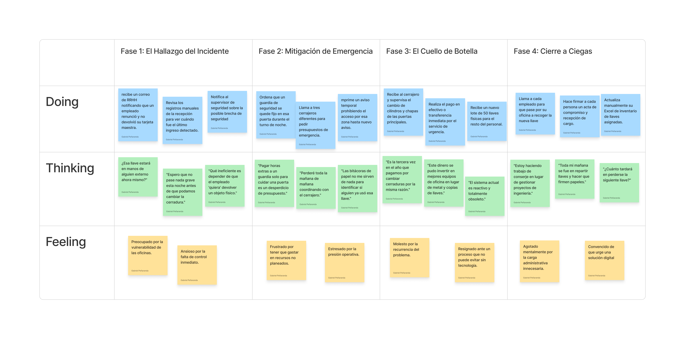

#### B. As-is Scenario Map: Valeria Rios (Segmento de Eventos)
**Escenario evaluado:** Control de acceso y validación de aforo durante la "hora pico" de un evento masivo.
Este escenario detalla el momento más crítico para Valeria: la apertura de puertas de un evento utilizando listas de Excel impresas y validación manual. Se destacan las acciones de su personal de seguridad (staff), la frustración ante la lentitud del proceso, la presión por las largas colas de asistentes y la imposibilidad de tener un conteo real del aforo en tiempo real para reportar a Defensa Civil.

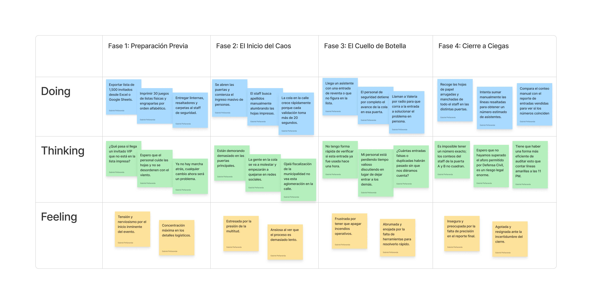

## 2.4. Big Picture Event Storming

En esta sección, el equipo introduce y resume el proceso colaborativo realizado para entender el dominio del negocio de **SmartLock**. Durante la sesión, nos enfocamos en identificar los eventos significativos, procesos clave y las relaciones entre ellos, permitiéndonos mapear el flujo completo desde que un usuario solicita un acceso hasta que la cerradura se activa mediante el código QR dinámico.

Esta primera aproximación visual de alto nivel nos permitió explorar el landscape del negocio, exponiendo potenciales problemas de sincronización y validación, así como oportunidades para optimizar la experiencia del usuario final al eliminar la dependencia de hardware físico tradicional.

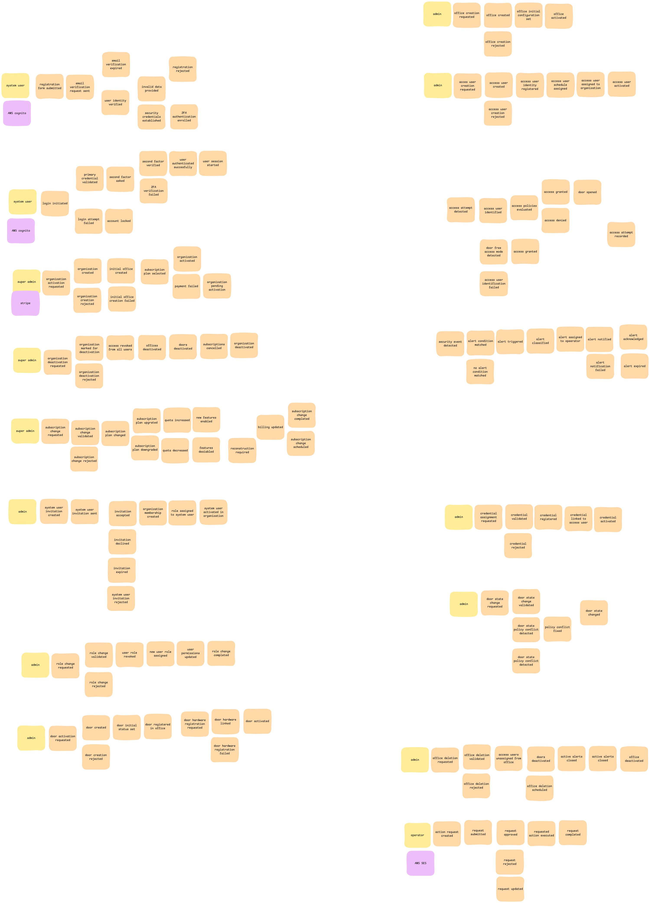

**Explicación de las etapas:**
* **Identificación de Eventos de Dominio:** Plasmamos en color naranja todos los sucesos relevantes (ej. QR generado, Acceso validado).
* **Ordenamiento Cronológico:** Organizamos los eventos en una línea de tiempo para asegurar la coherencia del proceso.
* **Identificación de Hotspots:** Marcamos puntos críticos o dudas técnicas que requieren mayor análisis.
* **Definición de Actores y Sistemas:** Vinculamos los eventos con los usuarios (clientes/visitantes) y sistemas externos (servicios de nube y dispositivos IoT).

## 2.5. Ubiquitous Language

En esta sección se define el **Lenguaje Ubicuo (Ubiquitous Language)** del proyecto, un concepto clave dentro de la arquitectura orientada al dominio (Domain-Driven Design). El objetivo es establecer un vocabulario estandarizado y compartido entre los desarrolladores y los expertos del negocio para evitar ambigüedades. A continuación, se detallan los términos en inglés organizados por sus respectivos contextos (*Bounded Contexts*).

### IAM
- User: Persona registrada en la plataforma. Tiene email, contraseña, nombre completo y una suscripción activa
- SignUp: Proceso de registro de un nuevo usuario (firstName, lastName, email, password)
- SignIn: Proceso de autenticación con email y password; devuelve un token JWT
- Authenticated User: Usuario autenticado que porta un token de sesión
### Space Management
- Organization: Entidad raíz (tenant). Contenedor de sites, people, devices, roles y access groups. Todo pertenece a una organización
- Site: Ubicación física (edificio, piso, sala) dentro de una organización donde se instalan dispositivos
- Person: Individuo (empleado, contratista) registrado en una organización. Tiene nombre completo y documento de identidad de 8 dígitos. Puede pertenecer a un grupo de acceso
- Device: Cerradura inteligente o dispositivo IoT instalado en un site
- Device Status: Estado de conectividad: ONLINE (operativo) u OFFLINE (desconectado)
- Device Mode: Modo operativo de la cerradura: FREE (paso libre), BLOCKED (bloqueado), SECURITY (seguridad reforzada)
### Administration
- Role: Conjunto nombrado de permisos dentro de una organización. Tipos: Root (todos los permisos, no eliminable), Basic (sin permisos, no eliminable), o personalizado (eliminable)
- Role Permissions: Permisos granulares: canCreateSites, canCreatePeople, canConnectDevices
- Membership: Asociación entre un User y un Role en una organización. Define qué puede hacer el usuario en ese contexto
- Invitation: Invitación enviada a un usuario para unirse a una organización con un rol específico. Tiene estado y fecha
### Access
- Access Group: Grupo nombrado que categoriza personas para fines de control de acceso. Pertenece a una organización
- Person Access: Vincula una Person a un AccessGroup con un estado (ENABLED o DISABLED). Relación uno a uno con Person
- Person Access Status: ENABLED (acceso activo) o DISABLED (acceso revocado/suspendido)
- Access Schedule: Asignación de un AccessGroup a un Device específico, definiendo cuándo ese grupo puede acceder a ese dispositivo
- Access Schedule Day: Día concreto dentro de un Access Schedule, con nombre y bloque horario (start/end)
- Scheduled Mode Change — Cambio automático programado del modo de un dispositivo en una fecha y hora específica (ej. pasar a BLOCKED a las 22:00)
### Report
- AccessEvent: Registro de un acceso a un dispositivo. Tiene dirección (IN/OUT) e indica si ocurrió fuera de horario (out_of_schedule)
- Direction: Sentido del acceso: entrada o salida
- Out Of Schedule: Indica si el acceso ocurrió fuera del horario permitido
- Alert: Alerta de seguridad asociada a un site. Tiene fecha, estado de resolución y comentario
- Resolved: Si la alerta ya fue atendida
- Schedule Day: Entrada de horario semanal: asigna a una persona un día de la semana y un bloque horario para acceso programado
### Billing
- Plan: Plan de suscripción con nombre y límite de organizaciones (organizations_limit)
- Subscription: Vincula un User a un Plan. Registra la fecha de pago (payment_date_time)
- Organizations Limit: Cantidad máxima de organizaciones que un usuario puede crear según su plan

# Capítulo III: Requirements Specification

## 3.1. User Stories

---
# Historias de Usuario — SmartLock

### Historias de Usuario Funcionales

| ID | Título | Descripción | Criterios de Aceptación | Epic |
|----|--------|-------------|--------------------------|------|
| HU-01 | Registro de usuario | Como usuario nuevo, quiero poder registrarme en la plataforma proporcionando mi nombre, apellido, correo electrónico y contraseña para crear una cuenta en el sistema. | Given soy un usuario no registrado When ingreso mi nombre, apellido, email y contraseña válidos en el formulario de registro Then el sistema crea mi cuenta y devuelve HTTP 201 con mis datos de usuario (id, nombre, apellido, email)  Given soy un usuario no registrado When ingreso un email que ya está registrado en el sistema Then el sistema devuelve HTTP 409 con un mensaje indicando que el email ya está en uso  Given soy un usuario no registrado When dejo cualquiera de los campos obligatorios vacío (nombre, apellido, email o contraseña) Then el sistema devuelve HTTP 400 con los mensajes de validación correspondientes por campo  Given soy un usuario no registrado When ingreso un email con formato inválido (sin @, sin dominio) Then el sistema devuelve HTTP 400 indicando formato de email incorrecto  Given soy un usuario no registrado When ingreso una contraseña con menos de 6 caracteres Then el sistema devuelve HTTP 400 indicando que la contraseña debe tener al menos 6 caracteres | EP-01 |
| HU-02 | Inicio de sesión | Como usuario registrado, quiero autenticarme con mi correo electrónico y contraseña para obtener un token JWT que me permita acceder a las funcionalidades protegidas. | Given tengo una cuenta registrada y activa When ingreso mi email y contraseña correctos en el formulario de inicio de sesión Then el sistema devuelve HTTP 200 con un token JWT, mis datos de usuario y la fecha de expiración del token  Given tengo una cuenta registrada When ingreso mi email correcto pero una contraseña incorrecta Then el sistema devuelve HTTP 401 con un mensaje de credenciales inválidas  Given no tengo una cuenta registrada When intento iniciar sesión con un email no registrado Then el sistema devuelve HTTP 401 con un mensaje de credenciales inválidas sin revelar si el email existe o no  Given estoy en el formulario de inicio de sesión When envío el formulario con el campo email o contraseña vacíos Then el sistema devuelve HTTP 400 con mensajes de validación | EP-01 |
| HU-03 | Persistencia de sesión | Como usuario autenticado, quiero que mi sesión se mantenga al recargar la página para no tener que iniciar sesión nuevamente mientras mi token JWT siga vigente. | Given inicié sesión previamente y mi token JWT está almacenado en localStorage When recargo la página o reabro la aplicación en el navegador Then el sistema lee el token de localStorage, restaura mi sesión automáticamente y me muestra la página de inicio  Given tengo un token JWT almacenado que ya ha expirado When intento acceder a cualquier ruta protegida Then el sistema elimina el token expirado del almacenamiento y me redirige a la pantalla de inicio de sesión  Given no tengo ningún token almacenado en localStorage When intento acceder a cualquier ruta protegida Then el sistema me redirige inmediatamente a la pantalla de inicio de sesión  Given tengo un token almacenado que ha sido corrompido o manipulado When el sistema intenta decodificar el token al restaurar la sesión Then el sistema descarta el token inválido y me redirige al inicio de sesión | EP-01 |
| HU-04 | Cierre de sesión | Como usuario autenticado, quiero poder cerrar sesión para que mi token JWT sea eliminado del almacenamiento local y quede desprotegido el acceso. | Given estoy con sesión iniciada en la aplicación When selecciono la opción "Cerrar sesión" desde el menú de usuario en la barra superior Then el sistema elimina mi token JWT de localStorage, limpia mi estado de usuario y me redirige a la pantalla de inicio de sesión  Given acabo de cerrar sesión When intento navegar manualmente a una URL protegida como /home u /operations Then el sistema me redirige a /auth/sign-in porque ya no hay token válido  Given tengo la aplicación abierta en dos pestañas del navegador When cierro sesión en una de las pestañas Then al interactuar en la otra pestaña, cualquier petición a la API falla por falta de token y soy redirigido al inicio de sesión | EP-01 |
| HU-05 | Crear organización | Como usuario autenticado, quiero crear una nueva organización proporcionando su nombre y descripción para comenzar a gestionar mis espacios y dispositivos. | Given estoy autenticado y en la página de inicio When completo el formulario con un nombre y descripción válidos y confirmo la creación Then el sistema crea la organización, me asigna como miembro con rol raíz y la muestra en mi lista de organizaciones con HTTP 201  Given estoy en el formulario de creación de organización When envío el formulario con el campo nombre vacío Then el sistema devuelve HTTP 400 indicando que el nombre es obligatorio  Given estoy en el formulario de creación de organización When envío un nombre que excede los 100 caracteres permitidos Then el sistema devuelve HTTP 400 indicando la longitud máxima permitida  Given no estoy autenticado When intento crear una organización mediante el endpoint de la API Then el sistema devuelve HTTP 401 | EP-02 |
| HU-06 | Listar organizaciones | Como usuario autenticado, quiero ver todas las organizaciones a las que pertenezco para seleccionar con cuál deseo trabajar. | Given soy miembro de una o más organizaciones When accedo a la página de inicio (/home) Then el sistema muestra tarjetas con el nombre, propietario y descripción de cada organización a la que pertenezco  Given soy un usuario recién registrado que no pertenece a ninguna organización When accedo a la página de inicio Then el sistema muestra un mensaje indicando que no tengo organizaciones y me invita a crear una  Given selecciono una organización haciendo clic en su tarjeta When el sistema cambia la organización activa Then me redirige al dashboard de operaciones de esa organización y todos los datos (sitios, dispositivos, personas) se cargan en ese contexto  Given soy miembro de múltiples organizaciones When cambio la organización seleccionada desde el menú de navegación Then el sistema actualiza el contexto activo y recarga los datos correspondientes a la nueva organización | EP-02 |
| HU-07 | Actualizar organización | Como propietario de una organización, quiero poder modificar el nombre y la descripción de mi organización para mantener la información actualizada. | Given soy el propietario de una organización When abro el menú de la tarjeta, selecciono editar, modifico el nombre o descripción y confirmo Then el sistema actualiza los datos y devuelve HTTP 200 con la organización actualizada reflejada en la interfaz  Given soy miembro de una organización pero no soy el propietario When intento actualizar los datos de la organización Then el sistema devuelve HTTP 403 indicando que no tengo permisos para modificar la organización  Given estoy editando una organización When intento guardar con el campo nombre vacío Then el sistema devuelve HTTP 400 con el mensaje de validación correspondiente  Given soy el propietario When intento actualizar una organización que ha sido eliminada por otro proceso concurrente Then el sistema devuelve HTTP 404 indicando que la organización no existe | EP-02 |
| HU-08 | Eliminar organización | Como propietario de una organización, quiero poder eliminarla completamente para remover todos sus sitios, dispositivos, personas, roles, grupos de acceso y horarios asociados. | Given soy el propietario de una organización When selecciono la opción de eliminar, confirmo en el diálogo de confirmación Then el sistema elimina la organización y todos sus recursos asociados en cascada, devuelve HTTP 204 y la organización desaparece de mi lista  Given se me muestra el diálogo de confirmación para eliminar la organización When cancelo la acción en el diálogo Then la organización no se elimina y permanece en mi lista sin cambios  Given soy miembro pero no propietario de la organización When intento eliminar la organización Then el sistema devuelve HTTP 403 indicando permisos insuficientes  Given soy el propietario When intento eliminar una organización que ya no existe Then el sistema devuelve HTTP 404 | EP-02 |
| HU-09 | Añadir sitio a organización | Como administrador de una organización, quiero añadir un nuevo sitio físico (edificio, piso, sala) proporcionando su nombre y descripción para organizar mis dispositivos por ubicación. | Given tengo una organización seleccionada y permisos de administración When completo el formulario con nombre y descripción del sitio y confirmo Then el sistema crea el sitio, lo asocia a la organización y devuelve HTTP 201 con los datos del sitio creado  Given estoy en el formulario de creación de sitio When envío el formulario con el campo nombre vacío Then el sistema devuelve HTTP 400 indicando que el nombre es obligatorio  Given tengo una organización seleccionada When intento crear un sitio con un nombre que excede 100 caracteres Then el sistema devuelve HTTP 400 con el error de validación de longitud  Given no tengo permisos de administración en la organización When intento añadir un sitio Then el sistema devuelve HTTP 403 indicando permisos insuficientes | EP-02 |
| HU-10 | Listar sitios | Como administrador, quiero ver todos los sitios de la organización seleccionada en una tabla con su identificador, nombre y descripción para gestionarlos. | Given tengo una organización seleccionada que contiene sitios When navego a la vista de sitios (/operations/sites) Then el sistema muestra una tabla con columnas ID, Nombre y Descripción para cada sitio de la organización  Given tengo una organización seleccionada que no tiene sitios creados When navego a la vista de sitios Then el sistema muestra la tabla vacía con un mensaje indicando que no hay sitios registrados  Given estoy viendo la tabla de sitios When cambio la organización seleccionada desde otra vista Then la tabla se actualiza automáticamente para mostrar los sitios de la nueva organización | EP-02 |
| HU-11 | Actualizar sitio | Como administrador, quiero editar el nombre y la descripción de un sitio existente directamente desde la tabla para corregir o actualizar su información. | Given estoy en la tabla de sitios con permisos de administración When activo la edición en línea de un sitio, modifico su nombre o descripción y guardo los cambios Then el sistema actualiza el sitio, devuelve HTTP 200 y los cambios se reflejan inmediatamente en la tabla  Given estoy editando un sitio en línea When dejo el campo nombre vacío y guardo Then el sistema devuelve HTTP 400 con el error de validación y la edición no se aplica  Given estoy editando un sitio en línea When cancelo la edición sin guardar Then los campos revierten a sus valores originales y no se realiza ninguna petición al servidor  Given soy administrador When intento actualizar un sitio que fue eliminado por otro usuario concurrentemente Then el sistema devuelve HTTP 404 y muestra un mensaje de error | EP-02 |
| HU-12 | Eliminar sitio | Como administrador, quiero eliminar un sitio que ya no se utiliza para removerlo junto con todos sus dispositivos asociados. | Given estoy en la tabla de sitios con permisos de administración When selecciono la opción eliminar en un sitio y confirmo la acción Then el sistema elimina el sitio y todos sus dispositivos asociados en cascada y devuelve HTTP 204  Given se me muestra la confirmación de eliminación de un sitio When cancelo la acción Then el sitio no se elimina y permanece en la tabla  Given soy administrador When intento eliminar un sitio que ya no existe Then el sistema devuelve HTTP 404  Given no tengo permisos de administración When intento eliminar un sitio Then el sistema devuelve HTTP 403 | EP-02 |
| HU-13 | Conectar dispositivo a sitio | Como administrador, quiero registrar un nuevo dispositivo smart lock en un sitio existente proporcionando su nombre y modo de operación para monitorearlo. | Given tengo una organización con sitios creados y permisos de administración When completo el formulario con nombre del dispositivo, selecciono el sitio destino y elijo el modo de operación Then el sistema registra el dispositivo, lo asocia al sitio seleccionado y devuelve HTTP 201  Given estoy en el formulario de creación de dispositivo When envío el formulario con el campo nombre vacío Then el sistema devuelve HTTP 400 indicando que el nombre es obligatorio  Given estoy en el formulario de creación de dispositivo When selecciono un sitio que no existe o no pertenece a mi organización Then el sistema devuelve HTTP 404 o 400 indicando que el sitio no es válido  Given estoy en el formulario de creación de dispositivo When no selecciono ningún sitio del listado desplegable Then el sistema devuelve HTTP 400 indicando que el sitio es obligatorio | EP-02 |
| HU-14 | Listar dispositivos | Como administrador, quiero ver todos los dispositivos de la organización en una tabla con su identificador, nombre, sitio, estado y modo para monitorear su operación. | Given tengo una organización seleccionada con dispositivos registrados When navego a la vista de dispositivos (/operations/devices) Then el sistema muestra una tabla con columnas ID, Nombre, Sitio, Estado y Modo para cada dispositivo  Given tengo una organización sin dispositivos registrados When navego a la vista de dispositivos Then el sistema muestra la tabla vacía con un mensaje indicando que no hay dispositivos  Given estoy en la vista de dispositivos When la tabla se carga Then el estado de cada dispositivo se muestra con un badge de color (verde para activo, rojo para inactivo, amarillo para mantenimiento, gris para desconocido) | EP-02 |
| HU-15 | Actualizar información de dispositivo | Como administrador, quiero editar el nombre, sitio, modo o estado de un dispositivo desde la tabla para mantener su configuración al día. | Given estoy en la tabla de dispositivos con permisos de administración When activo la edición en línea de un dispositivo, modifico su nombre, sitio, estado o modo y guardo Then el sistema actualiza el dispositivo, devuelve HTTP 200 y la tabla refleja los cambios  Given estoy editando un dispositivo When intento guardar con el campo nombre vacío Then el sistema devuelve HTTP 400 y la edición no se aplica  Given estoy editando un dispositivo When intento asignarlo a un sitio que no pertenece a la organización activa Then el sistema devuelve HTTP 400 o 404 indicando que el sitio no es válido  Given estoy editando un dispositivo When cancelo la edición sin guardar Then los campos revierten a sus valores originales | EP-02 |
| HU-16 | Eliminar dispositivo | Como administrador, quiero eliminar un dispositivo que ya no está en uso para removerlo del sistema. | Given estoy en la tabla de dispositivos con permisos de administración When selecciono eliminar en un dispositivo y confirmo Then el sistema elimina el dispositivo y devuelve HTTP 204, desapareciendo de la tabla  Given se me muestra la confirmación para eliminar un dispositivo When cancelo la acción Then el dispositivo no se elimina y permanece en la tabla  Given soy administrador When intento eliminar un dispositivo que ya fue eliminado Then el sistema devuelve HTTP 404  Given no tengo permisos de administración When intento eliminar un dispositivo Then el sistema devuelve HTTP 403 | EP-02 |
| HU-17 | Añadir persona a organización | Como administrador, quiero registrar una nueva persona en la organización proporcionando su nombre, apellido y documento de identidad para gestionar su acceso. | Given tengo una organización seleccionada y permisos de administración When completo el formulario con nombre, apellido y documento de identidad de la persona y confirmo Then el sistema registra la persona en la organización, dispara los eventos de creación de horario y acceso, y devuelve HTTP 201  Given estoy en el formulario de creación de persona When envío con el campo nombre vacío Then el sistema devuelve HTTP 400 indicando que el nombre es obligatorio  Given estoy en el formulario de creación de persona When envío con el campo apellido vacío Then el sistema devuelve HTTP 400 indicando que el apellido es obligatorio  Given estoy en el formulario de creación de persona When envío un documento de identidad que ya existe en la organización Then el sistema devuelve HTTP 409 indicando que la persona ya está registrada  Given estoy en el formulario de creación de persona When envío el formulario con el campo documento de identidad vacío Then el sistema devuelve HTTP 400 indicando que el documento es obligatorio | EP-02 |
| HU-18 | Listar personas | Como administrador, quiero ver todas las personas registradas en la organización en una tabla con su identificador, nombre, apellido y documento para gestionarlas. | Given tengo una organización seleccionada con personas registradas When navego a la vista de personas (/operations/people) Then el sistema muestra una tabla con columnas ID, Nombre, Apellido y Documento de Identidad para cada persona  Given tengo una organización sin personas registradas When navego a la vista de personas Then el sistema muestra la tabla vacía con un mensaje indicando que no hay personas registradas  Given estoy en la vista de personas con datos cargados When escribo en la barra de búsqueda parte del nombre o documento de una persona Then la tabla filtra en tiempo real mostrando solo las filas que coinciden con el texto ingresado | EP-02 |
| HU-19 | Actualizar persona | Como administrador, quiero editar el nombre, apellido o documento de identidad de una persona desde la tabla para corregir sus datos. | Given estoy en la tabla de personas con permisos de administración When activo la edición en línea de una persona, modifico su nombre, apellido o documento y guardo Then el sistema actualiza los datos, devuelve HTTP 200 y la tabla refleja los cambios  Given estoy editando una persona When intento guardar con el campo nombre o apellido vacío Then el sistema devuelve HTTP 400 y la edición no se aplica  Given estoy editando una persona When cambio el documento de identidad a uno que ya pertenece a otra persona en la misma organización Then el sistema devuelve HTTP 409 indicando duplicidad de documento  Given estoy editando una persona When cancelo la edición sin guardar Then los campos revierten a sus valores originales | EP-02 |
| HU-20 | Eliminar persona | Como administrador, quiero eliminar una persona que ya no pertenece a la organización para revocar todo su acceso y horarios asociados. | Given estoy en la tabla de personas con permisos de administración When selecciono eliminar en una persona y confirmo Then el sistema elimina la persona junto con sus horarios (scheduleDays) y registro de acceso (personAccess), y devuelve HTTP 204  Given se me muestra la confirmación para eliminar una persona When cancelo la acción Then la persona no se elimina y permanece en la tabla  Given soy administrador When intento eliminar una persona que ya fue eliminada Then el sistema devuelve HTTP 404  Given elimino una persona que tenía asignado un grupo de acceso When se completa la eliminación Then su registro de acceso también se elimina y el grupo de acceso ya no la referencia | EP-02 |
| HU-21 | Crear grupo de acceso | Como administrador, quiero crear un grupo de acceso con un nombre y descripción para clasificar y organizar los permisos de entrada a distintos espacios. | Given tengo una organización seleccionada y permisos de administración When completo el formulario con nombre y descripción del grupo de acceso y confirmo Then el sistema crea el grupo, lo asocia a la organización y devuelve HTTP 201  Given estoy en el formulario de creación de grupo de acceso When envío el formulario con el campo nombre vacío Then el sistema devuelve HTTP 400 indicando que el nombre es obligatorio  Given estoy en el formulario de creación de grupo de acceso When intento crear un grupo con un nombre que ya existe en la misma organización Then el sistema devuelve HTTP 409 indicando que el nombre ya está en uso  Given estoy en el formulario de creación de grupo de acceso When envío un nombre que excede los 100 caracteres Then el sistema devuelve HTTP 400 con error de validación de longitud | EP-03 |
| HU-22 | Listar grupos de acceso | Como administrador, quiero ver todos los grupos de acceso de la organización en una tabla con su identificador, nombre y descripción para gestionarlos. | Given tengo una organización seleccionada con grupos de acceso creados When navego a la vista de grupos de acceso (/operations/access-groups) Then el sistema muestra una tabla con columnas ID, Nombre y Descripción para cada grupo  Given tengo una organización sin grupos de acceso When navego a la vista de grupos de acceso Then el sistema muestra la tabla vacía con un mensaje indicando que no hay grupos de acceso  Given cambio la organización seleccionada When el sistema detecta el cambio Then la tabla de grupos de acceso se actualiza automáticamente para mostrar los grupos correspondientes a la nueva organización | EP-03 |
| HU-23 | Asignar persona a grupo de acceso | Como administrador, quiero asignar una persona registrada a un grupo de acceso específico para definir qué espacios puede acceder. | Given tengo una persona y un grupo de acceso en la misma organización When vinculo la persona al grupo de acceso mediante el endpoint correspondiente Then el sistema crea el registro PersonAccess con estado activo y devuelve HTTP 201  Given una persona ya está asignada a otro grupo de acceso When intento asignarla a un nuevo grupo de acceso Then el sistema devuelve HTTP 409 indicando que la persona ya tiene un grupo de acceso asignado  Given intento asignar una persona a un grupo de acceso When la persona y el grupo pertenecen a organizaciones diferentes Then el sistema devuelve HTTP 400 indicando que deben pertenecer a la misma organización  Given intento asignar una persona a un grupo de acceso When la persona no existe en el sistema Then el sistema devuelve HTTP 404 | EP-03 |
| HU-24 | Cambiar estado de acceso de persona | Como administrador, quiero cambiar el estado de acceso de una persona (activo, suspendido, revocado) para controlar su capacidad de ingresar a los espacios protegidos. | Given una persona tiene un registro PersonAccess activo When cambio su estado a suspendido Then el sistema actualiza el estado y devuelve HTTP 200. Los dispositivos rechazarán el acceso de esta persona  Given una persona tiene un registro PersonAccess suspendido When cambio su estado a revocado Then el sistema actualiza el estado y devuelve HTTP 200. La persona no podrá acceder a ningún espacio  Given una persona tiene un registro PersonAccess activo When intento cambiar su estado a un valor inválido no contemplado en el sistema Then el sistema devuelve HTTP 400 indicando que el estado no es válido  Given intento cambiar el estado de acceso de una persona When la persona no tiene ningún registro PersonAccess asignado Then el sistema devuelve HTTP 404 indicando que no existe registro de acceso para esa persona  Given una persona con acceso revocado When intenta acceder a un espacio protegido por un dispositivo smart lock Then el dispositivo rechaza la entrada y registra un evento de acceso denegado | EP-03 |
| HU-25 | Crear rol con permisos | Como administrador, quiero crear un rol personalizado con permisos específicos (crear sitios, crear personas, conectar dispositivos) para delegar responsabilidades a otros miembros. | Given tengo una organización seleccionada y permisos de administración When completo el formulario con nombre del rol y activo los permisos deseados (canCreateSites, canCreatePeople, canConnectDevices) y confirmo Then el sistema crea el rol con los permisos configurados y devuelve HTTP 201  Given estoy en el formulario de creación de rol When envío el formulario con el campo nombre vacío Then el sistema devuelve HTTP 400 indicando que el nombre es obligatorio  Given estoy en el formulario de creación de rol When intento crear un rol con un nombre que ya existe en la misma organización Then el sistema devuelve HTTP 409 indicando duplicidad de nombre  Given estoy en el formulario de creación de rol When envío el formulario sin activar ningún permiso Then el sistema crea el rol igualmente con todos los permisos en false y devuelve HTTP 201 | EP-04 |
| HU-26 | Listar roles | Como administrador, quiero ver todos los roles definidos en la organización en una tabla con su identificador, nombre y permisos para gestionarlos. | Given tengo una organización seleccionada con roles creados When navego a la vista de roles (/operations/roles) Then el sistema muestra una tabla con columnas ID, Nombre y los tres permisos (Crear Sitios, Crear Personas, Conectar Dispositivos) para cada rol  Given tengo una organización recién creada When navego a la vista de roles Then el sistema muestra al menos el rol raíz (Root Role) creado automáticamente al fundar la organización  Given tengo una organización sin roles adicionales When navego a la vista de roles Then el rol raíz se marca como no eliminable (deletable=false) | EP-04 |
| HU-27 | Actualizar rol | Como administrador, quiero modificar el nombre o los permisos de un rol existente desde la tabla para ajustar sus capacidades. | Given estoy en la tabla de roles con permisos de administración When activo la edición en línea de un rol, modifico su nombre o activo/desactivo permisos y guardo Then el sistema actualiza el rol, devuelve HTTP 200 y todos los usuarios con ese rol heredan los cambios de permisos  Given estoy editando un rol When intento guardar con el campo nombre vacío Then el sistema devuelve HTTP 400 y la edición no se aplica  Given estoy editando un rol When intento modificar el rol raíz (deletable=false) eliminando todos sus permisos Then el sistema permite la edición de permisos del rol raíz pero mantiene la restricción de no poder eliminarlo  Given estoy editando un rol Cuando intento cambiar el nombre a uno que ya existe en la organización Then el sistema devuelve HTTP 409 | EP-04 |
| HU-28 | Listar usuarios de organización | Como administrador, quiero ver todos los usuarios que pertenecen a mi organización con su rol asignado para conocer quiénes tienen acceso y con qué permisos. | Given tengo una organización seleccionada con miembros When navego a la vista de administradores (/operations/administrators) Then el sistema muestra una tabla con columnas ID, Nombre, Email y Rol para cada usuario miembro de la organización  Given soy el único miembro de la organización When navego a la vista de administradores Then el sistema me muestra como el único administrador listado con mi rol asignado  Given cambio de organización seleccionada When el sistema detecta el cambio Then la tabla de administradores se actualiza para mostrar los miembros de la nueva organización | EP-04 |
| HU-29 | Asignar rol a usuario | Como administrador, quiero cambiar el rol de un usuario dentro de la organización para otorgarle o revocarle permisos específicos. | Given hay usuarios registrados en mi organización When selecciono un nuevo rol para un usuario desde la tabla de administradores y confirmo Then el sistema actualiza la membresía del usuario con el nuevo rol y devuelve HTTP 200  Given estoy asignando un rol a un usuario When el usuario no pertenece a la organización Then el sistema devuelve HTTP 404 indicando que el usuario no es miembro  Given estoy asignando un rol a un usuario When el rol seleccionado no pertenece a la organización Then el sistema devuelve HTTP 404 indicando que el rol no existe en la organización  Given estoy en la tabla de administradores When filtro por rol usando el control desplegable Then la tabla muestra solo los usuarios que tienen el rol seleccionado | EP-04 |
| HU-30 | Invitar administrador | Como administrador, quiero invitar a un nuevo usuario mediante su correo electrónico y asignarle un rol para incorporarlo a la organización. | Given tengo una organización seleccionada When completo el formulario con el email de un usuario registrado y el rol que tendrá, y confirmo Then el sistema crea la membresía del usuario en la organización y el usuario aparece en la lista de administradores  Given estoy en el formulario de invitación When ingreso un email con formato inválido Then el sistema devuelve HTTP 400 indicando formato de email incorrecto  Given estoy en el formulario de invitación When intento invitar a un usuario que ya es miembro de la organización Then el sistema devuelve HTTP 409 indicando que el usuario ya pertenece a la organización  Given estoy en el formulario de invitación When el email ingresado no corresponde a ningún usuario registrado en la plataforma Then el sistema devuelve HTTP 404 indicando que el usuario no existe y debe registrarse primero  Given completo la invitación exitosamente When el usuario invitado inicia sesión Then puede ver y seleccionar la nueva organización en su lista | EP-04 |
| HU-31 | Ver dashboard de operaciones | Como administrador, quiero ver un panel de control con las métricas principales de la organización: intentos de acceso recientes, alertas activas, dispositivos fuera de línea y resúmenes informativos. | Given tengo una organización seleccionada When navego al dashboard de operaciones (/operations/dashboard) Then el sistema muestra cuatro secciones: intentos de acceso recientes, alertas activas, dispositivos fuera de línea y tarjetas de resumen informativo  Given mi organización no tiene actividad registrada When navego al dashboard Then las tarjetas de métricas muestran valores en cero y las tablas de actividad aparecen vacías con mensajes informativos  Given estoy en el dashboard When cambia el estado de un dispositivo o se registra un nuevo evento en tiempo real Then los contadores y tablas del dashboard se actualizan para reflejar la información más reciente  Given estoy en el dashboard When hago clic en "Ver más" en cualquiera de las secciones de actividad Then el sistema me redirige a la vista detallada correspondiente (eventos de acceso, alertas o dispositivos) | EP-05 |
| HU-32 | Listar eventos de acceso | Como administrador, quiero ver el historial de eventos de acceso registrados por los dispositivos smart lock con su ubicación, persona, estado y fecha para auditar la actividad. | Given tengo eventos de acceso registrados en el sistema When navego a la vista de eventos de acceso (/operations/access-events) Then el sistema muestra una tabla con columnas ID, Ubicación, Persona, Estado y Fecha para cada evento  Given no existen eventos de acceso registrados When navego a la vista de eventos de acceso Then el sistema muestra la tabla vacía con un mensaje indicando que no hay eventos registrados  Given estoy en la vista de eventos de acceso con muchos registros When la tabla se carga Then los eventos se ordenan por fecha descendente (más recientes primero) y se aplica paginación si el volumen lo requiere | EP-05 |
| HU-33 | Listar alertas del sistema | Como administrador, quiero ver las alertas generadas por el sistema (accesos no autorizados, dispositivos offline, intentos fallidos) con ubicación, persona, estado y fecha para tomar acciones correctivas. | Given existen alertas activas en el sistema When navego a la vista de alertas (/operations/alerts) Then el sistema muestra una tabla con columnas ID, Ubicación, Persona, Estado y Fecha para cada alerta  Given no existen alertas en el sistema When navego a la vista de alertas Then el sistema muestra la tabla vacía con un mensaje indicando que no hay alertas  Given estoy en la vista de alertas When una alerta tiene estado "activa" Then se muestra con un badge de color rojo para destacar su urgencia  Given estoy en la vista de alertas When una alerta tiene estado "resuelta" Then se muestra con un badge de color verde | EP-05 |
| HU-34 | Filtrar eventos de acceso | Como administrador, quiero filtrar los eventos de acceso por tipo y por estado para encontrar rápidamente la información que necesito auditar. | Given estoy en la vista de eventos de acceso con datos cargados When selecciono un filtro de tipo de evento en el control desplegable Then la tabla muestra únicamente los eventos que coinciden con el tipo seleccionado  Given estoy en la vista de eventos de acceso When selecciono un filtro de estado (exitoso, fallido) en el control desplegable Then la tabla muestra solo los eventos con el estado elegido  Given tengo filtros activos de tipo y estado simultáneamente When la tabla se filtra Then solo se muestran los eventos que cumplen ambas condiciones (intersección AND)  Given tengo filtros aplicados y no hay eventos que coincidan When la tabla se renderiza Then el sistema muestra un mensaje indicando que no se encontraron resultados con los filtros actuales  Given tengo filtros aplicados When limpio los filtros o selecciono la opción "Todos" Then la tabla vuelve a mostrar todos los eventos sin filtrar | EP-05 |
| HU-35 | Filtrar alertas | Como administrador, quiero filtrar las alertas por sitio de ocurrencia y por estado para priorizar la atención de incidentes. | Given estoy en la vista de alertas con datos cargados When selecciono un filtro de sitio en el control desplegable Then la tabla muestra únicamente las alertas ocurridas en el sitio seleccionado  Given estoy en la vista de alertas When selecciono un filtro de estado (activa, resuelta) en el control desplegable Then la tabla muestra solo las alertas con el estado elegido  Given tengo filtros de sitio y estado aplicados simultáneamente When la tabla se filtra Then solo se muestran las alertas que cumplen ambas condiciones  Given tengo filtros aplicados que no producen resultados When la tabla se renderiza Then el sistema muestra un mensaje de "sin resultados"  Given tengo filtros aplicados When restablezco los filtros a sus valores por defecto Then la tabla muestra nuevamente todas las alertas | EP-05 |
| HU-36 | Asignar horario a persona | Como administrador, quiero configurar los días y bloques horarios en que una persona tiene permitido acceder para restringir su entrada a franjas específicas. | Given una persona está registrada en la organización When asigno un día de la semana y un bloque horario (hora inicio y hora fin) a la persona Then el sistema registra el horario (ScheduleDay) y devuelve HTTP 201. Los dispositivos solo permitirán el acceso de esa persona dentro de la franja definida  Given estoy asignando un horario a una persona When la hora de fin es anterior o igual a la hora de inicio Then el sistema devuelve HTTP 400 indicando que el rango horario no es válido  Given estoy asignando un horario a una persona When intento asignar un día que no es válido (no es un día de la semana) Then el sistema devuelve HTTP 400 con error de validación  Given una persona tiene un horario asignado para un día When intento asignar un nuevo bloque horario que se solapa con uno existente para el mismo día Then el sistema devuelve HTTP 409 indicando conflicto de horarios  Given una persona con horario restringido When intenta acceder fuera de su franja horaria permitida Then el dispositivo smart lock rechaza la entrada y registra un evento de acceso denegado por horario | EP-05 |

### Requisitos No Funcionales

| ID | Título | Descripción | Criterios de Aceptación | Epic |
|----|--------|-------------|--------------------------|------|
| RNF-01 | Autenticación sin estado mediante JWT | El sistema debe autenticar cada petición mediante tokens JWT enviados en el header Authorization: Bearer. Las sesiones son stateless; el servidor no almacena estado de sesión. | Given un usuario tiene un token JWT válido y no expirado When realiza una petición a cualquier endpoint protegido con el header Authorization: Bearer {token} Then el sistema valida la firma del token, extrae la identidad del usuario y permite el acceso  Given un usuario envía un token JWT expirado When realiza una petición a un endpoint protegido Then el sistema devuelve HTTP 401 Unauthorized con un mensaje indicando que la sesión ha expirado  Given un usuario envía un token JWT con firma inválida o manipulado When el sistema intenta validar el token Then el sistema rechaza la petición con HTTP 401 y registra el intento fallido  Given un usuario envía una petición sin el header Authorization When intenta acceder a un endpoint protegido Then el sistema devuelve HTTP 401 indicando que se requiere autenticación  Given el backend se reinicia When un usuario con token válido realiza una petición Then el token sigue siendo válido porque el servidor no mantiene estado de sesión y la validación depende únicamente de la firma JWT | EP-06 |
| RNF-02 | Encriptación de contraseñas con BCrypt | Todas las contraseñas de usuario deben almacenarse encriptadas con el algoritmo BCrypt. El sistema nunca debe almacenar ni transmitir contraseñas en texto plano. | Given un usuario se registra con una contraseña When el sistema almacena sus datos en la base de datos Then la contraseña se guarda aplicando hash BCrypt con salt aleatorio y no puede recuperarse en texto plano  Given un usuario inicia sesión con su contraseña When el sistema verifica la contraseña ingresada Then utiliza BCrypt.matches() para comparar el hash almacenado sin necesidad de desencriptar  Given un administrador consulta la base de datos directamente When revisa la tabla de usuarios Then el campo password contiene únicamente el hash BCrypt, nunca el texto plano  Given se transmiten datos de usuario por la red When el sistema devuelve información de usuario en respuestas API Then el campo password nunca se incluye en las respuestas JSON | EP-06 |
| RNF-03 | Protección de rutas en frontend | La aplicación web debe proteger todas las rutas de operación mediante un guard funcional que verifique la autenticación del usuario y redirija al login si no hay sesión activa. | Given un usuario no autenticado intenta acceder directamente a /home o /operations/dashboard When el router evalúa la ruta solicitada Then el authGuard detecta que no hay token válido y redirige al usuario a /auth/sign-in  Given un usuario autenticado con token válido When navega a cualquier ruta dentro de /home u /operations Then el authGuard permite la navegación sin interrupciones  Given un usuario autenticado cierra sesión When intenta navegar a una ruta protegida usando el historial del navegador Then el authGuard detecta que el token fue eliminado y redirige al login  Given un usuario malicioso intenta acceder a /operations inyectando un token falso en localStorage When el authGuard y el interceptor HTTP procesan la petición Then el backend rechaza el token inválido con 401 y el frontend redirige al login | EP-06 |
| RNF-04 | Internacionalización en español e inglés | La interfaz de usuario debe soportar los idiomas español (es) e inglés (en) mediante archivos de traducción JSON cargados con ngx-translate. El usuario debe poder cambiar el idioma en cualquier momento desde la barra superior. | Given un usuario selecciona español en el selector de idioma de la barra superior When la aplicación carga las traducciones desde /i18n/es.json Then todos los textos de la interfaz (etiquetas, botones, mensajes, títulos de página) se muestran en español  Given un usuario selecciona inglés en el selector de idioma When la aplicación carga las traducciones desde /i18n/en.json Then todos los textos de la interfaz se muestran en inglés  Given un usuario cambia de idioma When la traducción se aplica Then todas las vistas activas se actualizan inmediatamente sin necesidad de recargar la página  Given se añade una nueva funcionalidad a la interfaz When se implementa Then se deben agregar las claves de traducción correspondientes en ambos archivos (en.json y es.json) para que ningún texto quede sin traducir  Given el backend está configurado con i18n When el sistema determina el idioma de las respuestas de error Then utiliza el header Accept-Language de la petición para devolver mensajes en el idioma solicitado (inglés por defecto, español como alternativa) | EP-06 |
| RNF-05 | Documentación de API con Swagger/OpenAPI | La API REST debe documentarse automáticamente con SpringDoc OpenAPI, exponiendo Swagger UI para que los desarrolladores puedan explorar y probar los endpoints interactivamente. | Given el backend está en ejecución en el perfil de desarrollo When un desarrollador accede a /swagger-ui.html desde el navegador Then se muestra la interfaz Swagger UI con todos los endpoints agrupados por controlador, esquemas de request/response documentados y el candado de seguridad JWT Bearer  Given un desarrollador quiere probar un endpoint protegido desde Swagger UI When hace clic en el botón Authorize e ingresa un token JWT válido con el prefijo "Bearer " Then Swagger UI adjunta el header Authorization automáticamente a todas las peticiones de prueba  Given se añade un nuevo endpoint al backend When el código incluye las anotaciones de Swagger adecuadas (@Operation, @ApiResponses) Then el endpoint aparece automáticamente en Swagger UI sin configuración adicional  Given un desarrollador accede a /v3/api-docs Then el sistema devuelve el documento OpenAPI en formato JSON con la especificación completa de la API | EP-06 |
| RNF-06 | Arquitectura DDD y Hexagonal | El código del backend debe seguir los principios de Domain-Driven Design con bounded contexts independientes y arquitectura hexagonal (puertos y adaptadores). El frontend debe reflejar los mismos bounded contexts en su estructura de carpetas. | Given se analiza la estructura del código backend When se revisa cada bounded context (iam, spacemanagement, access, administration, report) Then cada contexto contiene sus propias capas de domain (modelo, repositorios), application (servicios de comando/consulta), infrastructure (persistencia JPA, seguridad) e interfaces (controladores REST) sin dependencias directas a infraestructura de otros contextos  Given dos bounded contexts necesitan comunicarse When uno necesita datos del otro Then la comunicación se realiza a través de facades (ACL) definidas en la capa de interfaces, nunca accediendo directamente a repositorios de otro contexto  Given un desarrollador quiere cambiar la base de datos de MariaDB a PostgreSQL When modifica la capa de infraestructura (entidades JPA, adaptadores de repositorio) Entonces el dominio y la aplicación no requieren cambios porque dependen de interfaces (puertos), no de implementaciones concretas  Given se analiza la estructura del frontend When se revisa src/app/ Then los mismos bounded contexts existen como carpetas independientes (iam, space-management, access, administration, report) con subcapas presentation, application, domain e infrastructure | EP-06 |
| RNF-07 | Auditoría automática de entidades | Todas las entidades persistidas deben registrar automáticamente la fecha de creación (createdAt) y la fecha de última modificación (updatedAt) sin intervención manual del programador. | Given se crea cualquier entidad en el sistema (usuario, organización, sitio, dispositivo, persona, rol, membresía, grupo de acceso, horario) When la entidad se persiste por primera vez en la base de datos Then el campo createdAt se rellena automáticamente con la fecha y hora actual mediante @CreatedDate y @EnableJpaAuditing  Given se modifica cualquier campo de una entidad existente When la entidad se actualiza y se persiste en la base de datos Then el campo updatedAt se actualiza automáticamente con la fecha y hora de la modificación mediante @LastModifiedDate  Given consulto una entidad desde la API When examino la respuesta Then los campos createdAt y updatedAt están disponibles para conocer cuándo fue creada y modificada por última vez  Given un programador crea una nueva entidad manualmente When no establece explícitamente los campos createdAt y updatedAt Then JPA los asigna automáticamente sin intervención manual del desarrollador | EP-06 |
| RNF-08 | Interfaz de usuario responsiva con Angular Material | La aplicación web debe construirse exclusivamente con componentes de Angular Material y ser responsiva, adaptándose correctamente a diferentes tamaños de pantalla. | Given se analiza la composición de la interfaz When se inspeccionan los componentes utilizados en las plantillas Then todas las tablas, formularios, diálogos, botones, barras de herramientas, sidenav, badges y tarjetas están implementados con componentes mat-* de Angular Material (@angular/material y @angular/cdk)  Given un usuario accede desde un dispositivo de escritorio con pantalla grande When la aplicación se renderiza Then el layout muestra la barra lateral de navegación (sidenav) expandida y las tablas ocupan todo el ancho disponible  Given un usuario accede desde un dispositivo móvil o tableta con pantalla reducida When la aplicación se renderiza Then la barra lateral se colapsa en un menú tipo hamburguesa, las tablas permiten scroll horizontal y los formularios se apilan verticalmente  Given un usuario redimensiona la ventana del navegador When la ventana cruza el punto de ruptura responsive Then el layout se reconfigura dinámicamente sin perder funcionalidad ni datos ingresados | EP-06 |
| RNF-09 | Manejo centralizado de errores | Tanto el backend como el frontend deben manejar los errores de forma centralizada, devolviendo respuestas estructuradas con código de error y mensaje descriptivo en todos los casos. | Given ocurre un error de validación (@Valid) en una petición al backend When el GlobalExceptionHandler procesa la excepción MethodArgumentNotValidException Then el sistema devuelve HTTP 400 con un ErrorResource que contiene el código de estado, tipo de error y lista de mensajes de validación por campo  Given ocurre un error de lógica de negocio en el backend (IllegalArgumentException) When el GlobalExceptionHandler procesa la excepción Then el sistema devuelve HTTP 400 con un ErrorResource conteniendo el mensaje descriptivo del error  Given ocurre un error inesperado en el backend (RuntimeException genérica) When el GlobalExceptionHandler procesa la excepción Then el sistema devuelve HTTP 500 con un mensaje genérico sin exponer detalles internos del servidor  Given el frontend recibe una respuesta de error del servidor When el interceptor HTTP global procesa la respuesta Then extrae el mensaje del ErrorResource y lo muestra al usuario en un formato comprensible, redirigiendo al login si el error es 401  Given ocurre un error de red o timeout en el frontend When la petición HTTP falla sin respuesta del servidor Then el sistema muestra un mensaje genérico de error de conexión al usuario | EP-06 |
| RNF-10 | Configuración por entorno | El sistema debe separar la configuración de desarrollo y producción, utilizando variables de entorno para datos sensibles (credenciales de base de datos, secreto JWT) y archivos de properties para configuraciones específicas de cada entorno. | Given el sistema se despliega en entorno de producción When la aplicación Spring Boot se inicia con el perfil "prod" Then las credenciales de base de datos (SMARTLOCK_DATABASE, SMARTLOCK_USER, SMARTLOCK_PASSWORD) y el secreto JWT se obtienen exclusivamente de variables de entorno del sistema, nunca de archivos en texto plano  Given el sistema se ejecuta en entorno de desarrollo When la aplicación se inicia con el perfil "dev" Then se utiliza el archivo application-dev.properties con configuración de desarrollo (show-sql=true, ddl-auto=update) y las credenciales pueden referenciar variables de entorno  Given el frontend se compila para desarrollo con "ng serve" When Angular sustituye los archivos de entorno Then se utiliza environment.development.ts con production=false y todos los endpoint paths definidos explícitamente  Given el frontend se compila para producción con "ng build" When Angular sustituye los archivos de entorno Then se utiliza environment.ts con production=true y solo los endpoint paths esenciales configurados  Given se cambia la URL de la API entre entornos When se actualiza el archivo de entorno correspondiente Then toda la aplicación utiliza la nueva URL sin necesidad de modificar código en los servicios o componentes | EP-06 |

### Requisitos No Funcionales

| ID | Título | Descripción | Criterios de Aceptación | Epic |
|----|--------|-------------|--------------------------|------|
| RNF-01 | Autenticación sin estado mediante JWT | El sistema debe autenticar cada petición mediante tokens JWT enviados en el header Authorization: Bearer. Las sesiones son stateless; el servidor no almacena estado de sesión. | Given un usuario tiene un token JWT válido y no expirado When realiza una petición a cualquier endpoint protegido con el header Authorization: Bearer {token} Then el sistema valida la firma del token, extrae la identidad del usuario y permite el acceso  Given un usuario envía un token JWT expirado When realiza una petición a un endpoint protegido Then el sistema devuelve HTTP 401 Unauthorized con un mensaje indicando que la sesión ha expirado  Given un usuario envía un token JWT con firma inválida o manipulado When el sistema intenta validar el token Then el sistema rechaza la petición con HTTP 401 y registra el intento fallido  Given un usuario envía una petición sin el header Authorization When intenta acceder a un endpoint protegido Then el sistema devuelve HTTP 401 indicando que se requiere autenticación  Given el backend se reinicia When un usuario con token válido realiza una petición Then el token sigue siendo válido porque el servidor no mantiene estado de sesión y la validación depende únicamente de la firma JWT | EP-06 |
| RNF-02 | Encriptación de contraseñas con BCrypt | Todas las contraseñas de usuario deben almacenarse encriptadas con el algoritmo BCrypt. El sistema nunca debe almacenar ni transmitir contraseñas en texto plano. | Given un usuario se registra con una contraseña When el sistema almacena sus datos en la base de datos Then la contraseña se guarda aplicando hash BCrypt con salt aleatorio y no puede recuperarse en texto plano  Given un usuario inicia sesión con su contraseña When el sistema verifica la contraseña ingresada Then utiliza BCrypt.matches() para comparar el hash almacenado sin necesidad de desencriptar  Given un administrador consulta la base de datos directamente When revisa la tabla de usuarios Then el campo password contiene únicamente el hash BCrypt, nunca el texto plano  Given se transmiten datos de usuario por la red When el sistema devuelve información de usuario en respuestas API Then el campo password nunca se incluye en las respuestas JSON | EP-06 |
| RNF-03 | Protección de rutas en frontend | La aplicación web debe proteger todas las rutas de operación mediante un guard funcional que verifique la autenticación del usuario y redirija al login si no hay sesión activa. | Given un usuario no autenticado intenta acceder directamente a /home o /operations/dashboard When el router evalúa la ruta solicitada Then el authGuard detecta que no hay token válido y redirige al usuario a /auth/sign-in  Given un usuario autenticado con token válido When navega a cualquier ruta dentro de /home u /operations Then el authGuard permite la navegación sin interrupciones  Given un usuario autenticado cierra sesión When intenta navegar a una ruta protegida usando el historial del navegador Then el authGuard detecta que el token fue eliminado y redirige al login  Given un usuario malicioso intenta acceder a /operations inyectando un token falso en localStorage When el authGuard y el interceptor HTTP procesan la petición Then el backend rechaza el token inválido con 401 y el frontend redirige al login | EP-06 |
| RNF-04 | Internacionalización en español e inglés | La interfaz de usuario debe soportar los idiomas español (es) e inglés (en) mediante archivos de traducción JSON cargados con ngx-translate. El usuario debe poder cambiar el idioma en cualquier momento desde la barra superior. | Given un usuario selecciona español en el selector de idioma de la barra superior When la aplicación carga las traducciones desde /i18n/es.json Then todos los textos de la interfaz (etiquetas, botones, mensajes, títulos de página) se muestran en español  Given un usuario selecciona inglés en el selector de idioma When la aplicación carga las traducciones desde /i18n/en.json Then todos los textos de la interfaz se muestran en inglés  Given un usuario cambia de idioma When la traducción se aplica Then todas las vistas activas se actualizan inmediatamente sin necesidad de recargar la página  Given se añade una nueva funcionalidad a la interfaz When se implementa Then se deben agregar las claves de traducción correspondientes en ambos archivos (en.json y es.json) para que ningún texto quede sin traducir  Given el backend está configurado con i18n When el sistema determina el idioma de las respuestas de error Then utiliza el header Accept-Language de la petición para devolver mensajes en el idioma solicitado (inglés por defecto, español como alternativa) | EP-06 |
| RNF-05 | Documentación de API con Swagger/OpenAPI | La API REST debe documentarse automáticamente con SpringDoc OpenAPI, exponiendo Swagger UI para que los desarrolladores puedan explorar y probar los endpoints interactivamente. | Given el backend está en ejecución en el perfil de desarrollo When un desarrollador accede a /swagger-ui.html desde el navegador Then se muestra la interfaz Swagger UI con todos los endpoints agrupados por controlador, esquemas de request/response documentados y el candado de seguridad JWT Bearer  Given un desarrollador quiere probar un endpoint protegido desde Swagger UI When hace clic en el botón Authorize e ingresa un token JWT válido con el prefijo "Bearer " Then Swagger UI adjunta el header Authorization automáticamente a todas las peticiones de prueba  Given se añade un nuevo endpoint al backend When el código incluye las anotaciones de Swagger adecuadas (@Operation, @ApiResponses) Then el endpoint aparece automáticamente en Swagger UI sin configuración adicional  Given un desarrollador accede a /v3/api-docs Then el sistema devuelve el documento OpenAPI en formato JSON con la especificación completa de la API | EP-06 |
| RNF-06 | Arquitectura DDD y Hexagonal | El código del backend debe seguir los principios de Domain-Driven Design con bounded contexts independientes y arquitectura hexagonal (puertos y adaptadores). El frontend debe reflejar los mismos bounded contexts en su estructura de carpetas. | Given se analiza la estructura del código backend When se revisa cada bounded context (iam, spacemanagement, access, administration, report) Then cada contexto contiene sus propias capas de domain (modelo, repositorios), application (servicios de comando/consulta), infrastructure (persistencia JPA, seguridad) e interfaces (controladores REST) sin dependencias directas a infraestructura de otros contextos  Given dos bounded contexts necesitan comunicarse When uno necesita datos del otro Then la comunicación se realiza a través de facades (ACL) definidas en la capa de interfaces, nunca accediendo directamente a repositorios de otro contexto  Given un desarrollador quiere cambiar la base de datos de MariaDB a PostgreSQL When modifica la capa de infraestructura (entidades JPA, adaptadores de repositorio) Entonces el dominio y la aplicación no requieren cambios porque dependen de interfaces (puertos), no de implementaciones concretas  Given se analiza la estructura del frontend When se revisa src/app/ Then los mismos bounded contexts existen como carpetas independientes (iam, space-management, access, administration, report) con subcapas presentation, application, domain e infrastructure | EP-06 |
| RNF-07 | Auditoría automática de entidades | Todas las entidades persistidas deben registrar automáticamente la fecha de creación (createdAt) y la fecha de última modificación (updatedAt) sin intervención manual del programador. | Given se crea cualquier entidad en el sistema (usuario, organización, sitio, dispositivo, persona, rol, membresía, grupo de acceso, horario) When la entidad se persiste por primera vez en la base de datos Then el campo createdAt se rellena automáticamente con la fecha y hora actual mediante @CreatedDate y @EnableJpaAuditing  Given se modifica cualquier campo de una entidad existente When la entidad se actualiza y se persiste en la base de datos Then el campo updatedAt se actualiza automáticamente con la fecha y hora de la modificación mediante @LastModifiedDate  Given consulto una entidad desde la API When examino la respuesta Then los campos createdAt y updatedAt están disponibles para conocer cuándo fue creada y modificada por última vez  Given un programador crea una nueva entidad manualmente When no establece explícitamente los campos createdAt y updatedAt Then JPA los asigna automáticamente sin intervención manual del desarrollador | EP-06 |
| RNF-08 | Interfaz de usuario responsiva con Angular Material | La aplicación web debe construirse exclusivamente con componentes de Angular Material y ser responsiva, adaptándose correctamente a diferentes tamaños de pantalla. | Given se analiza la composición de la interfaz When se inspeccionan los componentes utilizados en las plantillas Then todas las tablas, formularios, diálogos, botones, barras de herramientas, sidenav, badges y tarjetas están implementados con componentes mat-* de Angular Material (@angular/material y @angular/cdk)  Given un usuario accede desde un dispositivo de escritorio con pantalla grande When la aplicación se renderiza Then el layout muestra la barra lateral de navegación (sidenav) expandida y las tablas ocupan todo el ancho disponible  Given un usuario accede desde un dispositivo móvil o tableta con pantalla reducida When la aplicación se renderiza Then la barra lateral se colapsa en un menú tipo hamburguesa, las tablas permiten scroll horizontal y los formularios se apilan verticalmente  Given un usuario redimensiona la ventana del navegador When la ventana cruza el punto de ruptura responsive Then el layout se reconfigura dinámicamente sin perder funcionalidad ni datos ingresados | EP-06 |
| RNF-09 | Manejo centralizado de errores | Tanto el backend como el frontend deben manejar los errores de forma centralizada, devolviendo respuestas estructuradas con código de error y mensaje descriptivo en todos los casos. | Given ocurre un error de validación (@Valid) en una petición al backend When el GlobalExceptionHandler procesa la excepción MethodArgumentNotValidException Then el sistema devuelve HTTP 400 con un ErrorResource que contiene el código de estado, tipo de error y lista de mensajes de validación por campo  Given ocurre un error de lógica de negocio en el backend (IllegalArgumentException) When el GlobalExceptionHandler procesa la excepción Then el sistema devuelve HTTP 400 con un ErrorResource conteniendo el mensaje descriptivo del error  Given ocurre un error inesperado en el backend (RuntimeException genérica) When el GlobalExceptionHandler procesa la excepción Then el sistema devuelve HTTP 500 con un mensaje genérico sin exponer detalles internos del servidor  Given el frontend recibe una respuesta de error del servidor When el interceptor HTTP global procesa la respuesta Then extrae el mensaje del ErrorResource y lo muestra al usuario en un formato comprensible, redirigiendo al login si el error es 401  Given ocurre un error de red o timeout en el frontend When la petición HTTP falla sin respuesta del servidor Then el sistema muestra un mensaje genérico de error de conexión al usuario | EP-06 |
| RNF-10 | Configuración por entorno | El sistema debe separar la configuración de desarrollo y producción, utilizando variables de entorno para datos sensibles (credenciales de base de datos, secreto JWT) y archivos de properties para configuraciones específicas de cada entorno. | Given el sistema se despliega en entorno de producción When la aplicación Spring Boot se inicia con el perfil "prod" Then las credenciales de base de datos (SMARTLOCK_DATABASE, SMARTLOCK_USER, SMARTLOCK_PASSWORD) y el secreto JWT se obtienen exclusivamente de variables de entorno del sistema, nunca de archivos en texto plano  Given el sistema se ejecuta en entorno de desarrollo When la aplicación se inicia con el perfil "dev" Then se utiliza el archivo application-dev.properties con configuración de desarrollo (show-sql=true, ddl-auto=update) y las credenciales pueden referenciar variables de entorno  Given el frontend se compila para desarrollo con "ng serve" When Angular sustituye los archivos de entorno Then se utiliza environment.development.ts con production=false y todos los endpoint paths definidos explícitamente  Given el frontend se compila para producción con "ng build" When Angular sustituye los archivos de entorno Then se utiliza environment.ts con production=true y solo los endpoint paths esenciales configurados  Given se cambia la URL de la API entre entornos When se actualiza el archivo de entorno correspondiente Then toda la aplicación utiliza la nueva URL sin necesidad de modificar código en los servicios o componentes | EP-06 |

---

### Definición de Epics (Módulos Generales)
| ID | Título | Descripción |
|----|--------|-------------|
| EP-01 | Autenticación y Gestión de Identidad | Funcionalidades que permiten a los usuarios registrarse, iniciar sesión, mantener la sesión activa mediante tokens JWT y cerrar sesión en el sistema SmartLock. |
| EP-02 | Gestión de Espacios | Módulo central que permite crear, listar, actualizar y eliminar organizaciones, sitios físicos, dispositivos smart lock y personas con acceso a las instalaciones. Establece la jerarquía organización → sitio → dispositivo → persona. |
| EP-03 | Control de Acceso | Funcionalidades para definir grupos de acceso, asignar personas a dichos grupos y gestionar el estado de acceso de cada persona a los espacios protegidos por dispositivos smart lock. |
| EP-04 | Administración de Roles y Usuarios | Gestión de roles con permisos específicos (crear sitios, crear personas, conectar dispositivos), membresías de usuarios en organizaciones, asignación de roles e invitación de administradores. |
| EP-05 | Reportes, Monitoreo y Horarios | Visualización de dashboard con métricas clave, consulta de eventos de acceso, gestión de alertas del sistema y asignación de horarios de acceso por persona y día de la semana. |
| EP-06 | Requisitos Transversales del Sistema | Requisitos no funcionales que abarcan seguridad, rendimiento, usabilidad, internacionalización, documentación técnica, arquitectura y estándares de calidad del sistema completo. |

## 3.2. Impact Mapping

  

 

## 3.3. Product Backlog Priorizado

| Orden | ID | Título | Descripción | Story Points |
|--------|-----|--------|-------------|--------------|
| 1 | HU-01 | Registro de usuario | Como usuario nuevo, quiero poder registrarme en la plataforma proporcionando mi nombre, apellido, correo electrónico y contraseña para crear una cuenta en el sistema. | 3 |
| 2 | HU-02 | Inicio de sesión | Como usuario registrado, quiero autenticarme con mi correo electrónico y contraseña para obtener un token JWT que me permita acceder a las funcionalidades protegidas. | 3 |
| 3 | HU-03 | Persistencia de sesión | Como usuario autenticado, quiero que mi sesión se mantenga al recargar la página para no tener que iniciar sesión nuevamente mientras mi token JWT siga vigente. | 2 |
| 4 | HU-04 | Cierre de sesión | Como usuario autenticado, quiero poder cerrar sesión para que mi token JWT sea eliminado del almacenamiento local y quede desprotegido el acceso. | 1 |
| 5 | TS-01 | Implementar endpoint de registro de usuarios | Como developer, necesito implementar el endpoint REST POST /api/v1/authentication/sign-up que reciba datos de registro, valide campos, encripte la contraseña con BCrypt, persista el usuario y devuelva HTTP 201. | 3 |
| 6 | TS-02 | Implementar endpoint de inicio de sesión | Como developer, necesito implementar el endpoint REST POST /api/v1/authentication/sign-in que reciba email y contraseña, delegue a Spring Security con BCrypt, genere un token JWT y devuelva HTTP 200. | 3 |
| 7 | TS-03 | Implementar filtro de autorización JWT en el pipeline de Spring Security | Como developer, necesito implementar el filtro BearerAuthorizationRequestFilter que intercepte cada petición HTTP, extraiga el token JWT del header Authorization, lo valide y establezca el SecurityContext. | 5 |
| 8 | RNF-01 | Autenticación sin estado mediante JWT | El sistema debe autenticar cada petición mediante tokens JWT en el header Authorization: Bearer. Las sesiones son stateless; el servidor no almacena estado de sesión. | 5 |
| 9 | RNF-02 | Encriptación de contraseñas con BCrypt | Todas las contraseñas de usuario deben almacenarse encriptadas con BCrypt. El sistema nunca debe almacenar ni transmitir contraseñas en texto plano. | 5 |
| 10 | RNF-03 | Protección de rutas en frontend | La aplicación web debe proteger todas las rutas de operación mediante un guard funcional que verifique la autenticación y redirija al login si no hay sesión activa. | 3 |
| 11 | TS-04 | Implementar manejo centralizado de errores REST | Como developer, necesito implementar la clase GlobalExceptionHandler con @RestControllerAdvice que capture todas las excepciones y las convierta en respuestas estructuradas ErrorResource con código HTTP, tipo y mensaje. | 5 |
| 12 | HU-05 | Crear organización | Como usuario autenticado, quiero crear una nueva organización proporcionando su nombre y descripción para comenzar a gestionar mis espacios y dispositivos. | 3 |
| 13 | HU-06 | Listar organizaciones | Como usuario autenticado, quiero ver todas las organizaciones a las que pertenezco para seleccionar con cuál deseo trabajar. | 1 |
| 14 | HU-07 | Actualizar organización | Como propietario de una organización, quiero poder modificar el nombre y la descripción de mi organización para mantener la información actualizada. | 3 |
| 15 | HU-08 | Eliminar organización | Como propietario de una organización, quiero poder eliminarla completamente para remover todos sus sitios, dispositivos, personas, roles, grupos de acceso y horarios asociados. | 5 |
| 16 | HU-09 | Añadir sitio a organización | Como administrador de una organización, quiero añadir un nuevo sitio físico proporcionando su nombre y descripción para organizar mis dispositivos por ubicación. | 2 |
| 17 | HU-10 | Listar sitios | Como administrador, quiero ver todos los sitios de la organización seleccionada en una tabla con su identificador, nombre y descripción para gestionarlos. | 1 |
| 18 | HU-11 | Actualizar sitio | Como administrador, quiero editar el nombre y la descripción de un sitio existente directamente desde la tabla para corregir o actualizar su información. | 2 |
| 19 | HU-12 | Eliminar sitio | Como administrador, quiero eliminar un sitio que ya no se utiliza para removerlo junto con todos sus dispositivos asociados. | 2 |
| 20 | HU-13 | Conectar dispositivo a sitio | Como administrador, quiero registrar un nuevo dispositivo smart lock en un sitio existente proporcionando su nombre y modo de operación para monitorearlo. | 2 |
| 21 | HU-14 | Listar dispositivos | Como administrador, quiero ver todos los dispositivos de la organización en una tabla con su identificador, nombre, sitio, estado y modo para monitorear su operación. | 1 |
| 22 | HU-15 | Actualizar información de dispositivo | Como administrador, quiero editar el nombre, sitio, modo o estado de un dispositivo desde la tabla para mantener su configuración al día. | 2 |
| 23 | HU-16 | Eliminar dispositivo | Como administrador, quiero eliminar un dispositivo que ya no está en uso para removerlo del sistema. | 2 |
| 24 | HU-17 | Añadir persona a organización | Como administrador, quiero registrar una nueva persona en la organización proporcionando su nombre, apellido y documento de identidad para gestionar su acceso. | 3 |
| 25 | HU-18 | Listar personas | Como administrador, quiero ver todas las personas registradas en la organización en una tabla con su identificador, nombre, apellido y documento para gestionarlas. | 1 |
| 26 | HU-19 | Actualizar persona | Como administrador, quiero editar el nombre, apellido o documento de identidad de una persona desde la tabla para corregir sus datos. | 2 |
| 27 | HU-20 | Eliminar persona | Como administrador, quiero eliminar una persona que ya no pertenece a la organización para revocar todo su acceso y horarios asociados. | 3 |
| 28 | TS-05 | Implementar endpoints CRUD de organizaciones | Como developer, necesito implementar los endpoints REST: POST/GET/PUT/DELETE /api/v1/organizations con autenticación JWT, creación con rol raíz y eliminación en cascada. | 5 |
| 29 | TS-06 | Implementar endpoints CRUD de sitios | Como developer, necesito implementar los endpoints REST: POST/GET/PUT/DELETE /api/v1/sites con filtro por organizationId y eliminación en cascada de dispositivos. | 3 |
| 30 | TS-07 | Implementar endpoints CRUD de dispositivos | Como developer, necesito implementar los endpoints REST: POST/GET/PUT/DELETE /api/v1/devices con status (ACTIVE/INACTIVE/MAINTENANCE) y mode (ENTRY/EXIT/BOTH). | 3 |
| 31 | TS-08 | Implementar endpoints CRUD de personas | Como developer, necesito implementar los endpoints REST: POST/GET/PUT/DELETE /api/v1/people con disparo de eventos PersonAddedToOrganizationEvent para crear horarios y acceso. | 3 |
| 32 | HU-21 | Crear grupo de acceso | Como administrador, quiero crear un grupo de acceso con un nombre y descripción para clasificar y organizar los permisos de entrada a distintos espacios. | 2 |
| 33 | HU-22 | Listar grupos de acceso | Como administrador, quiero ver todos los grupos de acceso de la organización en una tabla con su identificador, nombre y descripción para gestionarlos. | 1 |
| 34 | HU-23 | Asignar persona a grupo de acceso | Como administrador, quiero asignar una persona registrada a un grupo de acceso específico para definir qué espacios puede acceder. | 5 |
| 35 | HU-24 | Cambiar estado de acceso de persona | Como administrador, quiero cambiar el estado de acceso de una persona (activo, suspendido, revocado) para controlar su capacidad de ingresar a los espacios protegidos. | 5 |
| 36 | TS-09 | Implementar endpoints de grupos de acceso | Como developer, necesito implementar los endpoints REST: POST /api/v1/access-groups (crear) y GET /api/v1/access-groups?organizationId= (listar). | 3 |
| 37 | HU-25 | Crear rol con permisos | Como administrador, quiero crear un rol personalizado con permisos específicos (crear sitios, crear personas, conectar dispositivos) para delegar responsabilidades a otros miembros. | 2 |
| 38 | HU-26 | Listar roles | Como administrador, quiero ver todos los roles definidos en la organización en una tabla con su identificador, nombre y permisos para gestionarlos. | 1 |
| 39 | HU-27 | Actualizar rol | Como administrador, quiero modificar el nombre o los permisos de un rol existente desde la tabla para ajustar sus capacidades. | 3 |
| 40 | HU-28 | Listar usuarios de organización | Como administrador, quiero ver todos los usuarios que pertenecen a mi organización con su rol asignado para conocer quiénes tienen acceso y con qué permisos. | 1 |
| 41 | HU-29 | Asignar rol a usuario | Como administrador, quiero cambiar el rol de un usuario dentro de la organización para otorgarle o revocarle permisos específicos. | 2 |
| 42 | HU-30 | Invitar administrador | Como administrador, quiero invitar a un nuevo usuario mediante su correo electrónico y asignarle un rol para incorporarlo a la organización. | 5 |
| 43 | TS-10 | Implementar endpoints de roles | Como developer, necesito implementar los endpoints REST: POST/GET/PUT /api/v1/roles con permisos (canCreateSites, canCreatePeople, canConnectDevices). | 3 |
| 44 | TS-11 | Implementar endpoints de usuarios y membresías | Como developer, necesito implementar los endpoints REST: GET /api/v1/users?organizationId= (listar) y PUT /api/v1/users/{userId}/role (cambiar rol). | 3 |
| 45 | HU-31 | Ver dashboard de operaciones | Como administrador, quiero ver un panel de control con las métricas principales de la organización: intentos de acceso recientes, alertas activas, dispositivos fuera de línea y resúmenes informativos. | 5 |
| 46 | HU-32 | Listar eventos de acceso | Como administrador, quiero ver el historial de eventos de acceso registrados por los dispositivos smart lock con su ubicación, persona, estado y fecha para auditar la actividad. | 1 |
| 47 | HU-33 | Listar alertas del sistema | Como administrador, quiero ver las alertas generadas por el sistema con ubicación, persona, estado y fecha para tomar acciones correctivas. | 1 |
| 48 | HU-34 | Filtrar eventos de acceso | Como administrador, quiero filtrar los eventos de acceso por tipo y por estado para encontrar rápidamente la información que necesito auditar. | 3 |
| 49 | HU-35 | Filtrar alertas | Como administrador, quiero filtrar las alertas por sitio de ocurrencia y por estado para priorizar la atención de incidentes. | 3 |
| 50 | HU-36 | Asignar horario a persona | Como administrador, quiero configurar los días y bloques horarios en que una persona tiene permitido acceder para restringir su entrada a franjas específicas. | 5 |
| 51 | RNF-04 | Internacionalización en español e inglés | La interfaz de usuario debe soportar los idiomas español e inglés mediante archivos de traducción JSON cargados con ngx-translate. El usuario debe poder cambiar el idioma en cualquier momento. | 5 |
| 52 | RNF-05 | Documentación de API con Swagger/OpenAPI | La API REST debe documentarse automáticamente con SpringDoc OpenAPI, exponiendo Swagger UI para que los desarrolladores puedan explorar y probar los endpoints interactivamente. | 5 |
| 53 | RNF-06 | Arquitectura DDD y Hexagonal | El código del backend debe seguir los principios de Domain-Driven Design con bounded contexts independientes y arquitectura hexagonal. El frontend debe reflejar los mismos bounded contexts. | 8 |
| 54 | RNF-07 | Auditoría automática de entidades | Todas las entidades persistidas deben registrar automáticamente la fecha de creación (createdAt) y la fecha de última modificación (updatedAt) sin intervención manual del programador. | 2 |
| 55 | RNF-08 | Interfaz de usuario responsiva con Angular Material | La aplicación web debe construirse exclusivamente con componentes de Angular Material y ser responsiva, adaptándose correctamente a diferentes tamaños de pantalla. | 5 |
| 56 | RNF-09 | Manejo centralizado de errores | Tanto el backend como el frontend deben manejar los errores de forma centralizada, devolviendo respuestas estructuradas con código de error y mensaje descriptivo en todos los casos. | 5 |
| 57 | RNF-10 | Configuración por entorno | El sistema debe separar la configuración de desarrollo y producción, utilizando variables de entorno para datos sensibles y archivos de properties para configuraciones específicas de cada entorno. | 3 |
| 58 | TS-12 | Implementar documentación Swagger/OpenAPI | Como developer, necesito implementar la configuración de OpenAPI mediante SpringDoc en OpenApiConfiguration para que todos los endpoints REST queden documentados automáticamente en Swagger UI. | 5 |

---

### Evidencias de Gestión en Jira

A continuación, se adjuntan las capturas del tablero de Jira utilizado para la gestión del Backlog y la estimación de Story Points del equipo de SmartLock.

   
  <i>Story Points</i>  
  
   
  <i>Formato de Historias de Usuario</i>  
  
   
  <i>Estructura de Prioridad</i>

 

**Enlace al tablero de Jira:** [SmartLock - UPC Team Open Source](https://upc-team-open-source.atlassian.net/jira/software/projects/SMAR/boards/1?atlOrigin=eyJpIjoiNDFhNzk1OTIxMGU0NDc5ZjlmYjliMzlmYjU2MDVmOTIiLCJwIjoiaiJ9)

# Capítulo IV: Product Design

## 4.1. Style Guidelines.
Se describen las directrices que aseguran la uniformidad estética del proyecto. 

### 4.1.1. General Style Guidelines.
**Colors:**
 
Elegimos una paleta que grite **seguridad y tecnología**, pero sin cansar la vista (pensando en administradores que estarán pegados al dashboard monitoreando accesos).
 
* **Azul Oscuro (#1B263B):** Es nuestro color estrella. Da esa seriedad y confianza que necesitas cuando hablas de controlar quién entra a tu edificio u oficina.
* **Casi Negro (#0D1B2A):** Lo usamos para los textos importantes. No es negro puro porque eso agota la vista en sesiones largas, pero tiene el peso suficiente para que se lea claro.
* **Gris Neutro (#E0E1DD):** Este va de fondo en las secciones. Es limpio y hace que los demás elementos resalten sin esfuerzo.
* **Azul Eléctrico (#3E92CC):** Este es nuestro "call to action". Si hay algo que el usuario tiene que clickear sí o sí (como el botón de "Abrir Puerta" o "Guardar Configuración"), va en este color.

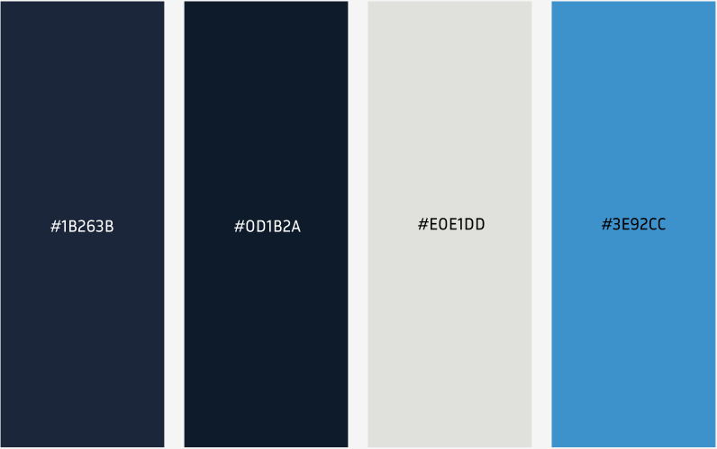

**Branding** 
El logo de **SmartLock** es directo al grano: un **candado**. Elegimos este isotipo porque es el símbolo universal de la seguridad física; no necesitamos complicarlo con más adornos para que el usuario entienda qué hacemos. Lo que lo hace moderno es su diseño minimalista y limpio. Acompañando al candado, la tipografía del nombre es sólida y de cortes precisos. Queríamos que la identidad visual transmitiera esa firmeza y robustez que se espera de un sistema de seguridad confiable, alejándonos de cualquier estética que pudiera parecer "frágil" o improvisada.

**Typography**  
Nos fuimos por **Inter**. ¿Por qué? Porque cuando tienes una lista gigante de registros de entrada y salida, necesitas una letra que se lea perfecto en pantallas de cualquier tamaño. Es una fuente *sans-serif* optimizada para entornos digitales.
* **Bold:** Para los títulos de sección y alertas que no puedes ignorar.
* **Semi-Bold:** Para encabezados de tablas o nombres de usuarios.
* **Regular:** Para el cuerpo de texto y los logs de acceso.
* *Referencia:* [Inter - Google Fonts](https://fonts.google.com/specimen/Inter)

**Spacing** 
Para que no todo esté tirado al azar, usamos la regla de los **8px**. Si vas a separar algo, que sea múltiplo de 8. En el código, **solo usamos `rem`** para que la interfaz sea escalable y se adapte bien si el usuario cambia el tamaño de fuente de su navegador.

| Categoría | Medida (rem / px) | Aplicación en el Diseño |
| :--- | :--- | :--- |
| **X-Small** | 0.25 rem / 4 px | Alineación de iconos y micro-ajustes de posición. |
| **Small** | 0.5 rem / 8 px | Espacio entre un texto y su campo de entrada (input). |
| **Medium** | 1.0 rem / 16 px | Relleno interno (padding) de botones y tarjetas. |
| **Large** | 1.5 rem / 24 px | Margen entre componentes de un mismo bloque funcional. |
| **X-Large** | 2.0 rem / 32 px | Distancia entre contenedores de información independientes. |
| **Section** | 4.0 rem / 64 px | El espacio grande entre bloques estructurales de la página. |

> **Nota técnica:** Queda prohibido usar píxeles (`px`) estáticos para márgenes o paddings. Todo debe ir en `rem` siguiendo la escala de arriba.

**Dimensions (Tono y Comunicación)** 
El estilo de comunicación de SmartLock es **directo y técnico**. Como ingenieros, no queremos meterle "floro" innecesario al usuario.
* Si alguien intenta entrar y no tiene permiso, el sistema dice **"Acceso Denegado"**, sin vueltas.
* Usamos términos que un jefe de seguridad entienda rápido (como "Trazabilidad", "Cifrado" o "Autenticación").
* La idea es que la plataforma sea una herramienta de trabajo estricta, libre de narrativa irrelevante, para que la toma de decisiones sea rápida.

---

### 4.1.2. Web Style Guidelines.

Aquí es donde aterrizamos todo para que la plataforma web se vea de nivel profesional:

1.  **Cero Adornos:** Si un botón o un icono no ayuda a monitorear o gestionar la seguridad, se quita. Queremos una interfaz limpia donde el control sea el protagonista.
2.  **Todo es Responsive:** El administrador puede estar en su oficina con un monitor gigante o en la entrada con su tablet. La estructura no debe romperse y los elementos deben ser fáciles de tocar/clickear en cualquier dispositivo.
3.  **Jerarquía Visual:** Usamos el contraste y los colores semánticos para que el ojo sepa qué es urgente.
* **Rojo:** Alertar brechas de seguridad o intentos fallidos.
* **Verde/Azul:** Accesos válidos y sistema operativo.
* **Amarillo:** Dar advertencias ante cualquier problema.

## 4.2. Information Architecture.
En SmartLock, la arquitectura de la información no es solo un menú de opciones; es el cerebro que permite que un administrador no entre en pánico cuando hay cientos de personas moviéndose por sus instalaciones. En el mundo de la seguridad digital, un segundo de duda puede ser un problema grave. Por eso, hemos diseñado una estructura donde la información crítica (como quién entró por la puerta principal hace un segundo) siempre está a la vista, eliminando cualquier "floro" visual que distraiga de lo importante: el control total y en tiempo real.

---

### 4.2.1. Organization Systems.
Para que SmartLock sea realmente eficiente tanto para el guardia en la puerta como para el administrador del sistema, hemos decidido combinar varios sistemas de organización:

### **Organización visual del contenido**
* **Jerárquica (Visual Hierarchy):** Elegimos este sistema porque en seguridad hay datos que "gritan" más fuerte que otros. En el Dashboard, los intentos de acceso fallidos o las alertas de puertas forzadas utilizan un tamaño y color prominente (rojo/bold). No es solo estética; es una estrategia para que el ojo del usuario sepa qué atender primero sin tener que leer toda la pantalla.
* **Organización secuencial (Step-by-step):** Registrar una nueva cerradura inteligente o dar de alta a un nuevo usuario puede ser tedioso. Lo dividimos en pasos claros (Identificación > Asignación de Permisos > Vinculación de Hardware) para evitar que el usuario se sienta abrumado y garantizar que no se salte ningún protocolo de seguridad.

### **Esquemas de categorización de contenido**
* **Por tópicos (Zonas de Acceso):** Organizamos la info por "Zonas" (ej. Piso 1, Almacén, Oficinas). Es la forma más lógica en la que un administrador piensa su espacio físico.
* **Según audiencia (Roles de Usuario):** El "Usuario Final" solo ve su llave digital y su historial personal. El "Administrador" ve todo el panel de control y analíticas. Esto "limpia" la interfaz de cada usuario, mostrándole solo lo que es relevante para su rol.
* **Cronológico:** Es vital para el Log de Eventos. Si pasa algo, necesitamos reconstruir la historia de forma lineal. Mostramos los ingresos por hora y fecha para que la trazabilidad sea impecable.
* **Alfabético:** Lo reservamos para el directorio de usuarios y empleados, donde la búsqueda por nombre de la A a la Z es la forma más rápida de encontrar a alguien.

---
### 4.2.2. Labeling Systems.

En el sistema de etiquetado de SmartLock, hemos huido del lenguaje genérico. Queremos que el usuario sienta que el software es una herramienta técnica y profesional:

* **Panel de Control:** En lugar de "Inicio", porque aquí es donde realmente se gestiona todo el hardware.
* **Bitácora de Accesos:** Suena más profesional que "Historial". Da la idea de un registro oficial y serio de cada movimiento para auditorías.
* **Credenciales Digitales:** Término usado para referirse a los permisos de acceso de los usuarios, reforzando la idea de seguridad y autenticación.
* **Puntos de Control:** En lugar de "Puertas", porque SmartLock puede controlar desde una puerta hasta un torniquete o una barrera vehicular.

---

### 4.2.3. SEO Tags and Meta Tags.
Queremos que SmartLock sea lo primero que aparezca cuando una empresa busque modernizar su seguridad.

### **Landing Page**
* **Título:** `<title>SmartLock | Control de Accesos Inteligente y Seguridad Digital</title>`
* **Descripción:** `<meta name="description" content="Moderniza la seguridad de tu edificio. SmartLock ofrece gestión de accesos en tiempo real, trazabilidad total y control desde la nube para oficinas y universidades."/>`
* **Keywords:** `<meta name="keywords" content="SmartLock, Control de accesos, Seguridad digital, Cerraduras inteligentes, Trazabilidad, SmartTecnologies, Software de seguridad Perú, ConTech."/>`
* **Autor:** `<meta name="author" content="SmartTecnologies" />`

### **Web Application**
* **Título:** `<title>Dashboard SmartLock - Gestión de Accesos</title>`
* **Descripción:** `<meta name="description" content="Panel de administración de SmartLock. Monitorea ingresos, gestiona usuarios y configura tus puntos de control en tiempo real."/>`

---

### 4.2.4. Searching Systems.
No queremos que el usuario "busque", queremos que "encuentre" rápido:

* **Búsqueda Predictiva:** A medida que el administrador escribe (ej. un DNI o nombre), el sistema sugiere usuarios registrados para ahorrar tiempo.
* **Filtros de Facetas:** El usuario puede refinar los registros por **Rango de fechas**, **Zona de acceso**, **Estado de ingreso** (Exitoso/Denegado) y **Tipo de usuario**, evitando la sobrecarga de información.
* **Búsqueda por Dispositivo:** Permite localizar rápidamente una cerradura o sensor específico dentro de toda la infraestructura mediante su ID técnico.

---
### 4.2.5. Navigation Systems.
La navegación en SmartLock está pensada para ser "invisible" y eficiente:

* **Menú Lateral Retráctil:** Prioriza el espacio de trabajo central para ver los mapas de calor y tablas de acceso, manteniendo los módulos principales a un solo clic.
* **Migas de Pan (Breadcrumbs):** Vital para no perderse cuando navegas por sedes (ej. Sedes > Lima Centro > Piso 3 > Laboratorio A), permitiendo al usuario ubicarse en todo momento.
* **Acciones Contextuales:** El sistema ofrece botones inteligentes según el estado del punto de control (ej. si una puerta detecta una intrusión, el botón principal será "Bloquear Acceso" o "Contactar Seguridad").

## 4.3. Landing Page UI Design.
En esta sección se detalla el proceso de diseño de la interfaz de usuario para la página de aterrizaje de **SmartLock**. El diseño se centra en la conversión de usuarios y la exposición clara de la propuesta de valor del sistema de control de acceso.

### 4.3.1. Landing Page Wireframe.
El wireframe de baja fidelidad define la estructura visual y la jerarquía de la información. Se ha priorizado una navegación intuitiva, destacando las funcionalidades principales y los beneficios de seguridad del sistema.

* **Elementos clave:** Estructura de navegación, sección hero con llamado a la acción (CTA) y secciones de beneficios para el segmento de negocios.

### 4.3.2. Landing Page Mock-up.
El mock-up de alta fidelidad integra la identidad visual de la marca, incluyendo la paleta de colores, tipografía y elementos gráficos finales. Este diseño representa la apariencia exacta que tendrá la aplicación web una vez implementada.

* **Detalles estéticos:** Uso de contrastes para mejorar la legibilidad y elementos visuales que refuerzan la confianza y modernidad del sistema **SmartLock**.

## 4.4. Web Applications UX/UI Design.
Esta sección presenta y explica la propuesta visual y de interacción para las aplicaciones que constituyen la experiencia de usuario con los productos digitales de **SmartLock**.

### 4.4.1. Web Applications Wireframes.
Esta sección presenta los esquemas de baja fidelidad que definen la estructura de la aplicación web. Se ha priorizado la **Arquitectura de Información** mediante un sistema de navegación lateral (Sidebar) que organiza las funciones de gestión de usuarios, eventos y seguridad de forma jerárquica.
* **Principios de Diseño:** Se aplica el principio de proximidad para agrupar funciones relacionadas (como el perfil de usuario y notificaciones) y consistencia en la ubicación de los elementos de control.
* **Diseño Inclusivo:** Los wireframes consideran espacios adecuados para elementos interactivos y una disposición clara que facilita el uso de tecnologías de asistencia como lectores de pantalla.

---

#### A. Flujo de Acceso y Autenticación

### Inicio de Sesión

  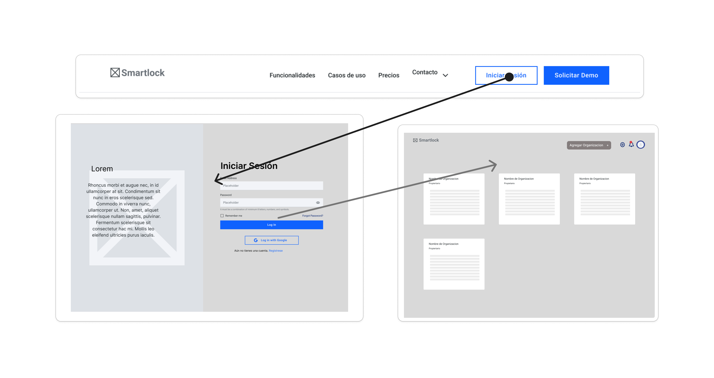

**Descripción:** Wireframe de la pantalla de acceso principal que define la estructura de los campos de autenticación, el botón de inicio de sesión y los elementos de recuperación de acceso.

---

### Registro de Sesión (Sign Up)

  

**Descripción:** Esquema del formulario de registro orientado al alta de nuevos administradores dentro de la plataforma, mostrando la distribución lógica de los campos requeridos.

---

### Autenticación de Dos Factores (2FA)

  

**Descripción:** Diseño estructural de la segunda capa de seguridad mediante verificación por código, enfocado en la simplicidad de interacción y validación segura del usuario.

---

#### B. Configuración de Infraestructura

### Creación de Sedes (Plan Principiante)

  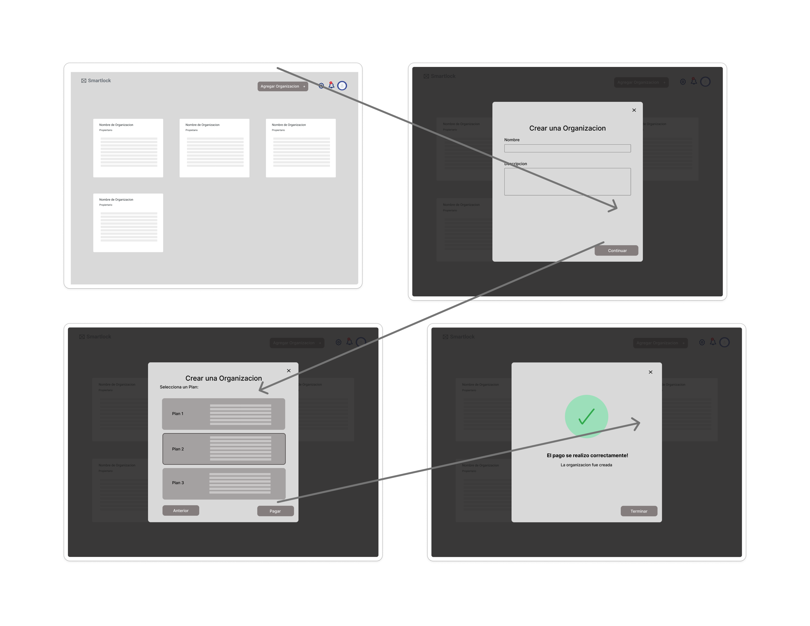

**Descripción:** Wireframe del proceso inicial de configuración de sedes, donde se organizan los campos necesarios para el despliegue y administración básica del sistema.

---

### Gestión de Eventos

  

**Descripción:** Módulo orientado a la configuración de accesos temporales mediante eventos programados, permitiendo restricciones horarias y control de visitantes.

---

### Gestión de Credenciales

  

**Descripción:** Organización funcional del sistema de emisión y control de credenciales digitales, permitiendo el seguimiento de accesos autorizados.

---

### Bitácora de Accesos

  

**Descripción:** Estructura diseñada para la visualización de logs históricos de acceso, facilitando auditorías de seguridad y trazabilidad de eventos.

### 4.4.2. Web Applications Wireflow Diagrams.
*[Sección en desarrollo]*

### 4.4.3. Web Applications Mock-ups.
Esta sección presenta los mock-ups de alta fidelidad de la plataforma web de SmartLock. Estos diseños representan la apariencia visual final del sistema, incluyendo identidad visual, paleta de colores, tipografía, distribución de componentes y experiencia de usuario orientada a la implementación real del producto.

---

#### A. Flujo de Acceso y Seguridad

### Inicio de Sesión

**Descripción:** Mock-up de la pantalla principal de acceso al sistema, donde se visualiza la interfaz final de autenticación con diseño visual completo, jerarquía de botones y elementos de recuperación de acceso.

---

### Registro de Sesión (Sign Up)

**Descripción:** Representación visual del formulario de registro de nuevos administradores, mostrando el diseño definitivo de campos, validaciones visuales y estructura de navegación.

---

### Autenticación de Dos Factores (2FA)

**Descripción:** Diseño final de la segunda capa de seguridad mediante código de verificación, enfocado en claridad visual, seguridad y facilidad de uso para el usuario.

---
#### B. Configuración de Infraestructura

### Dashboard Plan Principiante

**Descripción:** Mock-up del panel principal para usuarios del plan principiante, presentando una interfaz simplificada con acceso rápido a funciones esenciales y monitoreo básico del sistema.

---
### 4.4.4. Web Applications User Flow Diagrams.
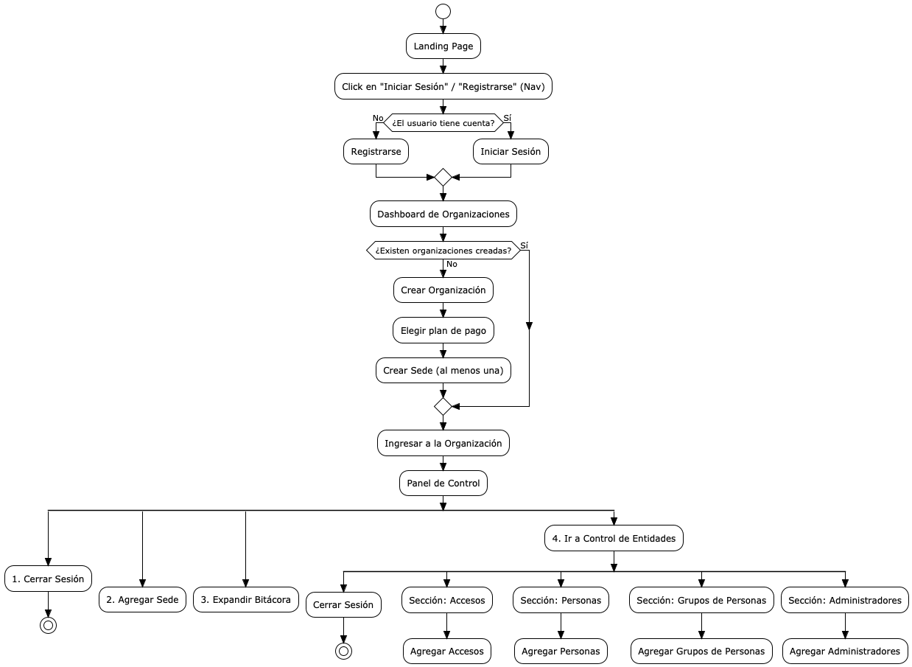

## 4.5. Web Applications Prototyping.
*[Sección en desarrollo]*

## 4.6. Domain-Driven Software Architecture.

### 4.6.1. Design-Level Event Storming.
En esta sección se detalla el diseño táctico del sistema, profundizando en la arquitectura y los componentes técnicos necesarios para implementar la solución. A diferencia del Big Picture, el DesignLevel Event Storming se enfoca en definir los límites de los agregados, los comandos que disparan cambios de estado y las políticas que gobiernan las reglas de negocio.

  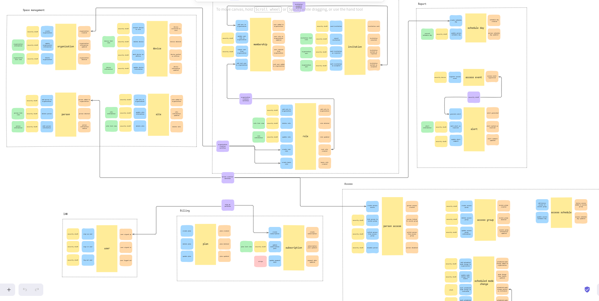

### 1. Space Management (Gestión de Espacios)
Es el contexto central encargado de la infraestructura física y lógica de la plataforma. Su responsabilidad principal es modelar la jerarquía operativa, gestionando entidades como **Organizations**, **Sites** (sedes) y **Zones**. Este contexto administra la relación entre los activos físicos y su ubicación, permitiendo que la plataforma identifique la posición de los dispositivos de bloqueo digital.

### 2. Access (Control de Acceso)
Este contexto se enfoca estrictamente en la autorización y la seguridad física. Gestiona las identidades mediante la entidad **Subject** y su agrupación en **Groups** para facilitar la asignación masiva de permisos. Su lógica de negocio define quién tiene permitido ingresar a áreas específicas basándose en la validación de tokens y reglas de seguridad configuradas.
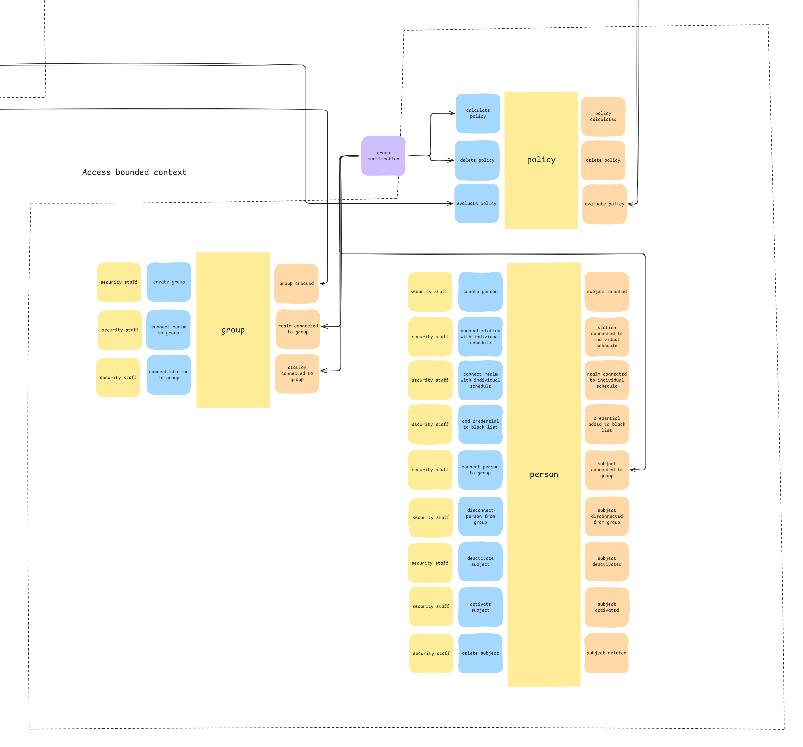

### 3. IAM (Autenticación e Identidad)
Responsable de la seguridad a nivel de software y la validación de la identidad del usuario en el sistema. Administra las **Accounts**, los hashes de contraseñas y los roles de usuario. Asegura que el usuario sea quien dice ser antes de permitirle interactuar con la interfaz del frontend o las APIs de la aplicación.

### 4. Report (Reportes y Auditoría)
Dedicado a la observabilidad y la persistencia de eventos históricos dentro del ecosistema SmartLock. Utiliza entidades como **Audit**, **AuditRecord** y **Alert** para registrar cada acción realizada por los usuarios y cada anomalía detectada por los dispositivos. Es fundamental para el cumplimiento normativo y la reconstrucción de líneas de tiempo ante incidentes de seguridad.
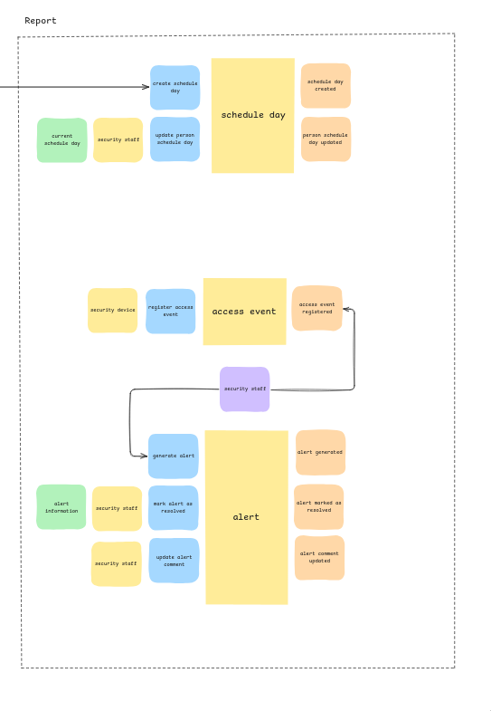

### 5. Billing (Facturación y Suscripciones)
Gestiona el aspecto comercial y la viabilidad del servicio para cada organización. Se encarga de la entidad **Subscription**, controlando los planes activos, precios y fechas de renovación. Este contexto habilita o restringe funcionalidades avanzadas, como el control por franjas horarias o alertas automáticas, según el estado de pago del cliente.

Descripción de los componentes identificados:
- **Comandos (Azul):** Representan las intenciones de los usuarios o sistemas externos para realizar una acción específica (ej. "Generar Código QR", "Validar Acceso").
- **Agregados (Amarillo):** Son las entidades o grupos de objetos que mantienen la consistencia de los datos y ejecutan la lógica de negocio ante un comando.
- **Políticas (Lila):** Definen reacciones automáticas del sistema ante eventos específicos ("Siempre que ocurra el Evento X, ejecutar el Comando Y").
- **Modelos de Lectura (Verde):** Representan la información que el usuario visualiza en la interfaz para poder tomar una decisión y ejecutar un comando.
- **Eventos de Dominio (Naranja):** Indican que algo relevante para el negocio ha sucedido exitosamente (ej. "Código QR Generado", "Acceso Denegado").

Este modelado permite al equipo de desarrollo tener una guía clara para la implementación de los servicios y la definición de la lógica en el código.
Descripción de los componentes identificados:
- **Comandos (Azul):** Representan las intenciones de los usuarios o sistemas externos para realizar una acción específica (ej. "Generar Código QR", "Validar Acceso"). 
- **Agregados (Amarillo):** Son las entidades o grupos de objetos que mantienen la consistencia de los datos y ejecutan la lógica de negocio ante un comando. 
- **Políticas (Lila):** Definen reacciones automáticas del sistema ante eventos específicos ("Siempre que ocurra el Evento X, ejecutar el Comando Y"). 
- **Modelos de Lectura (Verde):** Representan la información que el usuario visualiza en la interfaz para poder tomar una decisión y ejecutar un comando. 
- **Eventos de Dominio (Naranja):** Indican que algo relevante para el negocio ha sucedido exitosamente (ej. "Código QR Generado", "Acceso Denegado"). 

Este modelado permite al equipo de desarrollo tener una guía clara para la implementación de los servicios y la definición de la lógica en el código.

### 4.6.2. Software Architecture Context Diagram.

In this section, the team introduces the Software Architecture Context Diagram. This high-level overview illustrates the **SmartLock** software system as a central entity, surrounded by the key user personas and the external systems it interacts with to deliver its "Asset-Light" access control value proposition.

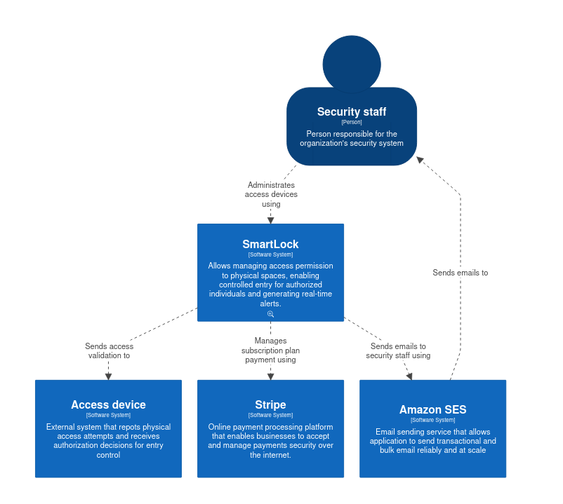

**Explicación del diagrama:**

* **SmartLock System:** Es el núcleo de la plataforma que centraliza la lógica de generación de códigos QR dinámicos y la validación de reglas de acceso.
* **Usuarios:** El diagrama identifica al **Administrator** (configuración), **Security Staff** (validación móvil) y **Attendee** (usuario final) como los actores principales.
* **Sistemas Externos:** Se detalla la integración con **AWS SES** para la gestión de correos electrónicos y **Twilio API** para el envío de alertas críticas de seguridad vía SMS.

### 4.6.3. Software Architecture Container Diagrams.

In this section, the team presents the **Container Diagram** for SmartLock. This diagram expands the system's context to reveal the software containers that compose it (web applications, mobile applications, APIs, and databases). It illustrates the high-level distribution of responsibilities, exposes key technology decisions—such as Angular for the frontend, Java Spring Boot for the backend, and MySQL for persistence—and details how these containers communicate through the AWS cloud infrastructure.

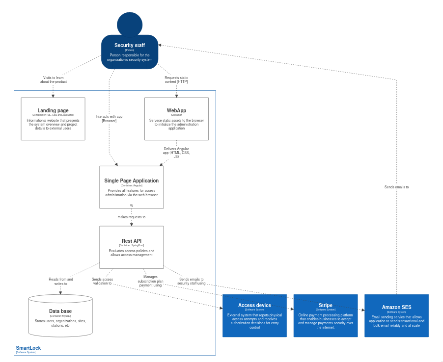

#### Diagram Explanation

The Container Diagram breaks down the internal architecture of SmartLock into the following key components:

* **Landing Page & Web Application (Frontend):** Developed using **Angular, TypeScript, and TailwindCSS**. The web application acts as a Single Page Application (SPA) that consumes the backend API. Both containers are hosted on **AWS S3** and distributed globally via **Amazon CloudFront** to ensure low latency and security via HTTPS.
* **Scanner Mobile App:** A specialized application for security staff, optimized for scanning QR codes and communicating with the server with minimal latency.
* **Core Backend API:** The system's main engine, developed in **Java using the Spring Boot framework**. It centralizes all domain-driven business logic (DDD), validates access attempts, and generates encrypted dynamic QR codes. It is deployed on **AWS Elastic Beanstalk** for automated load balancing and scaling.
* **Relational Database:** A **MySQL** database hosted on **Amazon RDS**, serving as the single source of truth. it ensures the immutability of access logs (audit trails) and the integrity of user profiles and access rules.
* **Communication:** The frontend and mobile app communicate asynchronously with the Backend API via **JSON over HTTPS**. The backend interacts with the database through **JDBC** and with third-party services (AWS SES and Twilio) via REST APIs.

### 4.6.4. Software Architecture Components Diagrams.

In this section, the team presents the **Component Diagram** for the Core Backend API container. This diagram zooms into the Java Spring Boot application to illustrate its internal structure based on Domain-Driven Design (DDD) and Layered Architecture. It shows how the system is divided into Controllers (Presentation), Services (Business Logic/Domain), and Repositories (Data Access), and how these components interact to execute the access control logic.

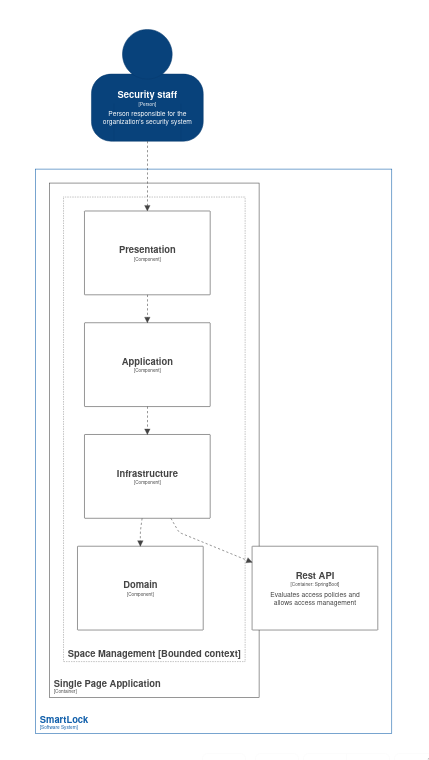

#### Diagram Explanation

The Component Diagram breaks down the **Core Backend API** into the following functional layers:

* **Controllers (Presentation Layer):**
  * **Auth & Security Controller:** Exposes REST endpoints to handle user login, 2FA verification, and JSON Web Token (JWT) issuance.
  * **Access Validation Controller:** Receives API calls from the Scanner Mobile App to validate dynamic QR payloads in real-time.
  * **Space Manager Controller:** Provides endpoints for administrators (via the Web App) to perform CRUD operations on physical spaces and configure access schedules.

* **Services (Domain / Business Logic Layer):**
  * **Access Credential Service (Core Domain):** The heart of the system. It evaluates complex access policies, generates dynamic QR codes using cryptographic signatures, and determines whether an access attempt is granted or denied.
  * **Authentication Service:** Implements Role-Based Access Control (RBAC) and manages the lifecycle of credentials and tokens.
  * **Notification Publisher:** Uses the Spring ApplicationEventPublisher to asynchronously delegate alerts to prevent blocking the main execution thread during access validations.

* **Repositories (Infrastructure Layer):**
  * **Audit & Log Repository:** Uses Spring Data JPA to securely write immutable logs of every access attempt and security event into the database.
  * **Domain Data Repository:** Manage the persistence of user profiles, organizational data, doors, and policies.

* **Communication Flow:** The web and mobile applications send HTTP requests to the **Controllers**. These controllers delegate the business logic to the **Services**. The services evaluate the rules and use the **Repositories** to interact with the MySQL database via JDBC, or use the **Notification Publisher** to dispatch asynchronous emails and SMS via AWS SES and Twilio.

## 4.7. Software Object-Oriented Design.

En esta sección, el equipo presenta el diseño orientado a objetos del software, detallando la implementación interna y la estructura de componentes para cada *Bounded Context* de **SmartLock**. Los diagramas a continuación ilustran cómo se ha aplicado el enfoque de *Domain-Driven Design* (DDD) a nivel de código, definiendo claramente las responsabilidades, los límites de los agregados y los patrones de diseño utilizados tanto en la capa de presentación (Frontend) como en la lógica de negocio (Backend). Esta estructura garantiza un código modular, mantenible y altamente escalable.

### 4.7.1. Class Diagrams.

#### Diagrama de clases (Frontend)

El diagrama organiza el frontend de SmartLock en cinco *Bounded Contexts* (Authentication, Organization, User, Security y Subscription), lo que permite aislar la lógica de negocio y asegurar que cada módulo evolucione de forma independiente. Dentro de estos contextos, se implementan los 8 Agregados definidos, donde entidades raíz como *Security* y *Organization* encapsulan a *Door* y *Office* respectivamente; esto garantiza la integridad del sistema, ya que cualquier cambio de estado físico o estructural debe ser validado por su respectiva raíz de agregado antes de impactar la interfaz.

Bajo el enfoque DDD, la aplicación utiliza un *EventBus* en la capa Shared para comunicar eventos entre contextos de forma desacoplada y emplea el patrón *Assembler* para transformar los datos crudos de la API en objetos de dominio con comportamiento propio. Los *Stores* de la capa de aplicación gestionan estos agregados mediante Signals, permitiendo que la interfaz reaccione instantáneamente a cambios operativos —como la apertura de una puerta o la actualización de un perfil— sin comprometer la separación de responsabilidades ni la pureza del modelo de negocio.

#### Diagrama de clases (Backend)

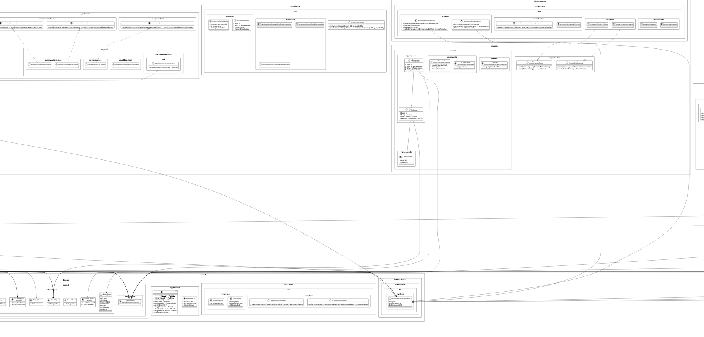

El backend de SmartLock ha sido estructurado estrictamente bajo los principios de *Domain-Driven Design* (DDD) utilizando el framework Spring Boot. La arquitectura se divide en 5 *Bounded Contexts* y 8 agregados principales, derivados del *Event Storming*, garantizando un alto nivel de cohesión y un bajo acoplamiento. Se emplean *Aggregate Roots* (como Security y Organization) para orquestar entidades secundarias (Door y Office), asegurando el cumplimiento de las reglas de negocio en la capa de dominio antes de ejecutar cualquier cambio de estado. 

Adicionalmente, se implementaron patrones de diseño estratégico como *Assembler* para la conversión de datos y aislamiento de la capa de presentación, el uso de *Records* de Java para garantizar la inmutabilidad de los DTOs, e interfaces dedicadas para los servicios y repositorios. Esta abstracción asegura un sistema altamente mantenible y preparado para escalar sin generar deuda técnica.

## 4.8. Database Design.

### 4.8.1. Database Diagrams.

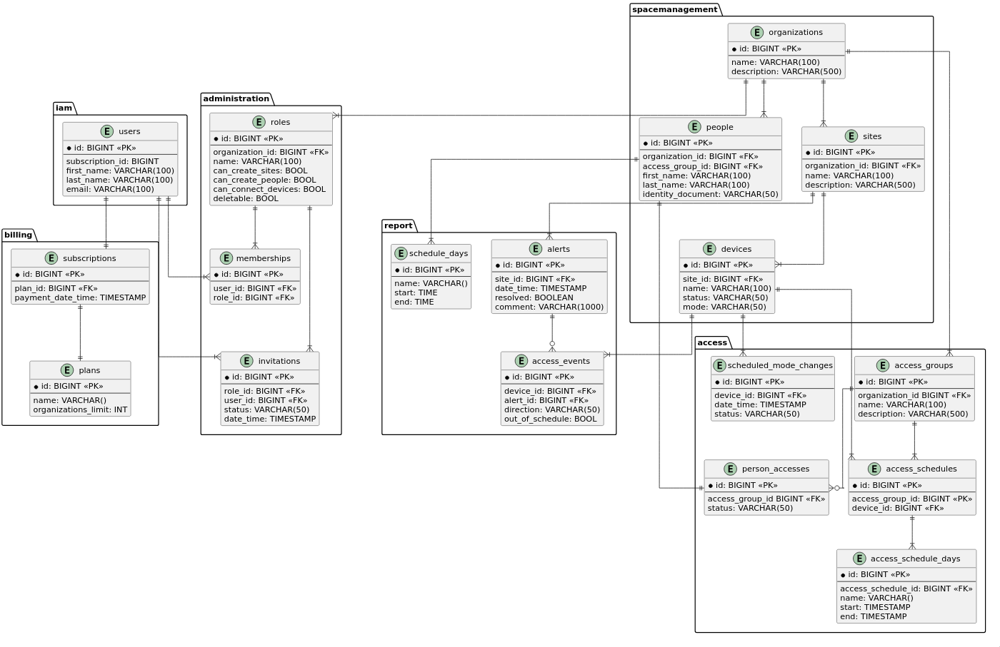

El diagrama de base de datos para SmartLock se ha estructurado bajo un enfoque de normalización 3FN y *Domain-Driven Design* (DDD), organizando la información en *Bounded Contexts* que actúan como *Aggregate Roots* (como Users y Organization) para garantizar la integridad operativa y la escalabilidad mediante el uso de tipos de datos atómicos en MySQL. Desde la perspectiva de seguridad y persistencia, el diseño separa estrictamente las credenciales en la tabla *authentications* y los datos sensibles en *user_profiles* (con correos encriptados) para cumplir con las leyes de protección de datos, mientras que la tabla *access_logs* asegura una auditoría inmutable de cada evento físico. Finalmente, la arquitectura está totalmente optimizada para un ORM como Hibernate, facilitando el mapeo de relaciones uno-a-muchos y uno-a-uno mediante claves foráneas claras y tipos bigint, lo que permite un manejo eficiente de la carga perezosa (*Lazy Loading*) y una transición fluida del modelo relacional al código en Spring Boot.

# Capítulo V: Product Implementation, Validation & Deployment.
## 5.1. Software Configuration Management.

En esta sección, el equipo establece las decisiones, herramientas y convenciones que permiten mantener la consistencia técnica durante el ciclo de vida de **SmartLock**. Para la gestión del código fuente, se utiliza **GitHub** bajo una estrategia de **GitHub Flow**, donde las ramas `main` y `develop` centralizan el código estable, aplicando la convención de **Conventional Commits** para garantizar un historial de cambios legible.

El entorno de desarrollo se ha estandarizado utilizando **Visual Studio Code** para el frontend y **IntelliJ IDEA** para el backend. El stack tecnológico comprende una **Landing Page** construida con HTML, CSS y JavaScript; una **Web Application** desarrollada en **Angular con TypeScript** utilizando **TailwindCSS** para el diseño de interfaces; y un **Backend** robusto desarrollado en **Java (JDK 17+)** gestionado con Maven. La persistencia de datos se maneja en **MySQL 8.0**, siguiendo convenciones de nomenclatura en `snake_case` y normalización 3FN para las tablas del sistema.

En cuanto a la configuración del despliegue, el equipo ha optado por un ecosistema basado íntegramente en **Amazon Web Services (AWS)**. El frontend se aloja en buckets de **Amazon S3** distribuidos mediante **Amazon CloudFront** para asegurar baja latencia y certificados SSL vía HTTPS. El backend se despliega sobre **AWS Elastic Beanstalk** para aprovechar el autoescalado y balanceo de carga, mientras que la base de datos se gestiona a través de **Amazon RDS (MySQL)**, lo que garantiza respaldos automatizados y alta disponibilidad. Finalmente, se utiliza **GitHub Actions** para automatizar el pipeline de CI/CD, permitiendo que cada integración validada se sincronice de forma inmediata con la infraestructura de nube.

### 5.1.1. Software Development Environment Configuration

En esta sección, se especifican las herramientas y productos de software utilizados por los miembros del equipo para colaborar en todas las fases del ciclo de vida de **SmartLock**. La configuración del entorno de desarrollo asegura la interoperabilidad y consistencia técnica, cubriendo desde la gestión del proyecto hasta el despliegue final en la nube.

| Producto | Categoría | Propósito de uso | Ruta de Referencia / Descarga |
| :--- | :--- | :--- | :--- |
| **Jira Software** | Project & Requirements Management | Gestión del Product Backlog, planificación de Sprints y seguimiento de User Stories. | [https://upc-team-open-source.atlassian.net/](https://upc-team-open-source.atlassian.net/) |
| **Figma** | Product UX/UI Design | Diseño de Wireframes, Mock-ups y prototipado interactivo de la Web App y Landing Page. | [https://www.figma.com/](https://www.figma.com/) |
| **UXPressia** | Product UX Design | Elaboración de artefactos de diseño de experiencia como User Personas y Journey Maps. | [https://uxpressia.com/](https://uxpressia.com/) |
| **IntelliJ IDEA** | Software Development | IDE principal para el desarrollo del Backend RESTful API utilizando Java y Spring Boot. | [https://www.jetbrains.com/idea/](https://www.jetbrains.com/idea/) |
| **DBeaver** | Software Development | Herramienta para el diseño, modelado y gestión local de la base de datos relacional. | [https://dev.mysql.com/downloads/workbench/](https://dev.mysql.com/downloads/workbench/) |
| **GitHub** | SCM & Software Documentation | Repositorio centralizado de código fuente y documentación técnica del proyecto. | [https://github.com/202610-1asi0729-11881-SmartIndustries](https://github.com/202610-1asi0729-11881-SmartIndustries) |
| **AWS Management Console** | Software Deployment | Gestión y monitoreo de servicios en la nube (S3, CloudFront, Elastic Beanstalk y RDS). | [https://aws.amazon.com/console/](https://aws.amazon.com/console/) |
| **Swagger / OpenAPI** | Software Documentation | Documentación interactiva y pruebas de los servicios web RESTful del backend. | Integrado en el Core Backend API. |

### 5.1.2. Source Code Management

En esta sección, el equipo establece los medios y el esquema de organización que aplicará para el seguimiento de modificaciones durante el ciclo de vida de **SmartLock**. Para ello, utilizamos **GitHub** como plataforma centralizada y sistema de control de versiones.

A continuación, se presentan los enlaces a la organización y los 4 repositorios que conforman la solución integral:

* **Organización en GitHub:** [https://github.com/202610-1asi0729-11881-SmartIndustries](https://github.com/202610-1asi0729-11881-SmartIndustries)
* **Landing Page:** [https://github.com/202610-1asi0729-11881-SmartIndustries/smartindustries-website](https://github.com/202610-1asi0729-11881-SmartIndustries/smartindustries-website)
* **Frontend Web Application:** [https://github.com/202610-1asi0729-11881-SmartIndustries/smartindustries-webapp](https://github.com/202610-1asi0729-11881-SmartIndustries/smartindustries-webapp)
* **Web Services (Core Backend API):** [https://github.com/202610-1asi0729-11881-SmartIndustries/smartindustries-platform](https://github.com/202610-1asi0729-11881-SmartIndustries/smartindustries-platform)
* **Project Report:** [https://github.com/202610-1asi0729-11881-SmartIndustries/smartindustries-report](https://github.com/202610-1asi0729-11881-SmartIndustries/smartindustries-report)

#### Implementación de GitFlow
Para mantener un flujo de trabajo ordenado, el equipo ha implementado **GitFlow** como *workflow* de control de versiones. Este modelo estructura nuestro trabajo en las siguientes ramas (*branches*):

**Ramas Principales:**
* `main`: Rama principal que contiene el código estable y listo para producción.
* `develop`: Rama de integración donde se fusionan las nuevas características antes de pasar a producción.

**Ramas de Soporte y Convenciones:**
* **Feature branches:** Cada nueva historia de usuario tiene su propia rama. Se crean a partir de `develop` y se fusionan de vuelta en `develop`.
  * *Convención de nombre:* `feature/<descripcion-corta>` (Ejemplo: `feature/qr-generation`).
* **Release branches:** Se utilizan para preparar una nueva versión para producción. Se ramifican desde `develop` y se fusionan en `main` y `develop`.
  * *Convención de nombre:* `release/v<version>` (Ejemplo: `release/v1.1.0`).
* **Hotfix branches:** Destinadas a solucionar errores críticos en producción. Se crean desde `main` y se fusionan en `main` y `develop`.
  * *Convención de nombre:* `hotfix/<descripcion-error>` (Ejemplo: `hotfix/login-crash`).

#### Semantic Versioning (SemVer)
Para nombrar las versiones en nuestras ramas de Release y en los *tags* de producción, aplicamos **Semantic Versioning 2.0.0** (`vMAJOR.MINOR.PATCH`):
* **MAJOR:** Cambios incompatibles en la API.
* **MINOR:** Nuevas funcionalidades retrocompatibles.
* **PATCH:** Corrección de errores retrocompatibles.

#### Conventional Commits
El equipo aplica el estándar **Conventional Commits** en todos los mensajes de los commits para asegurar un historial legible:
* `feat`: Nueva característica (ej. `feat(auth): add login`).
* `fix`: Corrección de un error (ej. `fix(ui): adjust button spacing`).
* `docs`: Modificaciones en documentación (ej. `docs: update repo links`).
* `style`: Cambios de formato que no afectan la lógica.
* `refactor`: Mejora de código sin añadir funciones ni arreglar bugs.
* `test`: Adición o corrección de pruebas.
* `chore`: Mantenimiento y actualización de configuraciones.
### 5.1.3. Source Code Style Guide & Conventions

Para garantizar la mantenibilidad, legibilidad y colaboración eficiente dentro del equipo **SmartIndustries**, se han adoptado guías de estilo y convenciones de codificación internacionales. Como regla mandatoria, **toda la nomenclatura (clases, métodos, variables, comentarios y documentación) se realiza estrictamente en inglés**.

#### A. HTML & CSS (Google HTML/CSS Style Guide)
Se siguen las recomendaciones de la *Google HTML/CSS Style Guide* para asegurar un marcado limpio y hojas de estilo eficientes:
* **HTML:** Uso de etiquetas semánticas, indentación de 2 espacios y omisión de protocolos en URLs de recursos (ej. `//www.google.com`).
* **CSS:** Uso de la nomenclatura **kebab-case** para nombres de clases (ej. `.access-button`). Se prioriza el uso de variables de CSS y utilidades de **TailwindCSS** para mantener la consistencia visual.

#### B. TypeScript & Angular (Google TypeScript Style Guide / Angular Coding Style)
Para el desarrollo de la Web Application, se aplican las guías oficiales de Angular:
* **Nomenclatura:** `PascalCase` para nombres de clases (ej. `AuthService`) y `camelCase` para variables y métodos (ej. `generateQrCode()`).
* **Estructura:** Se utiliza la estructura de carpetas sugerida por Angular (componentes, servicios, modelos) y se aplican decoradores de manera consistente.
* **Tipado:** Se evita el uso de `any`, forzando el tipado fuerte para aprovechar las ventajas de TypeScript.

#### C. Java & Spring Boot (Google Java Style Guide)
El backend sigue la *Google Java Style Guide* y las mejores prácticas de Spring Boot:
* **Clases:** Uso de `PascalCase` y nombres descriptivos basados en el dominio (ej. `AccessPolicyController`).
* **Variables/Métodos:** Uso de `camelCase`.
* **Anotaciones:** Uso correcto de las anotaciones de Spring (ej. `@RestController`, `@Service`, `@Repository`) para mantener la inversión de control y la inyección de dependencias.
* **Documentación:** Todo el código debe estar auto-documentado y los métodos complejos deben incluir JavaDocs en inglés.

#### D. Gherkin (Readable Specifications)
Para la definición de los criterios de aceptación en las historias de usuario, se sigue la sintaxis de **Gherkin** (Given-When-Then), asegurando que las especificaciones sean legibles tanto para el equipo técnico como para los stakeholders.

---

### 5.1.4. Software Deployment Configuration

La estrategia de despliegue de **SmartLock** se basa en un modelo de **Integración y Despliegue Continuo (CI/CD)** utilizando **GitHub Actions**, lo que permite que cada cambio validado en la rama `main` se publique automáticamente en la infraestructura de **Amazon Web Services (AWS)**.

#### Ecosistema de Despliegue
| Producto | Entorno de Hosting | Tecnología de Despliegue |
| :--- | :--- | :--- |
| **Landing Page** | Amazon S3 & CloudFront | Estático (HTML/CSS/JS) con CDN para baja latencia. |
| **Frontend Web App** | Amazon S3 & CloudFront | Angular Build (Producción) con certificados SSL. |
| **Web Services** | Amazon Elastic Beanstalk | Java Artifact (JAR) con escalado automático. |
| **Database** | Amazon RDS (MySQL) | Instancia gestionada con backups automáticos. |

#### Pasos para el Despliegue Satisfactorio

1.  **Build Local & Testing:** El desarrollador valida el código localmente ejecutando pruebas unitarias.
2.  **Push a GitHub:** Se realiza el *push* a la rama de funcionalidad y se abre un Pull Request hacia `develop`.
3.  **CI Pipeline (GitHub Actions):** * Se dispara un flujo de trabajo que compila el proyecto (Maven para Java, npm para Angular).
    * Se ejecutan las pruebas automatizadas. Si alguna falla, el despliegue se detiene.
4.  **Deployment (Frontend):** Una vez aprobada la fusión a `main`, el código de la Landing Page y la Web App se sincroniza con el bucket de **Amazon S3**. Se invalida la caché de **CloudFront** para que los usuarios vean los cambios de inmediato.
5.  **Deployment (Backend):** El artefacto `.jar` de Spring Boot se envía a **AWS Elastic Beanstalk**. El servicio gestiona el balanceo de carga y actualiza las instancias sin tiempo de inactividad (*Zero Downtime Deployment*).
6.  **Verificación:** Se realiza una prueba de humo (*smoke test*) en los endpoints de producción para asegurar la conectividad con **Amazon RDS**.
## 5.2. Landing Page, Services & Applications Implementation

En esta sección se detalla y evidencia el proceso continuo de implementación, pruebas de software, documentación técnica y despliegue en la nube de los componentes de la solución: Landing Page, RESTful Web Services y Frontend Web Applications. A partir de la priorización establecida en el Product Backlog, el desarrollo se ha estructurado mediante iteraciones ágiles, garantizando que tanto los procesos *core* del negocio (validación de accesos) como los procesos de soporte (autenticación) sean construidos y desplegados progresivamente aplicando principios de *Responsive Web Design*.

### 5.2.1. Sprint 1

En esta sección se registra y explica el avance obtenido durante el primer ciclo de desarrollo (Sprint 1), abarcando tanto la construcción de los productos de software iniciales como el trabajo colaborativo del equipo. Se incluyen los detalles de planificación, los líderes de cada aspecto, el backlog comprometido y las evidencias de ejecución, documentación y despliegue del trabajo completado.

#### 5.2.1.1. Sprint Planning 1

El Sprint Planning Meeting marcó el inicio formal del desarrollo del código de SmartLock. Durante esta sesión, el equipo de desarrollo junto al Product Owner seleccionaron las Historias de Usuario más prioritarias del Product Backlog para definir el objetivo central de la iteración. A continuación, se presenta el cuadro resumen con los detalles y acuerdos de esta reunión:

| **Sprint #** | Sprint 1 |
| :--- | :--- |
| **Sprint Planning Background** | |
| **Date** | 2026-04-20 |
| **Time** | 19:00 PM |
| **Location** | Reunión virtual (Microsoft Teams) |
| **Prepared By** | Huaman Oscco, Aldo Jesus |
| **Attendees (to planning meeting)** | Peñaranda Caldas, Gabriel Augusto / Palacios Tinoco, Adrian Fernando / Huaman Oscco, Aldo Jesus / Limache Coronel, Imanol Fabricio / Ayllon Pauccar, Juan David |
| **Sprint 1 Review Summary** | Al ser el primer Sprint de desarrollo, la revisión anterior corresponde a la fase de ideación. Resultados alcanzados: arquitectura C4 finalizada, bases de datos diseñadas y repositorios GitHub configurados. El Product Owner brindó el feedback necesario para iniciar la codificación orientada al dominio. |
| **Sprint 1 Retrospective Summary** | Como retrospectiva inicial de la forma de trabajo, el equipo identificó como acierto el uso de diagramas compartidos, pero reconoció como oportunidad de mejora establecer reglas más estrictas de GitFlow para evitar colisiones en los Pull Requests futuros. |
| **Sprint Goal & User Stories** | |
| **Sprint 1 Goal** | **Contexto:** El equipo decidió enfocar el primer esfuerzo de codificación en sentar las bases operativas de la plataforma, desarrollando la Landing Page para presentar el producto y construyendo el sistema central de autenticación y gestión de identidad, lo cual es requisito previo para cualquier operación de acceso físico.    **Sprint Goal:** *"Our focus is on offering a secure and reliable authentication gateway for the initial users of SmartLock, while establishing the product's digital presence through a responsive Landing Page.* *We believe it delivers a trustworthy onboarding experience to administrators and clear product value proposition to prospective customers.* *This will be confirmed when administrators can successfully register, log in using 2FA, and access the main dashboard, and visitors can navigate the Landing Page features without errors."* |
| **Sprint 1 Velocity** | 30 Story Points. (Velocidad estimada basada en la capacidad inicial del equipo para configurar los entornos y desarrollar los módulos de autenticación básicos). |
| **Sum of Story Points** | 29 Story Points. |

#### 5.2.1.2. Aspect Leaders and Collaborators

Para asegurar la eficiencia durante este primer Sprint, el alcance funcional se ha dividido en "Aspectos", los cuales representan módulos específicos de la arquitectura a construir. A continuación, se presenta la matriz **Leadership-and-Collaboration Matrix (LACX)**, la cual define quién asume el rol de Líder (L) —responsable de la revisión y entrega de ese módulo— y quiénes actúan como Colaboradores (C) apoyando en el desarrollo de tareas específicas. Esta organización tiene correlación directa con la selección de tareas en Jira.

| Team Member (Last Name, First Name) | GitHub Username | Landing Page (UI/UX & Frontend) | Identity & Auth (Backend API) | Security Configuration (AWS & DB) |
| :--- | :--- | :--- | :--- | :--- |
| Peñaranda Caldas, Gabriel Augusto | gapc2124 | C | L | C |
| Palacios Tinoco, Adrian Fernando | adrian-palacios | C | C | L |
| Huaman Oscco, Aldo Jesus | aldo-huaman | L | C | C |
| Limache Coronel, Imanol Fabricio | imanol-limache | C | C | C |
| Ayllon Pauccar, Juan David | juan-ayllon | C | C | C |
### Aspect Leaders and Collaborators

* En esta sección se presenta la **Leadership-and-Collaboration Matrix (LACX)**. Esta matriz detalla los líderes (L) y colaboradores (C) para cada aspecto clave del Sprint, asegurando una comunicación clara y una distribución de responsabilidades eficiente para el proyecto **SmartLock**.

La organización de líderes y colaboradores está directamente relacionada con la selección de tareas (tasks) que se desarrollarán durante el Sprint.

| Team Member | GitHub Username | Arquitectura & DDD (L/C) | Desarrollo Backend & API (L/C) | Simulacion IoT & Hardware (L/C) | Frontend & UI/UX (L/C) | QA & Testing (L/C) |
| :--- | :--- | :---: | :---: | :---: | :---: | :---: |
| Ayllon Pauccar, Juan David | JuanDPAUC | C | C | C | C | L |
| Limache Coronel, Imanol Fabricio | ImaLi06 | C | C | L | C | C |
| Huaman Oscco Aldo Jesus | Jesusho22 | C | C | C | L | C |
| Palacios Tinoco Adrian Fernando | AdranP3107 | C | L | C | C | C |
| Peñaranda Caldas Gabriel Augusto | gapc2124 | L | C | C | C | C |
---

> **Leyenda:**   
> **L:** Lider (Líder del aspecto)  
> **C:** Colaborador (Colaborador y desarrollo)

#### 5.2.1.3. Sprint Backlog 1.

* "Nuestro objetivo a sido consolidar el núcleo de seguridad y gestión de identidades del sistema SmartLock, de manera teorica hemos logrado la implementación de mecanismos de autenticación, aislamiento total de datos por cliente y blindaje contra ataques externos. Con esto, hemos transformado un diseño conceptual en una infraestructura técnica funcional que garantiza que solo las personas correctas tengan acceso a los recursos correctos, bajo un entorno de comunicación 100% cifrado y seguro. Esperamos que nuestros clientes tengan siempre la seguridad de que nuestro producto sera 100% confiable y eficiente"

<https://upc-team-open-source.atlassian.net/?continue=https%3A%2F%2Fupc-team-open-source.atlassian.net%2Fwelcome%2Fsoftware%3FprojectId%3D10000&atlOrigin=eyJpIjoiNjJkNmViYTYyM2ZmNGMzMDlmYjRiMDQ0MTNkMGVkZDIiLCJwIjoiamlyYS1zb2Z0d2FyZSJ9>

##### **Sprint 1 - Formato**

| **Sprint #** | **Sprint 1** | | | | | |
| :--- | :--- | :--- | :--- | :--- | :--- | :--- |
| **User Story** | **Work-Item / Task** | | | | | |
| **Id** | **Título** | **Id** | **Título** | **Descripción** | **Est. (Hrs)** | **Asignado** | **Status** |
| SMAR-33 | Encriptación | T-33-1 | Hash de claves | Programar la función para que las contraseñas se guarden "encriptadas" en la base de datos usando la librería Bcrypt. | 4 | Adrian | To-Do |
| SMAR-33 | Encriptación | T-33-2 | Pruebas de Login | Verificar que al loguearse, el sistema compare correctamente la clave escrita con la encriptada en la DB. | 3 | Adrian | To-Do |
| SMAR-34 | Datos en tránsito | T-34-1 | Configuración HTTPS | Configurar el servidor (o el entorno local) para que la URL use el candadito de seguridad (SSL). | 4 | Gabriel | To-Do |
| SMAR-34 | Datos en tránsito | T-34-2 | Redirección Segura | Hacer que si alguien entra por "http", la web lo mande automáticamente a "https". | 2 | Gabriel | To-Do |
| SMAR-45 | Data Isolation | T-45-1 | Campo de Empresa | Agregar una columna "Empresa_Id" en todas las tablas para separar los datos de cada cliente. | 6 | Imanol | To-Do |
| SMAR-45 | Data Isolation | T-45-2 | Filtro de Consultas | Programar la lógica para que un usuario solo pueda ver los registros que coincidan con su "Empresa_Id". | 8 | Imanol | To-Do |
| SMAR-01 | Login estándar | T-01-1 | Maquetado de Login | Crear la página visual (HTML/CSS) con el formulario de correo y contraseña que sea responsive. | 5 | Aldo | To-Do |
| SMAR-01 | Login estándar | T-01-2 | Conexión Backend | Programar el endpoint que recibe los datos del formulario y valida si el usuario existe. | 6 | Aldo | To-Do |
| SMAR-03 | Creación usuarios | T-03-1 | Formulario Registro | Diseñar la interfaz para que el Admin pueda escribir los datos de nuevos empleados. | 5 | Gabriel | To-Do |
| SMAR-03 | Creación usuarios | T-03-2 | Guardado de Usuario | Crear la función que inserta al nuevo usuario en la base de datos validando que el correo no esté repetido. | 5 | Gabriel | To-Do |
| SMAR-04 | Asignación roles | T-04-1 | Tabla de Roles | Crear en la base de datos los niveles (Admin, Staff, Monitor) y asignarlos a los usuarios. | 4 | Juan | To-Do |
| SMAR-04 | Asignación roles | T-04-2 | Control de Accesos | Programar que ciertas páginas o botones solo se activen si el usuario tiene el rol adecuado. | 6 | Juan | To-Do |
| SMAR-23 | Reset de clave | T-23-1 | Envío de Correo | Integrar el servicio de AWS para que el sistema envíe un mail automático al pedir el reset. | 6 | Imanol | To-Do |
| SMAR-23 | Reset de clave | T-23-2 | Link Temporal | Crear una página donde el usuario escriba su nueva clave usando un enlace que expire en 1 hora. | 5 | Imanol | To-Do |
| SMAR-26 | Cierre de sesión | T-26-1 | Botón de Salir | Programar la acción de "Cerrar sesión" que borre los datos guardados en el navegador. | 2 | Imanol | To-Do |
| SMAR-26 | Cierre de sesión | T-26-2 | Limpieza de Token | Asegurar que el servidor ya no acepte el token anterior una vez que el usuario salió. | 4 | Imanol | To-Do |
| SMAR-44 | Anti-Brute Force | T-44-1 | Contador de Fallos | Programar un contador que identifique si una misma persona falla su clave más de 5 veces. | 5 | Adrian | To-Do |
| SMAR-44 | Anti-Brute Force | T-44-2 | Bloqueo por tiempo | Hacer que el sistema impida el acceso a esa cuenta por 15 minutos tras los fallos detectados. | 4 | Adrian | To-Do |
| SMAR-51 | Complejidad clave | T-51-1 | Reglas de Clave | Crear las validaciones para que la clave sea difícil (mínimo 8 letras, un número y un símbolo). | 3 | Juan | To-Do |
| SMAR-51 | Complejidad clave | T-51-2 | Mensajes de Error | Mostrar mensajes en rojo al usuario si su clave es muy débil mientras la está escribiendo. | 3 | Juan | To-Do |
| SMAR-81 | Manejo Errores | T-81-1 | Pantalla de Error | Crear una página o alerta amigable para cuando el servidor falle, sin mostrar código técnico. | 5 | Aldo | To-Do |
| SMAR-81 | Manejo Errores | T-81-2 | Auditoría Interna | Configurar que el sistema guarde un archivo (log) con los errores reales para que el programador los revise. | 4 | Aldo | To-Do |
| SMAR-82 | CORS Policy | T-82-1 | Permisos de Dominio | Configurar el sistema para que solo acepte peticiones que vengan de tu propia web oficial. | 3 | Gabriel | To-Do |
| SMAR-82 | CORS Policy | T-82-2 | Seguridad de Cabeceras | Definir qué acciones (leer, escribir, borrar) están permitidas desde el navegador. | 3 | Gabriel | To-Do |
| **TOTAL HORAS** | | | | | **106** | | |

#### 5.2.1.5. Execution Evidence for Sprint Review.
#### 5.2.1.6. Services Documentation Evidence for Sprint Review.
#### 5.2.1.7. Software Deployment Evidence for Sprint Review.
#### 5.2.1.8. Team Collaboration Insights during Sprint.

### 5.2.2. Sprint 2

En esta sección se registra y explica el avance obtenido durante el segundo ciclo de desarrollo (Sprint 2), enfocado en la construcción de la jerarquía de infraestructura de espacios. Se incluyen los detalles de planificación, los líderes de cada aspecto, el backlog comprometido y las evidencias de ejecución, documentación y despliegue del trabajo completado.

#### 5.2.2.1. Sprint Planning 2

El Sprint Planning Meeting del Sprint 2 se centró en trasladar las bases de autenticación del Sprint 1 hacia la capa operativa del sistema, priorizando la construcción del módulo de infraestructura organizacional (Organization → Site → Device). Durante esta sesión, el equipo de desarrollo junto al Product Owner seleccionaron las Historias de Usuario del EP-02 (Space Management) necesarias para establecer la topología de espacios físicos sobre la cual operará el control de accesos.

| **Sprint #** | Sprint 2 |
| :--- | :--- |
| **Sprint Planning Background** | |
| **Date** | 2026-05-05 |
| **Time** | 19:00 PM |
| **Location** | Reunión virtual (Microsoft Teams) |
| **Prepared By** | Huaman Oscco, Aldo Jesus |
| **Attendees (to planning meeting)** | Peñaranda Caldas, Gabriel Augusto / Palacios Tinoco, Adrian Fernando / Huaman Oscco, Aldo Jesus / Limache Coronel, Imanol Fabricio / Ayllon Pauccar, Juan David |
| **Sprint 1 Review Summary** | El Sprint 1 culminó con éxito, logrando implementar el sistema de autenticación completo (SignUp, SignIn, JWT, BCrypt, protección de rutas) y desplegar la Landing Page. El Product Owner validó los endpoints de auth y la experiencia de onboarding. |
| **Sprint 1 Retrospective Summary** | El equipo identificó como mejora la necesidad de estandarizar los componentes de formularios Angular Material para reducir duplicación de código en los módulos CRUD. Se acordó crear un componente base `BaseFormComponent` reutilizable. Como acierto, se destacó la efectividad del GitFlow con Conventional Commits. |
| **Sprint Goal & User Stories** | |
| **Sprint 2 Goal** | **Contexto:** Con la autenticación operativa, el equipo decidió enfocar el segundo sprint en construir la jerarquía física completa del sistema: organizaciones, sitios y dispositivos. Este módulo representa el esqueleto sobre el cual se definirán posteriormente los permisos de acceso y los horarios.    **Sprint Goal:** *"Our focus is on building the core infrastructure layer of SmartLock, enabling administrators to create and manage their organizational hierarchy through a complete CRUD interface for organizations, sites, and devices.* *We believe it delivers a solid foundation for access control by establishing the physical space topology where smart locks will operate.* *This will be confirmed when administrators can successfully create organizations, register sites within them, connect smart lock devices, and view/edit/delete any resource in the hierarchy, with all data properly scoped by organization and audit timestamps automatically recorded."* |
| **Sprint 2 Velocity** | 36 Story Points. (Velocidad ajustada considerando la experiencia ganada en el Sprint 1 y la reutilización de componentes CRUD). |
| **Sum of Story Points** | 39 Story Points. |

#### 5.2.2.2. Aspect Leaders and Collaborators

Para asegurar la eficiencia durante este segundo Sprint, el alcance funcional se ha dividido en aspectos que representan módulos específicos de la arquitectura. A continuación, se presenta la matriz **Leadership-and-Collaboration Matrix (LACX)** para el Sprint 2.

| Team Member (Last Name, First Name) | GitHub Username | Frontend & UI/UX (L/C) | Backend API & CRUD (L/C) | DDD & Arquitectura (L/C) | Database & Persistence (L/C) | QA & Testing (L/C) |
| :--- | :--- | :---: | :---: | :---: | :---: | :---: |
| Huaman Oscco, Aldo Jesus | Jesusho22 | L | C | C | C | C |
| Peñaranda Caldas, Gabriel Augusto | gapc2124 | C | L | C | C | C |
| Limache Coronel, Imanol Fabricio | ImaLi06 | C | C | L | C | C |
| Palacios Tinoco, Adrian Fernando | AdranP3107 | C | C | C | L | C |
| Ayllon Pauccar, Juan David | JuanDPAUC | C | C | C | C | L |

---

> **Leyenda:**  
> **L:** Líder (Líder del aspecto)  
> **C:** Colaborador (Colaborador y desarrollo)

#### 5.2.2.3. Sprint Backlog 2

*"Nuestro objetivo ha sido consolidar la capa de infraestructura de espacios del sistema SmartLock. Hemos implementado el CRUD completo de organizaciones, sitios y dispositivos, estableciendo la jerarquía Organization → Site → Device con eliminación en cascada segura. Además, hemos integrado la auditoría automática de todas las entidades mediante JPA Auditing, garantizando trazabilidad desde el primer registro. Con esto, hemos transformado un diseño arquitectónico en una plataforma funcional donde los administradores pueden modelar sus espacios físicos con precisión y confianza."*

[https://upc-team-open-source.atlassian.net/jira/software/projects/SMAR/boards/1](https://upc-team-open-source.atlassian.net/jira/software/projects/SMAR/boards/1)

##### **Sprint 2 - Formato**

| **Sprint #** | **Sprint 2** | | | | | |
| :--- | :--- | :--- | :--- | :--- | :--- | :--- |
| **User Story** | **Work-Item / Task** | | | | | |
| **Id** | **Título** | **Id** | **Título** | **Descripción** | **Est. (Hrs)** | **Asignado** | **Status** |
| SMAR-05 | Crear organización | T-05-1 | Endpoint POST Organizations | Implementar POST /api/v1/organizations con creación de rol raíz automático y membresía del creador. | 5 | Gabriel | Done |
| SMAR-05 | Crear organización | T-05-2 | Formulario creación organización | Diseñar formulario Angular Material con campos nombre y descripción, validaciones y redirección al listado. | 4 | Aldo | Done |
| SMAR-06 | Listar organizaciones | T-06-1 | Endpoint GET Organizations | Implementar GET /api/v1/organizations filtrando por membresía del usuario autenticado. | 3 | Gabriel | Done |
| SMAR-06 | Listar organizaciones | T-06-2 | Componente tarjetas organizaciones | Crear vista /home con tarjetas (mat-card) mostrando nombre, propietario y descripción de cada organización. | 3 | Aldo | Done |
| SMAR-07 | Actualizar organización | T-07-1 | Endpoint PUT Organizations | Implementar PUT /api/v1/organizations/{id} con validación de propiedad y permisos. | 4 | Juan | Done |
| SMAR-07 | Actualizar organización | T-07-2 | Modal edición organización | Crear diálogo de edición con campos pre-rellenados, validación de nombre requerido y máximo 100 caracteres. | 3 | Aldo | Done |
| SMAR-08 | Eliminar organización | T-08-1 | Endpoint DELETE Organizations | Implementar DELETE /api/v1/organizations/{id} con eliminación en cascada de sites, devices, people, roles, access groups y schedules. | 6 | Juan | Done |
| SMAR-08 | Eliminar organización | T-08-2 | Diálogo confirmación eliminación | Implementar diálogo de confirmación con advertencia de eliminación irreversible de todos los recursos asociados. | 3 | Aldo | Done |
| SMAR-09 | Añadir sitio | T-09-1 | Endpoint POST Sites | Implementar POST /api/v1/organizations/{organizationId}/sites con validación de pertenencia a la organización. | 4 | Imanol | Done |
| SMAR-09 | Añadir sitio | T-09-2 | Formulario creación sitio | Diseñar formulario con campos nombre y descripción dentro del contexto de la organización seleccionada. | 3 | Adrian | Done |
| SMAR-10 | Listar sitios | T-10-1 | Endpoint GET Sites | Implementar GET /api/v1/organizations/{organizationId}/sites con ordenamiento por nombre. | 2 | Imanol | Done |
| SMAR-10 | Listar sitios | T-10-2 | Tabla de sitios | Crear vista /operations/sites con mat-table mostrando ID, Nombre y Descripción. Mensaje informativo si no hay registros. | 3 | Adrian | Done |
| SMAR-11 | Actualizar sitio | T-11-1 | Endpoint PUT Sites | Implementar PUT /api/v1/sites/{id} con validación de permisos de administración en la organización. | 3 | Imanol | Done |
| SMAR-11 | Actualizar sitio | T-11-2 | Edición en línea sitio | Implementar inline editing en la tabla de sitios con toggle de modo edición/lectura y botones guardar/cancelar. | 3 | Adrian | Done |
| SMAR-12 | Eliminar sitio | T-12-1 | Endpoint DELETE Sites | Implementar DELETE /api/v1/sites/{id} con eliminación en cascada de todos los dispositivos asociados al sitio. | 4 | Imanol | Done |
| SMAR-12 | Eliminar sitio | T-12-2 | Botón eliminar sitio | Agregar acción de eliminar con confirmación en la tabla. Cancelar revierte sin cambios. | 2 | Adrian | Done |
| SMAR-13 | Conectar dispositivo | T-13-1 | Endpoint POST Devices | Implementar POST /api/v1/devices con campos name, siteId y mode (FREE/BLOCKED/SECURITY). Validar sitio pertenezca a la organización activa. | 4 | Gabriel | Done |
| SMAR-13 | Conectar dispositivo | T-13-2 | Formulario registro dispositivo | Diseñar formulario con nombre, selector de sitio (dropdown) y selector de modo de operación. | 3 | Aldo | Done |
| SMAR-14 | Listar dispositivos | T-14-1 | Endpoint GET Devices | Implementar GET /api/v1/organizations/{organizationId}/devices con proyección de sitio y estado. | 2 | Gabriel | Done |
| SMAR-14 | Listar dispositivos | T-14-2 | Tabla dispositivos con badges | Crear vista /operations/devices con mat-table y badges de color para estado: verde (ONLINE), rojo (OFFLINE), amarillo (MAINTENANCE), gris (UNKNOWN). | 3 | Aldo | Done |
| SMAR-15 | Actualizar dispositivo | T-15-1 | Endpoint PUT Devices | Implementar PUT /api/v1/devices/{id} permitiendo actualizar name, siteId, status y mode. | 3 | Juan | Done |
| SMAR-15 | Actualizar dispositivo | T-15-2 | Edición en línea dispositivo | Implementar inline editing con dropdowns para sitio, estado y modo. Validar que el sitio pertenezca a la organización activa. | 3 | Aldo | Done |
| SMAR-16 | Eliminar dispositivo | T-16-1 | Endpoint DELETE Devices | Implementar DELETE /api/v1/devices/{id} removiendo el dispositivo del sistema. | 3 | Juan | Done |
| SMAR-16 | Eliminar dispositivo | T-16-2 | Botón eliminar dispositivo | Agregar acción de eliminar con confirmación en la tabla de dispositivos. | 2 | Aldo | Done |
| TS-05 | CRUD Organizaciones | T-TS05-1 | Servicio de dominio OrganizationService | Implementar lógica de negocio: creación asigna rol raíz, actualización valida propiedad, eliminación en cascada por bounded context. | 5 | Gabriel | Done |
| TS-05 | CRUD Organizaciones | T-TS05-2 | Repositorio JPA OrganizationRepository | Implementar queries: findByMembershipUserId, findByIdWithSites, existsByName. | 3 | Imanol | Done |
| TS-06 | CRUD Sitios | T-TS06-1 | Servicio de dominio SiteService | Implementar CRUD de sitios con validación de pertenencia a organización y eliminación de dispositivos asociados. | 4 | Imanol | Done |
| TS-07 | CRUD Dispositivos | T-TS07-1 | Servicio de dominio DeviceService | Implementar CRUD de dispositivos con validación de modo (FREE/BLOCKED/SECURITY) y estado (ONLINE/OFFLINE/MAINTENANCE). | 4 | Juan | Done |
| RNF-07 | Auditoría automática | T-RNF07-1 | Configuración JPA Auditing | Configurar @EnableJpaAuditing, @CreatedDate y @LastModifiedDate en la clase base AuditableModel. | 3 | Adrian | Done |
| RNF-07 | Auditoría automática | T-RNF07-2 | Verificación entidades | Revisar que Organization, Site y Device extiendan AuditableModel y registrar correctamente createdAt/updatedAt. | 2 | Adrian | Done |
| **TOTAL HORAS** | | | | | **86** | | |

#### 5.2.2.4. Development Evidence for Sprint Review

En esta sección se presentan las evidencias del desarrollo correspondiente al Sprint 2. Se incluyen capturas de los commits realizados en los repositorios de GitHub para los módulos de Organizations, Sites y Devices.

**Repositorios y ramas trabajadas:**
- **Frontend Web App:** `feature/organization-crud`, `feature/site-management`, `feature/device-registry`
- **Backend API:** `feature/org-endpoints`, `feature/site-endpoints`, `feature/device-endpoints`, `feature/jpa-auditing`

  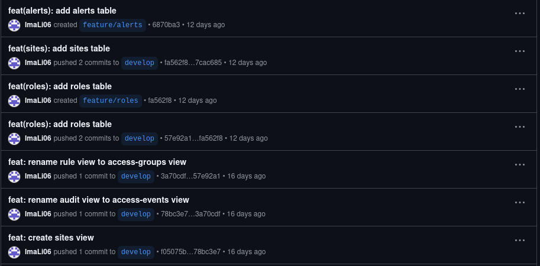

#### 5.2.2.5. Execution Evidence for Sprint Review

En esta sección se adjuntan capturas de pantalla del software funcionando, mostrando las interfaces desarrolladas durante el Sprint 2 para la gestión de infraestructura de espacios.

**Interfaces implementadas:**
- Dashboard de organizaciones (`/home`) con tarjetas de organización
- Vista de sitios (`/operations/sites`) con tabla CRUD e inline editing
- Vista de dispositivos (`/operations/devices`) con badges de estado y tabla CRUD
- Formularios de creación con validaciones y mensajes de error
- Diálogos de confirmación de eliminación con warning

  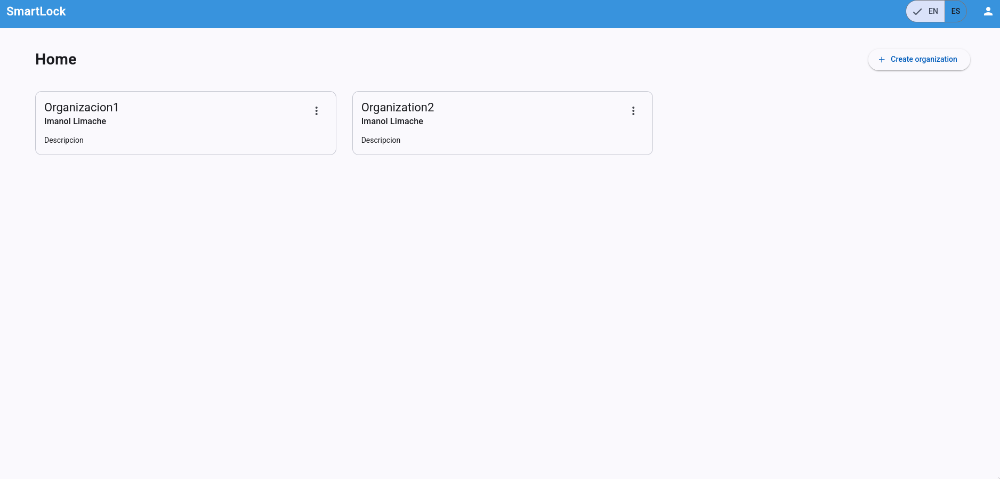

  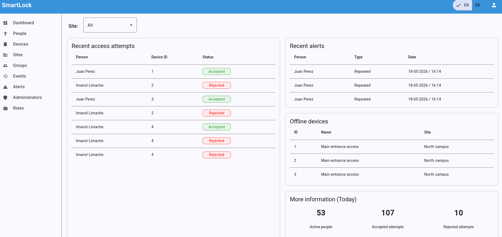

#### 5.2.2.6. Services Documentation Evidence for Sprint Review

En esta sección se evidencia la documentación de los servicios REST implementados durante el Sprint 2 mediante Swagger/OpenAPI.

**Endpoints documentados:**
- `POST /api/v1/organizations` — Crear organización
- `GET /api/v1/organizations` — Listar organizaciones del usuario
- `PUT /api/v1/organizations/{id}` — Actualizar organización
- `DELETE /api/v1/organizations/{id}` — Eliminar organización (cascada)
- `POST /api/v1/organizations/{organizationId}/sites` — Crear sitio
- `GET /api/v1/organizations/{organizationId}/sites` — Listar sitios
- `PUT /api/v1/sites/{id}` — Actualizar sitio
- `DELETE /api/v1/sites/{id}` — Eliminar sitio (cascada de dispositivos)
- `POST /api/v1/devices` — Registrar dispositivo
- `GET /api/v1/organizations/{organizationId}/devices` — Listar dispositivos
- `PUT /api/v1/devices/{id}` — Actualizar dispositivo
- `DELETE /api/v1/devices/{id}` — Eliminar dispositivo

#### 5.2.2.7. Software Deployment Evidence for Sprint Review

En esta sección se presentan las evidencias del despliegue continuo realizado durante el Sprint 2.

**Entornos de despliegue:**
- **Frontend Web App:** Amazon S3 + CloudFront (CDN con HTTPS)
- **Backend API:** AWS Elastic Beanstalk (Java 17, Spring Boot 3.x)
- **Base de Datos:** Amazon RDS MySQL 8.0

#### 5.2.2.8. Team Collaboration Insights during Sprint

En esta sección se documenta la colaboración del equipo durante el Sprint 2 mediante evidencias de actividad en GitHub y reuniones de coordinación.

**Actividades colaborativas:**
- Code reviews en Pull Requests antes de merge a `develop`
- Pair programming en las tareas de inline editing (Aldo + Adrian) y eliminación en cascada (Juan + Imanol)

  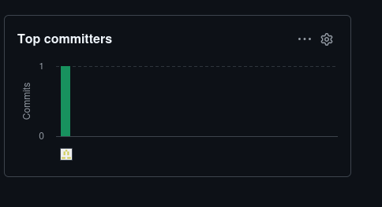

  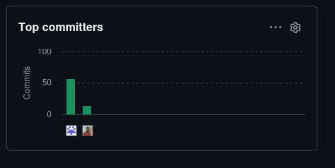

---

### 5.2.3. Sprint 3

En esta sección se registra y explica el avance obtenido durante el tercer ciclo de desarrollo (Sprint 3), enfocado en poblar la infraestructura con personas, definir el control de acceso mediante grupos y establecer el sistema de roles y permisos delegables. Se incluyen los detalles de planificación, los líderes de cada aspecto, el backlog comprometido y las evidencias de ejecución, documentación y despliegue del trabajo completado.

#### 5.2.3.1. Sprint Planning 3

El Sprint Planning Meeting del Sprint 3 se centró en transformar la jerarquía de espacios vacía construida en el Sprint 2 en un sistema de control de acceso operativo. Durante esta sesión, el equipo seleccionó las Historias de Usuario de los epics EP-02 (People), EP-03 (Access Control) y EP-04 (Roles) necesarias para que los administradores puedan registrar personas, agruparlas, controlar su estado de acceso y delegar responsabilidades mediante roles personalizados.

| **Sprint #** | Sprint 3 |
| :--- | :--- |
| **Sprint Planning Background** | |
| **Date** | 2026-05-19 |
| **Time** | 19:00 PM |
| **Location** | Reunión virtual (Microsoft Teams) |
| **Prepared By** | Huaman Oscco, Aldo Jesus |
| **Attendees (to planning meeting)** | Peñaranda Caldas, Gabriel Augusto / Palacios Tinoco, Adrian Fernando / Huaman Oscco, Aldo Jesus / Limache Coronel, Imanol Fabricio / Ayllon Pauccar, Juan David |
| **Sprint 2 Review Summary** | El Sprint 2 culminó con éxito, logrando implementar la jerarquía completa Organization → Site → Device con CRUD funcional, eliminación en cascada y auditoría automática. El Product Owner validó la experiencia de administración de espacios y destacó la consistencia visual de los badges de estado de dispositivos. |
| **Sprint 2 Retrospective Summary** | El equipo identificó que los componentes de inline editing y formularios modales reutilizados del Sprint 2 aceleraron significativamente el desarrollo. Como mejora, se propuso implementar pruebas unitarias para los servicios de dominio antes del cierre del sprint. Se destacó como acierto la rotación de roles en el LACX, permitiendo que todos los integrantes tuvieran exposición al backend y frontend. |
| **Sprint Goal & User Stories** | |
| **Sprint 3 Goal** | **Contexto:** Con la infraestructura de espacios operativa (Orgs, Sites, Devices), el equipo se enfocó en la capa de personas y control de acceso. Este sprint implementa el registro de personas, la agrupación lógica mediante Access Groups, el control de estado de acceso individual (ENABLED/DISABLED/REVOKED) y la creación de roles con permisos delegables para administración compartida.    **Sprint Goal:** *"Our focus is on populating the infrastructure with people and defining who can access what, implementing the person registry, access groups, and role-based permissions.* *We believe it transforms the empty space hierarchy into an operational access control system by linking people to access groups and delegating administration through custom roles.* *This will be confirmed when administrators can register people in an organization, assign them to access groups, toggle their access status (ENABLED/DISABLED/REVOKED), and create custom roles with specific permissions to delegate responsibilities."* |
| **Sprint 3 Velocity** | 36 Story Points. (Velocidad consistente con el Sprint 2, manteniendo el ritmo de entrega del equipo). |
| **Sum of Story Points** | 34 Story Points. |

#### 5.2.3.2. Aspect Leaders and Collaborators

Para asegurar la eficiencia durante este tercer Sprint, el alcance funcional se ha dividido en aspectos que representan módulos específicos de la arquitectura. Se ha rotado el liderazgo respecto al Sprint 2 para fomentar la polivalencia del equipo. A continuación, se presenta la matriz **Leadership-and-Collaboration Matrix (LACX)** para el Sprint 3.

| Team Member (Last Name, First Name) | GitHub Username | Frontend & UI/UX (L/C) | Backend API & CRUD (L/C) | DDD & Arquitectura (L/C) | Access Control Logic (L/C) | QA & Testing (L/C) |
| :--- | :--- | :---: | :---: | :---: | :---: | :---: |
| Huaman Oscco, Aldo Jesus | Jesusho22 | L | C | C | C | C |
| Peñaranda Caldas, Gabriel Augusto | gapc2124 | C | L | C | C | C |
| Limache Coronel, Imanol Fabricio | ImaLi06 | C | C | C | L | C |
| Palacios Tinoco, Adrian Fernando | AdranP3107 | C | C | C | C | L |
| Ayllon Pauccar, Juan David | JuanDPAUC | C | C | L | C | C |

---

> **Leyenda:**  
> **L:** Líder (Líder del aspecto)  
> **C:** Colaborador (Colaborador y desarrollo)

#### 5.2.3.3. Sprint Backlog 3

*"Nuestro objetivo ha sido transformar la plataforma SmartLock de un cascarón de infraestructura vacía a un sistema de control de acceso funcional. Hemos implementado el registro completo de personas con disparo automático de eventos de dominio para la creación de horarios y accesos, la gestión de grupos de acceso como mecanismo de categorización, el control granular del estado de acceso individual (activar, suspender, revocar) y la creación de roles personalizados con permisos atómicos que permiten la administración delegada. Con esto, los administradores ya pueden gestionar quién entra a sus espacios y bajo qué condiciones."*

[https://upc-team-open-source.atlassian.net/jira/software/projects/SMAR/boards/1](https://upc-team-open-source.atlassian.net/jira/software/projects/SMAR/boards/1)

##### **Sprint 3 - Formato**

| **Sprint #** | **Sprint 3** | | | | | |
| :--- | :--- | :--- | :--- | :--- | :--- | :--- |
| **User Story** | **Work-Item / Task** | | | | | |
| **Id** | **Título** | **Id** | **Título** | **Descripción** | **Est. (Hrs)** | **Asignado** | **Status** |
| SMAR-17 | Añadir persona | T-17-1 | Endpoint POST People | Implementar POST /api/v1/people con disparo de PersonAddedToOrganizationEvent para crear ScheduleDays y PersonAccess automáticamente. Validar DNI único por organización. | 5 | Gabriel | Done |
| SMAR-17 | Añadir persona | T-17-2 | Formulario creación persona | Diseñar formulario con campos nombre, apellido y documento de identidad (8 dígitos). Validaciones en tiempo real. | 4 | Aldo | Done |
| SMAR-18 | Listar personas | T-18-1 | Endpoint GET People | Implementar GET /api/v1/organizations/{organizationId}/people con soporte de búsqueda por nombre o documento (Query Param). | 2 | Gabriel | Done |
| SMAR-18 | Listar personas | T-18-2 | Tabla personas con búsqueda | Crear vista /operations/people con mat-table, barra de búsqueda con filtro en tiempo real y columnas ID, Nombre, Apellido, Documento. | 3 | Aldo | Done |
| SMAR-19 | Actualizar persona | T-19-1 | Endpoint PUT People | Implementar PUT /api/v1/people/{id} con validación de DNI único (excluyendo el propio ID). | 3 | Juan | Done |
| SMAR-19 | Actualizar persona | T-19-2 | Edición en línea persona | Implementar inline editing en la tabla de personas con validación de campos requeridos. Cancelar revierte a valores originales. | 3 | Aldo | Done |
| SMAR-20 | Eliminar persona | T-20-1 | Endpoint DELETE People | Implementar DELETE /api/v1/people/{id} con eliminación en cascada de ScheduleDays y PersonAccess asociados. | 5 | Juan | Done |
| SMAR-20 | Eliminar persona | T-20-2 | Confirmación eliminación persona | Diálogo de confirmación advirtiendo que se eliminarán horarios y accesos de la persona. | 2 | Aldo | Done |
| SMAR-21 | Crear grupo de acceso | T-21-1 | Endpoint POST Access Groups | Implementar POST /api/v1/access-groups con validación de nombre único por organización y límite de 100 caracteres. | 4 | Imanol | Done |
| SMAR-21 | Crear grupo de acceso | T-21-2 | Formulario creación grupo | Diseñar formulario con campos nombre y descripción. Validar duplicidad de nombre con mensaje de error 409. | 3 | Adrian | Done |
| SMAR-22 | Listar grupos de acceso | T-22-1 | Endpoint GET Access Groups | Implementar GET /api/v1/organizations/{organizationId}/access-groups. | 2 | Imanol | Done |
| SMAR-22 | Listar grupos de acceso | T-22-2 | Tabla grupos de acceso | Crear vista /operations/access-groups con mat-table mostrando ID, Nombre y Descripción. | 2 | Adrian | Done |
| SMAR-23 | Asignar persona a grupo | T-23-1 | Endpoint POST PersonAccess | Implementar POST /api/v1/person-access vinculando persona a grupo con estado ENABLED. Validar que persona y grupo pertenezcan a la misma organización. Retornar 409 si la persona ya tiene grupo asignado. | 8 | Imanol | Done |
| SMAR-23 | Asignar persona a grupo | T-23-2 | Interfaz asignación persona-grupo | Diseñar componente con dropdown de persona, dropdown de grupo de acceso y botón asignar. Mostrar estado actual de cada persona en la tabla. | 5 | Adrian | Done |
| SMAR-24 | Cambiar estado de acceso | T-24-1 | Endpoint PUT PersonAccess Status | Implementar PUT /api/v1/person-access/{id}/status con estados válidos: ENABLED, DISABLED, REVOKED. Disparar evento de dominio al revocar acceso. | 6 | Gabriel | Done |
| SMAR-24 | Cambiar estado de acceso | T-24-2 | Control cambio de estado | Implementar mat-select en la tabla con cambio de estado y confirmación. Badges de color: verde (ENABLED), amarillo (DISABLED), rojo (REVOKED). | 5 | Aldo | Done |
| SMAR-25 | Crear rol con permisos | T-25-1 | Endpoint POST Roles | Implementar POST /api/v1/roles con campos name, canCreateSites, canCreatePeople, canConnectDevices. Validar nombre único por organización. | 4 | Juan | Done |
| SMAR-25 | Crear rol con permisos | T-25-2 | Formulario creación rol | Diseñar formulario con campo nombre y tres checkboxes (mat-slide-toggle) para los permisos. Permitir crear rol sin permisos (todos false). | 3 | Aldo | Done |
| SMAR-26 | Listar roles | T-26-1 | Endpoint GET Roles | Implementar GET /api/v1/organizations/{organizationId}/roles incluyendo roles del sistema (Root, Basic) marcados como no eliminables. | 2 | Juan | Done |
| SMAR-26 | Listar roles | T-26-2 | Tabla roles con badges permisos | Crear vista /operations/roles con columnas ID, Nombre y badges verde/gris para cada permiso. Marcar rol Root como no eliminable. | 2 | Aldo | Done |
| TS-08 | CRUD Personas | T-TS08-1 | Servicio de dominio PersonService | Implementar lógica de negocio con eventos de dominio: PersonAddedToOrganizationEvent dispara creación automática de ScheduleDays y PersonAccess. | 5 | Gabriel | Done |
| TS-08 | CRUD Personas | T-TS08-2 | Repositorio PersonRepository | Implementar queries: findAllByOrganizationId, findByDocumentIdAndOrganizationId, searchByNameOrDocument. | 3 | Imanol | Done |
| TS-09 | Endpoints grupos de acceso | T-TS09-1 | Servicio de dominio AccessGroupService | Implementar CRUD de grupos con validación de nombre único y límite de caracteres. | 4 | Imanol | Done |
| TS-10 | Endpoints roles | T-TS10-1 | Servicio de dominio RoleService | Implementar CRUD de roles con lógica de roles no eliminables (Root, Basic) y validación de permisos atómicos. | 4 | Juan | Done |
| **TOTAL HORAS** | | | | | **87** | | |

#### 5.2.3.4. Development Evidence for Sprint Review

En esta sección se presentan las evidencias del desarrollo correspondiente al Sprint 3. Se incluyen capturas de los commits realizados en los repositorios de GitHub para los módulos de People, Access Groups, PersonAccess y Roles.

**Repositorios y ramas trabajadas:**
- **Frontend Web App:** `feature/people-management`, `feature/access-groups`, `feature/person-access`, `feature/roles-admin`
- **Backend API:** `feature/people-endpoints`, `feature/access-group-endpoints`, `feature/person-access-logic`, `feature/roles-endpoints`

  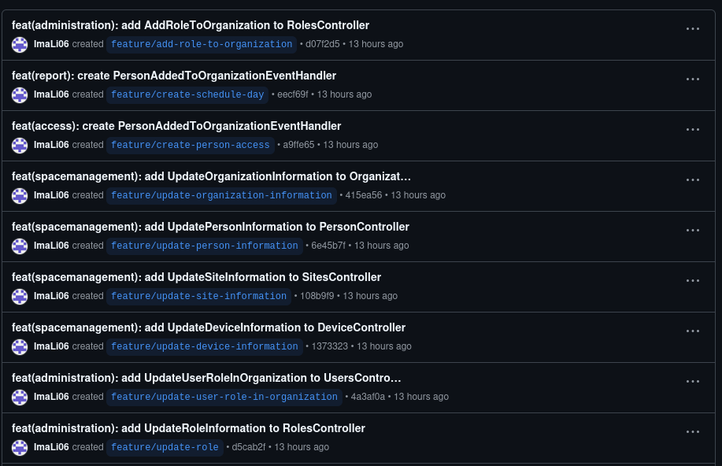

#### 5.2.3.5. Execution Evidence for Sprint Review

En esta sección se adjuntan capturas de pantalla del software funcionando, mostrando las interfaces desarrolladas durante el Sprint 3 para la gestión de personas, control de acceso y roles.

**Interfaces implementadas:**
- Vista de personas (`/operations/people`) con tabla, búsqueda en tiempo real e inline editing
- Vista de grupos de acceso (`/operations/access-groups`) 
- Componente de asignación persona-grupo con dropdowns y validación de organización
- Control de estado de acceso con badges de color (verde/amarillo/rojo) y confirmación de cambio
- Vista de roles (`/operations/roles`) con badges de permisos y roles no eliminables marcados
- Formulario de creación de rol con mat-slide-toggle para cada permiso

  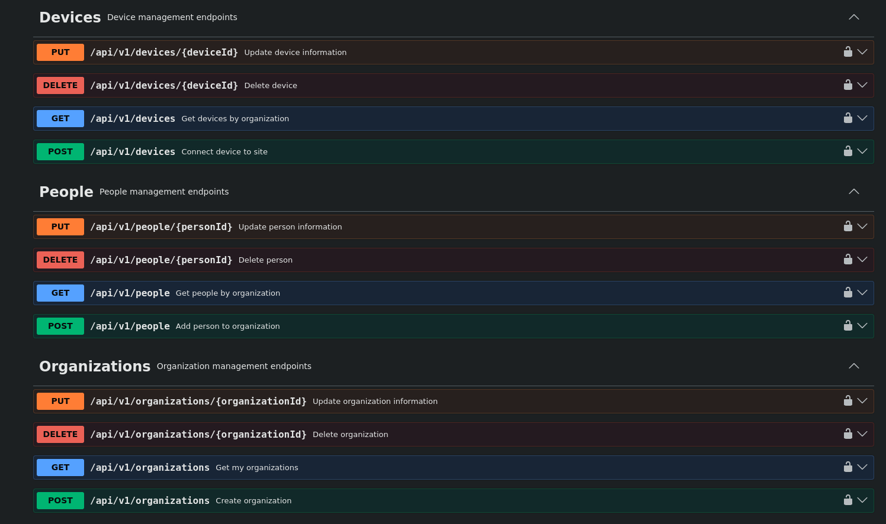

#### 5.2.3.6. Services Documentation Evidence for Sprint Review

En esta sección se evidencia la documentación de los servicios REST implementados durante el Sprint 3 mediante Swagger/OpenAPI.

**Endpoints documentados:**
- `POST /api/v1/people` — Registrar persona (dispara eventos de dominio)
- `GET /api/v1/organizations/{organizationId}/people` — Listar personas con búsqueda
- `PUT /api/v1/people/{id}` — Actualizar persona
- `DELETE /api/v1/people/{id}` — Eliminar persona (cascada)
- `POST /api/v1/access-groups` — Crear grupo de acceso
- `GET /api/v1/organizations/{organizationId}/access-groups` — Listar grupos
- `POST /api/v1/person-access` — Asignar persona a grupo
- `PUT /api/v1/person-access/{id}/status` — Cambiar estado de acceso
- `POST /api/v1/roles` — Crear rol con permisos
- `GET /api/v1/organizations/{organizationId}/roles` — Listar roles

  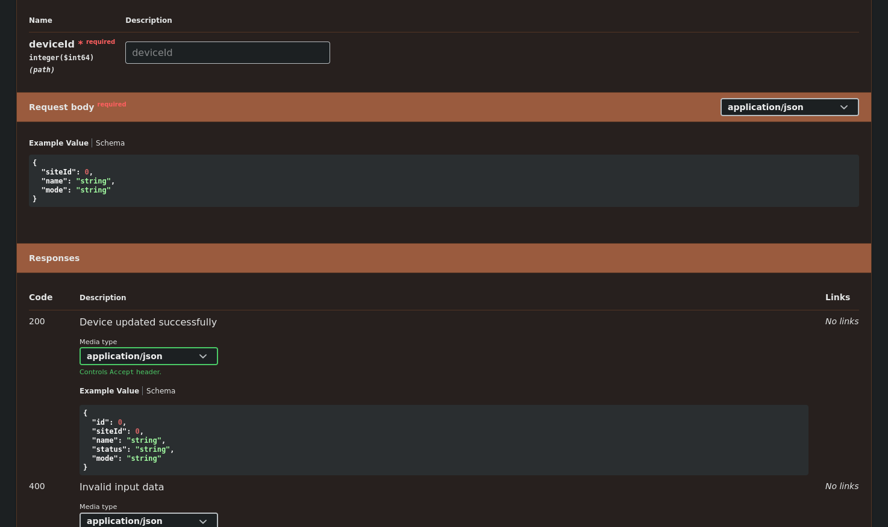

  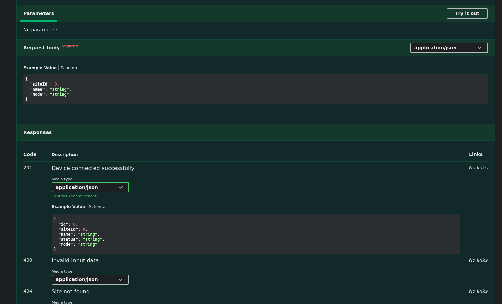

#### 5.2.3.7. Software Deployment Evidence for Sprint Review

En esta sección se presentan las evidencias del despliegue continuo realizado durante el Sprint 3.

**Entornos de despliegue:**
- **Frontend Web App:** Amazon S3 + CloudFront
- **Backend API:** AWS Elastic Beanstalk
- **Base de Datos:** Amazon RDS MySQL 8.0
- **Pipeline CI/CD:** GitHub Actions con stages de build → test → deploy

#### 5.2.3.8. Team Collaboration Insights during Sprint

  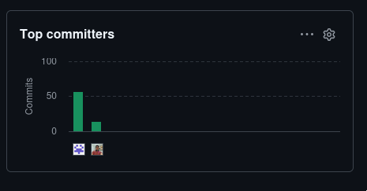

  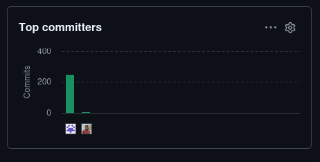

  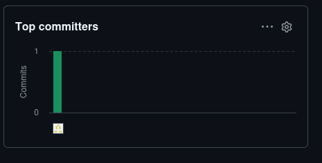

---

## 5.3. Validation Interviews.

### 5.3.1. Diseño de Entrevistas.

Objetivo: Validar la propuesta de valor y las hipótesis de uso de SmartLock con usuarios reales (organizadores de eventos y empresarios), identificando puntos de dolor, expectativas y oportunidades de diseño.

Orden a seguir en cada entrevista (guion compacto):

1. Presentación (30–60s): saludo, nombre del entrevistador, objetivo de la entrevista y tiempo estimado.
2. Consentimiento (30s): pedir permiso para grabar/registrar y explicar cómo se usará la información.
3. Preguntas generales (5–8 min): contexto del entrevistado, proceso actual de control de accesos, problemas principales y prioridades.
4. Preguntas orientadas a la solución (3–5 min): reacción ante la propuesta SmartLock, disposición a pagar, preferencias (web vs. móvil, sin/hardware).
5. Tareas con la Web Application (observación): pedir al participante que explique cómo resolvería una tarea típica (ej.: registrar un asistente, revocar acceso temporal) y anotar dificultades y comentarios.
6. Cierre (1 min): agradecimiento y pasos siguientes.

Guion breve de preguntas (usar según segmento):
- ¿Cómo gestionas actualmente el acceso a tus eventos/instalaciones?
- ¿Qué te demora más en el proceso de ingreso de asistentes?
- ¿Qué herramientas usas hoy? ¿por qué sí/no usarías otra?
- ¿Qué tan importante es para ti el control de aforo en tiempo real?
- ¿Qué características te harían preferir SmartLock sobre soluciones actuales?

Para la parte práctica en la Web Application, pedir al participante que realice (o describa) en voz alta:
- Crear/emitir un cupón/QR temporal para un asistente.
- Revocar el acceso a un usuario específico.
- Visualizar el aforo en tiempo real y generar un reporte simple.

### 5.3.2. Registro de Entrevistas.

| Campo | Valor |
| :--- | :--- |
| Nombre | Fernando Güere Calero |
| Edad | 21 |
| Distrito | La Molina |
| Segmento | Organizadora (Eventos) |
| Rol | Pesonal de Seguridad |
| Fecha | 19-06-26 |
| Medio | Video (Stream) |
| Captura | 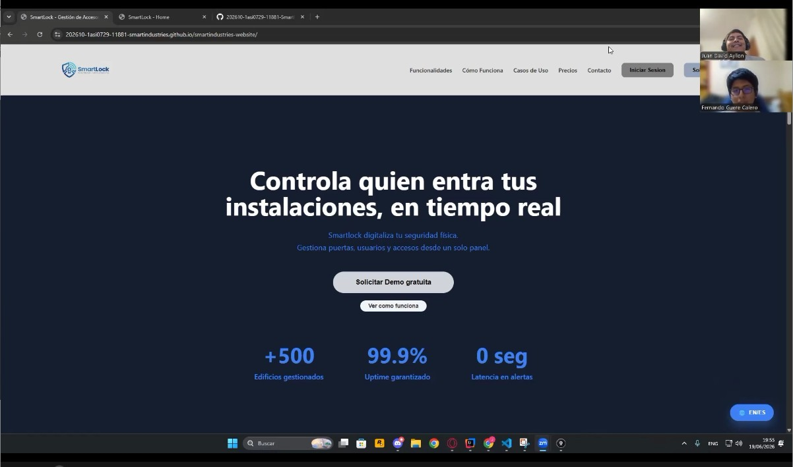 |
| Enlace | https://upcedupe-my.sharepoint.com/:v:/g/personal/u20241a860_upc_edu_pe/IQCNUbOzjMlbR4976PjOPObJAeAsCJ4tOJdy-Tj5dztkVeo?nav=eyJyZWZlcnJhbEluZm8iOnsicmVmZXJyYWxBcHAiOiJPbmVEcml2ZUZvckJ1c2luZXNzIiwicmVmZXJyYWxBcHBQbGF0Zm9ybSI6IldlYiIsInJlZmVycmFsTW9kZSI6InZpZXciLCJyZWZlcnJhbFZpZXciOiJNeUZpbGVzTGlua0NvcHkifX0&e=ZhMJ6W |
| Tiempo inicio | 00:00 |
| Tiempo fin | 08:16 |
| Duración | 08:16 |

### 5.3.3. Evaluaciones según heurísticas.

| Campo | Detalle |
|---|---|
| **CARRERA** | Ingeniería de Software |
| **CURSO** | Desarrollo de Aplicaciones Open Source |
| **SECCIÓN** | 11811 |
| **PROFESORES** | Bautista Ubillús, Efraín Ricardo |
| **AUDITOR** | Juan David Ayllon Pauccar |
| **CLIENTE(S)** | Equipo SmartIndustries |
| **SITE A EVALUAR** | SmartLock — Landing Page (smartlock.com) |
 
---
 
#### Tareas a evaluar
 
El alcance de esta evaluación incluye la revisión de la usabilidad de las siguientes tareas dentro de la landing page de SmartLock:
 
1. Comprensión inicial de la propuesta de valor (Hero)
2. Navegación entre secciones mediante el menú superior
3. Identificación visual de las funcionalidades del producto
4. Acceso a la acción "Ver cómo funciona"
5. Diferenciación entre "Iniciar Sesión" y "Solicitar Demo"
6. Cambio de idioma (ES/EN)
No están incluidas en esta versión de la evaluación las siguientes tareas:
 
1. Proceso de pago o checkout de planes
2. Flujo posterior al login (panel/dashboard interno)
3. Formulario de contacto (validaciones de backend)
---
 
### Escala de severidad
 
Los errores serán puntuados tomando en cuenta la siguiente escala de severidad:
 
| Nivel | Descripción |
|---|---|
| **1** | Problema superficial: fácilmente superable por el usuario u ocurre con muy poca frecuencia. No requiere arreglo salvo disponibilidad de tiempo. |
| **2** | Problema menor: ocurre un poco más frecuentemente o es algo más difícil de superar. Prioridad baja para el siguiente release. |
| **3** | Problema mayor: ocurre frecuentemente o los usuarios no logran resolverlo por sí mismos. Prioridad alta, debe corregirse. |
| **4** | Problema muy grave: error de gran impacto que impide al usuario continuar usando la herramienta. Corrección imperativa antes del lanzamiento. |
 
---
 
### Tabla resumen de hallazgos
 
A continuación se detallan los problemas identificados en la landing page de SmartLock, evaluados sobre las capturas del Hero y la sección de Funcionalidades, con foco en pobreza de diseño visual, errores de visibilidad y funcionalidades no implementadas.
 
| # | Problema | Severidad | Heurística / Principio violado(a) |
|---|---|:---:|---|
| 1 | El botón principal del Hero ("Solicitar Demo gratuita") usa el mismo gris apagado que el fondo y que botones secundarios, sin contraste cromático que lo distinga como acción primaria. No hay jerarquía visual entre CTA primario y secundario. | 3 | Usability: Visibilidad del estado del sistema / Jerarquía visual |
| 2 | Las 4 tarjetas de "Funcionalidades" son recuadros negros sólidos sin íconos, ilustraciones ni imágenes de apoyo. El contenido es solo texto centrado, lo que genera una sección visualmente plana y poco memorable frente a la convención de landing pages SaaS (ícono + título + texto). | 2 | Usability: Reconocer antes que recordar / Estética y diseño minimalista |
| 3 | Bajo contraste de color: textos en azul claro ("Smartlock digitaliza tu seguridad física") sobre fondo azul marino oscuro no cumple el ratio mínimo de contraste 4.5:1 de WCAG 2.1 AA para texto normal. | 3 | Inclusive Design: Proporciona experiencias comparables (accesibilidad visual) |
| 4 | El botón flotante "EN/ES" se superpone con la barra de scroll y queda parcialmente cortado en la esquina inferior derecha en la sección de Funcionalidades, además de duplicar la función del botón "EN/ES" ya presente en el navbar. | 2 | Usability: Consistencia y estándares |
| 5 | El botón "Iniciar Sesión" no tiene un estado visualmente diferenciado de "Solicitar Demo" en el navbar (ambos son variantes de gris/azul apagado); un usuario nuevo no identifica de inmediato cuál acción es la prioritaria para conversión. | 2 | Usability: Visibilidad del estado del sistema |
| 6 | No existen imágenes, capturas de producto, mockups de la app/panel ni video demostrativo en todo el Hero. Una landing de un producto de control de accesos físico depende fuertemente de mostrar la interfaz real para generar confianza, y actualmente solo hay texto. | 3 | Information Architecture: Is it usable? / Credibilidad del producto |
| 7 | Las tarjetas de funcionalidades no son clicables ni enlazan a documentación o detalle ampliado de cada característica (no hay "Ver más" ni affordance de interacción como cursor pointer o hover state visible en las capturas). | 2 | Information Architecture: Is it findable? |
| 8 | El botón "Ver cómo funciona" no tiene implementado ningún scroll, modal de video o navegación hacia la sección "Cómo Funciona" (sin atributo href/onclick funcional detectado), generando una promesa rota de navegación. | 4 | Usability: Libertad y control del usuario |
| 9 | Espaciado vertical excesivo y no balanceado entre el bloque de estadísticas (+500, 99.9%, 0 seg) y el resto del contenido del Hero, dejando áreas vacías grandes que no aportan información y obligan a un scroll mayor al necesario. | 1 | Usability: Estética y diseño minimalista |
| 10 | Transición abrupta de fondo oscuro (Hero, azul marino) a fondo claro (Funcionalidades, gris claro) sin elemento de transición visual (wave, degradado, sombra), lo que rompe la continuidad de la experiencia de scroll. | 1 | Usability: Consistencia y estándares |
| 11 | No hay indicador de carga, skeleton ni feedback visual mientras el contenido dinámico (de existir backend conectado) carga en pantalla; en el estado actual la página es completamente estática sin señal de qué elementos son interactivos. | 2 | Usability: Visibilidad del estado del sistema |
| 12 | Las imágenes referenciadas en el código (logo SmartLock) no incluyen texto alternativo descriptivo más allá de "SmartLock Logo" genérico, y no se evidencian atributos alt en íconos o elementos gráficos adicionales de las tarjetas. | 2 | Inclusive Design: Proporciona experiencias comparables |
 
---
 
### Detalle de hallazgos por categoría
 
### 1. Diseño visual pobre / falta de jerarquía
 
La landing presenta una paleta reducida (azul marino, gris, blanco) aplicada de forma uniforme tanto a botones primarios como secundarios, lo que elimina la jerarquía visual esperada en un flujo de conversión. El botón "Solicitar Demo gratuita" del Hero, que debería ser el CTA principal, comparte el mismo peso visual que "Ver cómo funciona", un CTA secundario. Asimismo, las tarjetas de la sección "Funcionalidades" son bloques negros sin íconos ni imágenes, lo que reduce el reconocimiento rápido de cada característica y empobrece la percepción de marca frente a competidores del rubro PropTech/Seguridad.
 
**Recomendación:**
- Definir un color de acento (ej. cian o azul brillante, ya usado en las cifras +500/99.9%) exclusivo para el CTA primario.
- Incorporar un ícono SVG por tarjeta de funcionalidad (candado, reloj, historial, edificio) para reforzar reconocimiento visual.
- Aplicar mayor contraste de fondo entre tarjetas y fondo de sección para evitar el efecto de "bloques negros flotantes".
### 2. Errores de visibilidad
 
Se identificaron problemas de contraste de color que afectan la legibilidad, particularmente el texto descriptivo del Hero (azul claro sobre azul marino), el cual no garantiza el ratio de contraste mínimo recomendado por WCAG 2.1 nivel AA (4.5:1 para texto normal). Adicionalmente, el botón flotante de idioma ("EN/ES") se superpone con el scrollbar del navegador en la sección de Funcionalidades, generando un elemento duplicado y parcialmente oculto.
 
**Recomendación:**
- Verificar todos los pares texto/fondo con una herramienta de contraste (ej. WebAIM Contrast Checker) y ajustar a un mínimo de 4.5:1.
- Eliminar el botón flotante "EN/ES" duplicado o reposicionarlo fuera del área del scrollbar, dejando un único selector de idioma persistente.
### 3. Funcionalidades no implementadas
 
El botón "Ver cómo funciona" no presenta comportamiento funcional visible (no hace scroll a la sección "Cómo Funciona" ni abre un modal/video), lo que constituye una promesa de navegación rota y es el hallazgo de mayor severidad de esta evaluación. Las tarjetas de funcionalidades tampoco son interactivas ni enlazan a contenido ampliado, limitando la capacidad del usuario de profundizar en cada característica antes de solicitar una demo.
 
**Recomendación:**
- Implementar scroll suave (smooth scroll) desde "Ver cómo funciona" hacia el ancla `#how-it-works`.
- Convertir las tarjetas de funcionalidades en elementos clicables que despliegen más detalle (modal, acordeón o página de detalle).
- Agregar estado hover/focus visible en todos los botones para confirmar al usuario que el elemento es interactivo.
---
 
## Conclusión general
 
- SmartLock presenta una propuesta sólida basada en una solución SaaS para control de accesos y eventos, con hallazgos de entrevistas que validan la demanda de control en tiempo real y la preferencia por soluciones sin hardware físico.
- Las entrevistas con organizadores y empresarios revelan dos necesidades clave: gestión rápida de aforo/validación de asistentes y revocación de accesos de último minuto.
- La evaluación de la landing y la documentación muestra que el proyecto tiene una base coherente, pero requiere mejoras en usabilidad, jerarquía visual y funcionalidad interactiva antes de una presentación comercial definitiva.

### Recomendaciones

- Priorizar la corrección de los problemas de contraste y la diferenciación clara entre CTA primario y secundario en la landing page.
- Implementar el comportamiento funcional de botones clave como "Ver cómo funciona", añadiendo scroll suave o modal de video para cumplir la promesa de navegación.
- Mejorar la visibilidad de los resultados de acceso (confirmación de validación/revocación) y reducir los pasos necesarios para los organizadores durante el registro de asistentes.
- Documentar y mantener las entrevistas en un formato uniforme, incluyendo capturas de video, timestamps y observaciones, para facilitar la toma de decisiones en las siguientes iteraciones.

**Video about the team**:

  

00:00 - 03:12

## 5.4. Video About-the-Product.

  

00:00 - 03:43

- *Microsoft Stream:* https://upcedupe-my.sharepoint.com/:v:/g/personal/u20241a860_upc_edu_pe/IQBVMXcdnPuSQKI9hqh9AEtDAS_bI9VVnOsDtJQ5Ij98DFc?nav=eyJyZWZlcnJhbEluZm8iOnsicmVmZXJyYWxBcHAiOiJPbmVEcml2ZUZvckJ1c2luZXNzIiwicmVmZXJyYWxBcHBQbGF0Zm9ybSI6IldlYiIsInJlZmVycmFsTW9kZSI6InZpZXciLCJyZWZlcnJhbFZpZXciOiJNeUZpbGVzTGlua0NvcHkifX0&e=jQ3MQz
- *YouTube:* https://youtu.be/PqTKXO1_uNk

# Anexos
* ** Web Landing Page Deployment Link: https://202610-1asi0729-11881-smartindustries.github.io/smartindustries-website/

* ** Web Application Deployment Link: https://main.d4a0r9vfa2800.amplifyapp.com/auth/sign-in

* **Organización en GitHub:** [https://github.com/202610-1asi0729-11881-SmartIndustries](https://github.com/202610-1asi0729-11881-SmartIndustries)
* **Landing Page:** [https://github.com/202610-1asi0729-11881-SmartIndustries/smartindustries-website](https://github.com/202610-1asi0729-11881-SmartIndustries/smartindustries-website)
* **Frontend Web Application:** [https://github.com/202610-1asi0729-11881-SmartIndustries/smartindustries-webapp](https://github.com/202610-1asi0729-11881-SmartIndustries/smartindustries-webapp)
* **Web Services (Core Backend API):** [https://github.com/202610-1asi0729-11881-SmartIndustries/smartindustries-platform](https://github.com/202610-1asi0729-11881-SmartIndustries/smartindustries-platform)
* **Project Report:** [https://github.com/202610-1asi0729-11881-SmartIndustries/smartindustries-report](https://github.com/202610-1asi0729-11881-SmartIndustries/smartindustries-report)
* **About the team (Microsoft Stream)**: https://upcedupe-my.sharepoint.com/:v:/g/personal/u20241a860_upc_edu_pe/IQBVMXcdnPuSQKI9hqh9AEtDAS_bI9VVnOsDtJQ5Ij98DFc?nav=eyJyZWZlcnJhbEluZm8iOnsicmVmZXJyYWxBcHAiOiJPbmVEcml2ZUZvckJ1c2luZXNzIiwicmVmZXJyYWxBcHBQbGF0Zm9ybSI6IldlYiIsInJlZmVycmFsTW9kZSI6InZpZXciLCJyZWZlcnJhbFZpZXciOiJNeUZpbGVzTGlua0NvcHkifX0&e=Gg3B5Y

* **About the team (Youtube)**: https://youtu.be/PqTKXO1_uNk

* **Diagramas de clase**: https://drive.google.com/drive/folders/1Vxsqy9zSTlkX-08k8zkIp1uketg2mJ8n?usp=sharing

* **2.4. y 2.6.1. Event Storming (Big Picture & Design Level):** [Excalidraw](https://excalidraw.com/#json=vUgvQ_f8p5qxOvlqhFRzb,fcVt4lcEfKf0J_ePWUhZhw)
* **2.3. User Personas y Community:** [Figma Board](https://www.figma.com/board/okEnho158yZOcK5r6UzEgj/user-personal--Community-?node-id=0-1&t=y2q6BjfRkX2B6Mr1-1)
* **Landing Page y Web Application Design:** [Figma Design](https://www.figma.com/design/kVDoKtb6qnhzGb0kD1rCyR/Untitled?node-id=14-2537&t=k6bdmNtl5T5W5I9Q-1)
* **3.3. Gestión del Proyecto y Backlog:** [Jira Board](https://upc-team-open-source.atlassian.net/jira/software/projects/SMAR/boards/1?atlOrigin=eyJpIjoiNDFhNzk1OTIxMGU0NDc5ZjlmYjliMzlmYjU2MDVmOTIiLCJwIjoiaiJ9)

* Evidencia de herramienta utilizada : Jira :

*  

*  

*  

*  
